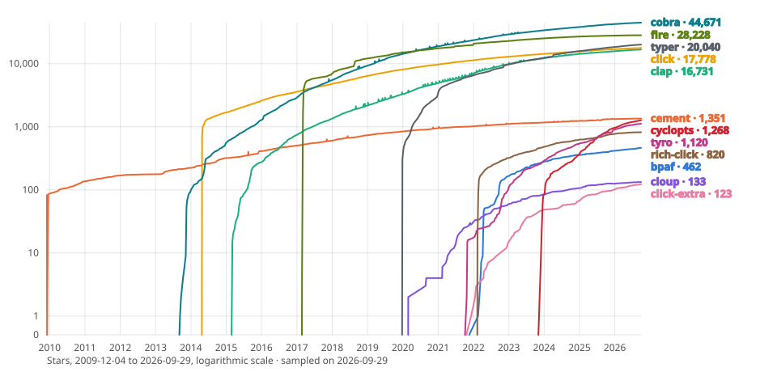

# {octicon}`trophy` Benchmark

<!-- Editing rules of this page:
     - A click-extra ✅ or 🟡 always links the click-extra documentation of the feature,
       and the label of its row carries the same target. A competitor ✅ or 🟡 links what
       proves the support: its documentation, or the source line at the graded release.
     - A ❌ always links explicit evidence that the project lacks or rejects the feature:
       an issue or pull request closed as not planned, a maintainer comment, a feature
       request left open, an official page stating the limit. Absence of the feature is
       never enough: with no citable source, the cell stays blank.
     - Verify each URL before committing it. Prefer an `#issuecomment-{id}` anchor where
       a maintainer states the position.
     - To audit a column, research one framework at a time, and report "no evidence" as
       a blank cell. -->

Feature comparison between Click Extra and competing CLI frameworks across ecosystems. The tables below track where Click Extra leads, where it matches, and where it can still improve.

Every cell links to its evidence. A ✅ marks support built in, on by default or behind one documented switch, and links its documentation or source line. A 🟡 marks partial or opt-in support, or support from an official companion package, and links the proof. A ❌ links a statement that rules the feature out: a maintainer's refusal, a feature request left open, a documented limit. A blank cell means no citable source was found either way, and N/A marks a row that does not apply to the framework. A row label links to click-extra's documentation of the feature.

## Developer experience

| Feature ↴ \\ Framework →                                          |                `click-extra`                 |                                                `Click`[^1]                                                 |                                                `Cloup`[^2]                                                 |                                                  `cobra`[^3]                                                  |                             `Fire`[^4]                              |                                       `Typer`[^5]                                       |                               `clap`[^6]                               |                                                             `Cement`[^7]                                                              |                                           `Cyclopts`[^8]                                           |                                         `Tyro`[^9]                                          |                                             `rich-click`[^10]                                              |                                             `bpaf`[^11]                                              |
| ----------------------------------------------------------------- | :------------------------------------------: | :--------------------------------------------------------------------------------------------------------: | :--------------------------------------------------------------------------------------------------------: | :-----------------------------------------------------------------------------------------------------------: | :-----------------------------------------------------------------: | :-------------------------------------------------------------------------------------: | :--------------------------------------------------------------------: | :-----------------------------------------------------------------------------------------------------------------------------------: | :------------------------------------------------------------------------------------------------: | :-----------------------------------------------------------------------------------------: | :--------------------------------------------------------------------------------------------------------: | :--------------------------------------------------------------------------------------------------: |
| [Config file discovery](config-discovery.md)                      |          [✅](config-discovery.md)           |                                                                                                            |                                                                                                            |               [✅](https://github.com/spf13/viper/blob/v1.21.0/README.md#reading-config-files)                |                                                                     |                                                                                         |                                                                        |                [✅](https://docs.builtoncement.com/core-foundation/configuration-settings#configuration-file-loading)                 |           [🟡](https://cyclopts.readthedocs.io/en/v5.1.1/config_file.html#toml-example)            |                                                                                             |                                                                                                            |                                                                                                      |
| [Config precedence chain](config.md#precedence)                   |          [✅](config.md#precedence)          |      [🟡](https://click.palletsprojects.com/en/stable/commands-and-groups/#parameter-source-priority)      |      [🟡](https://click.palletsprojects.com/en/stable/commands-and-groups/#parameter-source-priority)      | [✅](https://cobra.dev/docs/how-to-guides/working-with-flags/#optional-wire-flags-to-environmentconfig-viper) |                                                                     |                                                                                         |                                                                        |                 [🟡](https://docs.builtoncement.com/core-foundation/configuration-settings#configuration-load-order)                  | [✅](https://cyclopts.readthedocs.io/en/v5.1.1/config_file.html#combining-multiple-config-sources) |                                                                                             |      [🟡](https://click.palletsprojects.com/en/stable/commands-and-groups/#parameter-source-priority)      |                                                                                                      |
| Type-hint-driven params                                           |                                              |                                                                                                            |                                                                                                            |                                                                                                               |                                                                     |              [✅](https://typer.tiangolo.com/features/#just-modern-python)              |   [✅](https://docs.rs/clap/4.6.7/clap/_derive/index.html#arg-types)   |                                                                                                                                       |             [✅](https://cyclopts.readthedocs.io/en/v5.1.1/rules.html#coercion-rules)              | [✅](https://brentyi.github.io/tyro/your_first_cli/#command-line-interfaces-from-functions) |                                                                                                            | [✅](https://docs.rs/bpaf/0.9.28/bpaf/_documentation/_1_tutorials/_2_derive_api/_0_intro/index.html) |
| [Option groups / constraints](tutorial.md#cloup-integration)      |     [✅](tutorial.md#cloup-integration)      |                                                                                                            |      [✅](https://cloup.readthedocs.io/en/stable/pages/option-groups.html#the-option-group-decorator)      |           [🟡](https://github.com/spf13/cobra/blob/v1.10.2/site/content/user_guide.md#flag-groups)            |                                                                     | [🟡](https://typer.tiangolo.com/tutorial/commands/help/#help-panels-for-cli-parameters) |       [✅](https://docs.rs/clap/4.6.7/clap/struct.ArgGroup.html)       | [🟡](https://cement.readthedocs.io/en/3.0/api/ext/ext_argparse.html#cement.ext.ext_argparse.ArgparseController._pre_argument_parsing) |               [✅](https://cyclopts.readthedocs.io/en/v5.1.1/groups.html#validators)               |       [✅](https://brentyi.github.io/tyro/examples/basics/#mutually-exclusive-groups)       |      [🟡](https://ewels.github.io/rich-click/1.9/documentation/panels/overview/#introduction-to-api)       |            [✅](https://docs.rs/bpaf/0.9.28/bpaf/macro.construct.html#combinatoric-usage)            |
| Persistent / inherited flags                                      |      [❌](#persistent-inherited-flags)       |                  [❌](https://github.com/pallets/click/issues/66#issuecomment-674322963)                   |                                                                                                            |         [✅](https://github.com/spf13/cobra/blob/v1.10.2/site/content/user_guide.md#persistent-flags)         | [✅](https://google.github.io/python-fire/guide/#calling-functions) |              [❌](https://typer.tiangolo.com/tutorial/commands/callback/)               |  [✅](https://docs.rs/clap/4.6.7/clap/struct.Arg.html#method.global)   |                                                                                                                                       |          [✅](https://cyclopts.readthedocs.io/en/v5.1.1/parse_mode.html#fallthrough-mode)          |     [✅](https://brentyi.github.io/tyro/api/tyro/conf/#tyro.conf.CascadeSubcommandArgs)     |                                                                                                            |            [🟡](https://docs.rs/bpaf/0.9.28/bpaf/struct.OptionParser.html#method.command)            |
| [Lazy subcommand loading](commands.md#lazily-loading-subcommands) | [✅](commands.md#lazily-loading-subcommands) |                                                                                                            |                                                                                                            |                                                      N/A                                                      |                                                                     |                                                                                         | [✅](https://docs.rs/clap/4.6.7/clap/struct.Command.html#method.defer) |                                                                                                                                       |           [✅](https://cyclopts.readthedocs.io/en/v5.1.1/lazy_loading.html#basic-usage)            |                                                                                             |                                                                                                            |                                                                                                      |
| [Parameter introspection](parameters.md#params-option)            |      [✅](parameters.md#params-option)       | [🟡](https://click.palletsprojects.com/en/stable/commands-and-groups/#detecting-the-source-of-a-parameter) | [🟡](https://click.palletsprojects.com/en/stable/commands-and-groups/#detecting-the-source-of-a-parameter) |                   [🟡](https://github.com/spf13/cobra/blob/v1.10.2/command.go#L1499-L1538)                    |                                                                     |                                                                                         |                                                                        |                                                                                                                                       |                                                                                                    |                                                                                             | [🟡](https://click.palletsprojects.com/en/stable/commands-and-groups/#detecting-the-source-of-a-parameter) |                                                                                                      |

[click-extra reads TOML, YAML, JSON, INI, and XML config files](config.md), including `[tool.*]`{l=toml} sections from `pyproject.toml` and remote URLs. [Config-file precedence](config.md#precedence) is layered through Click's `default_map`, so command-line flags and environment variables always win. The strict-check pipeline ships an [extension mechanism](config-validation.md#extending-validation) so apps can validate data-keyed sub-tables alongside click-extra's own CLI-flag checks. cobra achieves similar coverage through Viper (YAML, TOML, JSON, HCL, INI, env vars). Cyclopts supports TOML, YAML, JSON, and env vars. Cement uses INI by default with YAML and JSON via extensions. clap requires a companion crate for config file support.

## End-user experience

| Feature ↴ \\ Framework →                                |             `click-extra`              |                                     `Click`[^1]                                      |                                     `Cloup`[^2]                                      |                                                         `cobra`[^3]                                                         |                                     `Fire`[^4]                                     |                                          `Typer`[^5]                                           |                                        `clap`[^6]                                         |                                                     `Cement`[^7]                                                     |                                     `Cyclopts`[^8]                                      |                                                  `Tyro`[^9]                                                   |                                  `rich-click`[^10]                                   |                                      `bpaf`[^11]                                      |
| ------------------------------------------------------- | :------------------------------------: | :----------------------------------------------------------------------------------: | :----------------------------------------------------------------------------------: | :-------------------------------------------------------------------------------------------------------------------------: | :--------------------------------------------------------------------------------: | :--------------------------------------------------------------------------------------------: | :---------------------------------------------------------------------------------------: | :------------------------------------------------------------------------------------------------------------------: | :-------------------------------------------------------------------------------------: | :-----------------------------------------------------------------------------------------------------------: | :----------------------------------------------------------------------------------: | :-----------------------------------------------------------------------------------: |
| [Colored help](colorize.md)                             |           [✅](colorize.md)            |                                                                                      |      [🟡](https://cloup.readthedocs.io/en/stable/pages/formatting.html#themes)       |                                                                                                                             | [🟡](https://github.com/google/python-fire/blob/v0.7.1/fire/formatting.py#L31-L36) |       [✅](https://typer.tiangolo.com/tutorial/commands/help/#rich-markdown-and-markup)        |  [✅](https://docs.rs/clap/4.6.7/clap/builder/styling/struct.Styles.html#method.styled)   | [🟡](https://cement.readthedocs.io/en/3.0/api/ext/ext_argparse.html#cement.ext.ext_argparse.ArgparseArgumentHandler) |  [✅](https://cyclopts.readthedocs.io/en/v5.1.1/help_customization.html#color-styles)   |              [✅](https://brentyi.github.io/tyro/api/tyro/extras/#tyro.extras.set_accent_color)               |                [✅](https://ewels.github.io/rich-click/1.9/#features)                |           [🟡](https://docs.rs/bpaf/0.9.28/bpaf/index.html#cargo-features)            |
| [Command suggestions](commands.md#typo-suggestions)     |   [✅](commands.md#typo-suggestions)   |       [✅](https://click.palletsprojects.com/en/stable/changes/#version-8-4-0)       |       [✅](https://click.palletsprojects.com/en/stable/changes/#version-8-4-0)       |                              [🟡](https://github.com/spf13/cobra/blob/v1.10.2/args.go#L24-L39)                              |                                                                                    |           [✅](https://typer.tiangolo.com/tutorial/commands/help/#suggest-commands)            | [✅](https://docs.rs/clap/4.6.7/clap/error/enum.ErrorKind.html#variant.InvalidSubcommand) |                                                                                                                      |   [✅](https://cyclopts.readthedocs.io/en/v5.1.1/commands.html#registering-a-command)   |                                                                                                               |       [✅](https://click.palletsprojects.com/en/stable/changes/#version-8-4-0)       |       [✅](https://github.com/pacak/bpaf/blob/v0.9.28/src/meta_youmean.rs#L65)        |
| [Shell completion](carapace.md)                         |           [🟡](carapace.md)            | [🟡](https://click.palletsprojects.com/en/stable/shell-completion/#shell-completion) | [🟡](https://click.palletsprojects.com/en/stable/shell-completion/#shell-completion) |      [✅](https://github.com/spf13/cobra/blob/v1.10.2/site/content/completions/_index.md#dynamic-completion-of-nouns)       |       [🟡](https://google.github.io/python-fire/using-cli/#completion-flag)        | [✅](https://typer.tiangolo.com/tutorial/options-autocompletion/#custom-completion-for-values) |                 [🟡](https://docs.rs/clap_complete/4.6.10/clap_complete/)                 |                                                                                                                      | [✅](https://cyclopts.readthedocs.io/en/v5.1.1/shell_completion.html#custom-completers) |                      [✅](https://brentyi.github.io/tyro/tab_completion/#tab-completion)                      | [🟡](https://click.palletsprojects.com/en/stable/shell-completion/#shell-completion) |       [✅](https://docs.rs/bpaf/0.9.28/bpaf/trait.Parser.html#method.complete)        |
| [Man page generation](man-page.md#generating-man-pages) | [✅](man-page.md#generating-man-pages) |       [❌](https://github.com/pallets/click/issues/434#issuecomment-389257166)       |                                                                                      | [✅](https://github.com/spf13/cobra/blob/v1.10.2/site/content/docgen/man.md#generating-man-pages-for-your-own-cobracommand) |                                                                                    |                                                                                                |            [🟡](https://docs.rs/clap_mangen/0.3.3/clap_mangen/struct.Man.html)            |                                                                                                                      |                                                                                         |                                                                                                               |                                                                                      | [✅](https://docs.rs/bpaf/0.9.28/bpaf/struct.OptionParser.html#method.render_manpage) |
| [Table / data output](table.md)                         |             [✅](table.md)             |                                                                                      |                                                                                      |                                                                                                                             |                                                                                    |                                                                                                |                                                                                           |                        [🟡](https://docs.builtoncement.com/extensions/tabulate#requirements)                         |                                                                                         |                                                                                                               |                                                                                      |                                                                                       |
| [Timer / profiling](execution.md#timer)                 |        [✅](execution.md#timer)        |                                                                                      |                                                                                      |                                                                                                                             |                                                                                    |                                                                                                |                                                                                           |                                                                                                                      |                                                                                         | [🟡](https://brentyi.github.io/tyro/api/tyro/_settings/#tyro._settings.ExperimentalOptionsDict.enable_timing) |                                                                                      |                                                                                       |
| [Telemetry control](telemetry.md)                       |           [✅](telemetry.md)           |                                                                                      |                                                                                      |                                                                                                                             |                                                                                    |                                                                                                |                                                                                           |                                                                                                                      |                                                                                         |                                                                                                               |                                                                                      |                                                                                       |
| [Version with git metadata](version.md#variables)       |       [✅](version.md#variables)       |  [🟡](https://click.palletsprojects.com/en/stable/api/#click.custom_version_option)  |  [🟡](https://click.palletsprojects.com/en/stable/api/#click.custom_version_option)  |                                                                                                                             |                                                                                    |                                                                                                |                                                                                           |                                                                                                                      |          [🟡](https://cyclopts.readthedocs.io/en/v5.1.1/version.html#version)           |                                                                                                               |  [🟡](https://click.palletsprojects.com/en/stable/api/#click.custom_version_option)  |                                                                                       |

click-extra's [colored help](colorize.md) uses [a theme system](theme.md) with semantic highlighting for options, choices, metavars, defaults, env vars, and subcommand names. [Seven built-in themes](theme.md#built-in-themes) ship out of the box (`dark`, `light`, `dracula`, `monokai`, `nord`, `solarized-dark`, plus a monochrome `manpage`); users can [override any slot of an existing palette or define brand-new themes directly in the CLI's `--config` file](theme.md#themes-from-your-config-file) (`[tool.<cli>.themes.<name>]`), with overrides scoped per-invocation so concurrent runs in the same process don't bleed into each other. A machine-wide [`CLICK_EXTRA_THEME`](theme.md#environment-variables) variable, or the per-CLI `<CLI>_THEME` Click derives, picks a palette without touching either. cobra's help is plain text. Cyclopts uses Rich for formatted help output and ships a single style. rich-click also renders through Rich and ships over a hundred themes, which end users select with the `RICH_CLICK_THEME` variable or its wrapper's own flag, but a custom palette is declared in Python rather than in the wrapped CLI's configuration file, and it has no background-detection equivalent of `--theme=auto`. Shell completion in Click and click-extra covers command names, option names and values in bash, zsh and fish, with no installer. click-extra also offers [`--params`](parameters.md#params-option), [`--time`](execution.md#timer), [`--table-format`](table.md) and [git-aware `--version`](version.md) out of the box, and an opt-in [`--telemetry`/`--no-telemetry`](telemetry.md).

## Parser flag scoping

Behavior when placing global flags before vs. after a subcommand:

| Framework         |                            Global flags before subcommand                             |
| ----------------- | :-----------------------------------------------------------------------------------: |
| `click-extra`     |                           [✅](commands.md#option-position)                           |
| `Click`[^1]       |    [✅](https://click.palletsprojects.com/en/stable/commands/#callback-invocation)    |
| `Cloup`[^2]       |    [✅](https://click.palletsprojects.com/en/stable/commands/#callback-invocation)    |
| `cobra`[^3]       |      [✅](https://github.com/spf13/cobra/blob/v1.10.2/command_test.go#L616-L641)      |
| `Fire`[^4]        |          [🟡](https://google.github.io/python-fire/guide/#calling-functions)          |
| `Typer`[^5]       |             [✅](https://typer.tiangolo.com/tutorial/commands/callback/)              |
| `clap`[^6]        |          [✅](https://docs.rs/clap/4.6.7/clap/struct.Arg.html#method.global)          |
| `Cement`[^7]      | [✅](https://docs.builtoncement.com/core-foundation/controllers#controller-arguments) |
| `Cyclopts`[^8]    |      [✅](https://cyclopts.readthedocs.io/en/v5.1.1/meta_app.html#meta-sub-app)       |
| `Tyro`[^9]        |  [✅](https://brentyi.github.io/tyro/api/tyro/conf/#tyro.conf.CascadeSubcommandArgs)  |
| `rich-click`[^10] |    [✅](https://click.palletsprojects.com/en/stable/commands/#callback-invocation)    |
| `bpaf`[^11]       |    [✅](https://docs.rs/bpaf/0.9.28/bpaf/struct.OptionParser.html#method.command)     |

Every framework accepts a parent command's flags before the subcommand. Fire gets 🟡 because a bare boolean flag there takes the subcommand name as its value. The [clig.dev table](#clig-dev-guidelines) covers the other position: Click, and the frameworks built on it, reject a parent's flags after the subcommand.

<a name="clig-dev-guidelines"></a>

## clig.dev guidelines

The [Command Line Interface Guidelines](https://clig.dev) are an open-source guide to command-line design. The table grades each framework against the 50 guidelines a framework can implement, out of the guide's 96. The other 46 are advice on what an app prints and how it behaves, listed below the table.

Graded in October 2026 from source code and probes of minimal apps, against click-extra `9.4.1`, Click `8.5.0`, Cloup `4.0.0`, cobra `1.10.2`, Fire `0.7.1`, Typer `0.27.2`, clap `4.6.7`, Cement `3.0.16`, Cyclopts `5.1.1`, Tyro `1.0.16`, rich-click `1.9.9` and bpaf `0.9.28`.

| Guideline ↴ \\ Framework →                                               |                  `click-extra`                  |                                           `Click`[^1]                                            |                                           `Cloup`[^2]                                            |                                                          `cobra`[^3]                                                           |                                         `Fire`[^4]                                         |                                           `Typer`[^5]                                            |                                            `clap`[^6]                                            |                                                                   `Cement`[^7]                                                                   |                                           `Cyclopts`[^8]                                           |                                                `Tyro`[^9]                                                |                                                       `rich-click`[^10]                                                       |                                                 `bpaf`[^11]                                                 |
| ------------------------------------------------------------------------ | :---------------------------------------------: | :----------------------------------------------------------------------------------------------: | :----------------------------------------------------------------------------------------------: | :----------------------------------------------------------------------------------------------------------------------------: | :----------------------------------------------------------------------------------------: | :----------------------------------------------------------------------------------------------: | :----------------------------------------------------------------------------------------------: | :----------------------------------------------------------------------------------------------------------------------------------------------: | :------------------------------------------------------------------------------------------------: | :------------------------------------------------------------------------------------------------------: | :---------------------------------------------------------------------------------------------------------------------------: | :---------------------------------------------------------------------------------------------------------: |
| **[The basics](https://clig.dev/#the-basics)**                           |                                                 |                                                                                                  |                                                                                                  |                                                                                                                                |                                                                                            |                                                                                                  |                                                                                                  |                                                                                                                                                  |                                                                                                    |                                                                                                          |                                                                                                                               |                                                                                                             |
| [Non-zero exit code on failure](man-page.md#exit-status)                 |          [✅](man-page.md#exit-status)          |      [✅](https://click.palletsprojects.com/en/stable/exceptions/#where-are-errors-handled)      |      [✅](https://click.palletsprojects.com/en/stable/exceptions/#where-are-errors-handled)      |                            [🟡](https://github.com/spf13/cobra/blob/v1.10.2/command.go#L1293-L1297)                            |         [✅](https://github.com/google/python-fire/blob/v0.7.1/fire/core.py#L139)          |        [✅](https://github.com/fastapi/typer/blob/0.27.2/typer/_click/exceptions.py#L45)         |          [✅](https://docs.rs/clap/4.6.7/clap/error/struct.Error.html#method.exit_code)          |                            [✅](https://docs.builtoncement.com/additional-topics/cleanup#exit-status-and-error-codes)                            |  [✅](https://cyclopts.readthedocs.io/en/v5.1.1/app_calling.html#exception-handling-and-exiting)   |   [✅](https://github.com/brentyi/tyro/blob/v1.0.16/src/tyro/_backends/_tyro_help_formatting.py#L854)    |                    [✅](https://click.palletsprojects.com/en/stable/exceptions/#where-are-errors-handled)                     |                        [✅](https://docs.rs/bpaf/0.9.28/bpaf/enum.ParseFailure.html)                        |
| [Help and version on `stdout`](commands.md#streams-and-exit-codes)       |    [✅](commands.md#streams-and-exit-codes)     |       [✅](https://github.com/pallets/click/blob/8.5.0/src/click/decorators.py#L612-L616)        |       [✅](https://github.com/pallets/click/blob/8.5.0/src/click/decorators.py#L612-L616)        |                             [✅](https://github.com/spf13/cobra/blob/v1.10.2/command.go#L494-L496)                             |                                                                                            |        [✅](https://github.com/fastapi/typer/blob/0.27.2/typer/_click/decorators.py#L45)         |       [✅](https://docs.rs/clap/4.6.7/clap/error/enum.ErrorKind.html#variant.DisplayHelp)        |               [✅](https://cement.readthedocs.io/en/3.0/api/ext/ext_argparse.html#cement.ext.ext_argparse.ArgparseArgumentHandler)               |  [✅](https://cyclopts.readthedocs.io/en/v5.1.1/app_calling.html#exception-handling-and-exiting)   |     [✅](https://github.com/brentyi/tyro/blob/v1.0.16/src/tyro/_backends/_tyro_backend.py#L502-L521)     |                      [✅](https://github.com/pallets/click/blob/8.5.0/src/click/decorators.py#L612-L616)                      |                [✅](https://docs.rs/bpaf/0.9.28/bpaf/enum.ParseFailure.html#variant.Stdout)                 |
| [Errors on `stderr`](commands.md#streams-and-exit-codes)                 |    [✅](commands.md#streams-and-exit-codes)     |       [✅](https://click.palletsprojects.com/en/stable/exceptions/#which-exceptions-exist)       |       [✅](https://click.palletsprojects.com/en/stable/exceptions/#which-exceptions-exist)       |                            [✅](https://github.com/spf13/cobra/blob/v1.10.2/command.go#L1159-L1161)                            |       [✅](https://github.com/google/python-fire/blob/v0.7.1/fire/core.py#L297-L302)       |           [✅](https://github.com/fastapi/typer/blob/0.27.2/typer/rich_utils.py#L707)            |            [✅](https://docs.rs/clap/4.6.7/clap/error/struct.Error.html#method.exit)             |               [✅](https://cement.readthedocs.io/en/3.0/api/ext/ext_argparse.html#cement.ext.ext_argparse.ArgparseArgumentHandler)               |        [✅](https://cyclopts.readthedocs.io/en/v5.1.1/api.html#cyclopts.App.error_console)         | [✅](https://github.com/brentyi/tyro/blob/v1.0.16/src/tyro/_backends/_tyro_help_formatting.py#L846-L854) |                     [✅](https://click.palletsprojects.com/en/stable/exceptions/#which-exceptions-exist)                      |                [✅](https://docs.rs/bpaf/0.9.28/bpaf/enum.ParseFailure.html#variant.Stderr)                 |
| **[Help](https://clig.dev/#help)**                                       |                                                 |                                                                                                  |                                                                                                  |                                                                                                                                |                                                                                            |                                                                                                  |                                                                                                  |                                                                                                                                                  |                                                                                                    |                                                                                                          |                                                                                                                               |                                                                                                             |
| [`--help` on every subcommand](colorize.md#help-h-aliases)               |        [✅](colorize.md#help-h-aliases)         |  [✅](https://click.palletsprojects.com/en/stable/documentation/#help-parameter-customization)   |  [✅](https://click.palletsprojects.com/en/stable/documentation/#help-parameter-customization)   |                   [✅](https://github.com/spf13/cobra/blob/v1.10.2/site/content/user_guide.md#help-command)                    |              [✅](https://google.github.io/python-fire/using-cli/#help-flag)               |                [✅](https://typer.tiangolo.com/features/#user-friendly-cli-apps)                 |          [✅](https://docs.rs/clap/4.6.7/clap/_derive/_tutorial/index.html#subcommands)          |                             [✅](https://github.com/datafolklabs/cement/blob/3.0.16/cement/ext/ext_argparse.py#L737)                             |             [✅](https://cyclopts.readthedocs.io/en/v5.1.1/parse_mode.html#help-pages)             |            [✅](https://brentyi.github.io/tyro/examples/subcommands/#subcommands-are-unions)             |                 [✅](https://click.palletsprojects.com/en/stable/documentation/#help-parameter-customization)                 |               [✅](https://docs.rs/bpaf/0.9.28/bpaf/struct.OptionParser.html#method.command)                |
| [Concise help when arguments are missing](commands.md#missing-arguments) |       [✅](commands.md#missing-arguments)       |     [✅](https://click.palletsprojects.com/en/stable/exceptions/#help-pages-and-exit-codes)      |     [✅](https://click.palletsprojects.com/en/stable/exceptions/#help-pages-and-exit-codes)      |              [✅](https://github.com/spf13/cobra/blob/v1.10.2/site/content/user_guide.md#example-kubectl-plugin)               |     [✅](https://github.com/google/python-fire/blob/v0.7.1/fire/helptext.py#L678-L681)     | [✅](https://typer.tiangolo.com/tutorial/commands/#show-the-help-message-if-no-command-is-given) |     [✅](https://docs.rs/clap/4.6.7/clap/struct.Command.html#method.arg_required_else_help)      |                          [✅](https://docs.builtoncement.com/core-foundation/controllers#application-base-controllers)                           |        [✅](https://cyclopts.readthedocs.io/en/v5.1.1/api.html#cyclopts.App.help_on_error)         | [✅](https://github.com/brentyi/tyro/blob/v1.0.16/src/tyro/_backends/_tyro_help_formatting.py#L829-L845) |                    [✅](https://click.palletsprojects.com/en/stable/exceptions/#help-pages-and-exit-codes)                    |          [✅](https://docs.rs/bpaf/0.9.28/bpaf/struct.OptionParser.html#method.fallback_to_usage)           |
| [Both `-h` and `--help`](colorize.md#help-h-aliases)                     |        [✅](colorize.md#help-h-aliases)         |  [🟡](https://click.palletsprojects.com/en/stable/documentation/#help-parameter-customization)   |  [🟡](https://click.palletsprojects.com/en/stable/documentation/#help-parameter-customization)   |                     [✅](https://github.com/spf13/cobra/blob/v1.10.2/site/content/user_guide.md#example-1)                     |             [🟡](https://google.github.io/python-fire/guide/#using-fire-flags)             |                  [🟡](https://typer.tiangolo.com/reference/typer/#typer.Typer)                   |        [✅](https://docs.rs/clap/4.6.7/clap/struct.Command.html#method.disable_help_flag)        |                                 [✅](https://docs.builtoncement.com/core-foundation/arguments#adding-arguments)                                  |          [✅](https://cyclopts.readthedocs.io/en/v5.1.1/api.html#cyclopts.App.help_flags)          |                     [✅](https://brentyi.github.io/tyro/examples/basics/#functions)                      |                 [🟡](https://click.palletsprojects.com/en/stable/documentation/#help-parameter-customization)                 |             [✅](https://docs.rs/bpaf/0.9.28/bpaf/struct.OptionParser.html#method.help_parser)              |
| [Support link in help](commands.md#help-epilog)                          |          [🟡](commands.md#help-epilog)          |       [🟡](https://click.palletsprojects.com/en/stable/documentation/#command-epilog-help)       |       [🟡](https://click.palletsprojects.com/en/stable/documentation/#command-epilog-help)       |              [🟡](https://github.com/spf13/cobra/blob/v1.10.2/site/content/user_guide.md#defining-your-own-help)               |             [🟡](https://google.github.io/python-fire/guide/#using-fire-flags)             |                 [🟡](https://typer.tiangolo.com/tutorial/commands/help/#epilog)                  |           [🟡](https://docs.rs/clap/4.6.7/clap/struct.Command.html#method.after_help)            |           [🟡](https://cement.readthedocs.io/en/3.0/api/ext/ext_argparse.html#cement.ext.ext_argparse.ArgparseController.Meta.epilog)            |        [🟡](https://cyclopts.readthedocs.io/en/v5.1.1/help.html#help-prologue-and-epilogue)        |                         [🟡](https://brentyi.github.io/tyro/api/tyro/#tyro.cli)                          |                     [🟡](https://click.palletsprojects.com/en/stable/documentation/#command-epilog-help)                      |                [🟡](https://docs.rs/bpaf/0.9.28/bpaf/struct.OptionParser.html#method.footer)                |
| [Docs link in help](commands.md#help-epilog)                             |          [🟡](commands.md#help-epilog)          |       [🟡](https://click.palletsprojects.com/en/stable/documentation/#command-epilog-help)       |       [🟡](https://click.palletsprojects.com/en/stable/documentation/#command-epilog-help)       |                  [🟡](https://github.com/spf13/cobra/blob/v1.10.2/site/content/user_guide.md#create-rootcmd)                   |             [🟡](https://google.github.io/python-fire/guide/#using-fire-flags)             |                 [🟡](https://typer.tiangolo.com/tutorial/commands/help/#epilog)                  |           [🟡](https://docs.rs/clap/4.6.7/clap/struct.Command.html#method.before_help)           |           [🟡](https://cement.readthedocs.io/en/3.0/api/ext/ext_argparse.html#cement.ext.ext_argparse.ArgparseController.Meta.epilog)            |        [🟡](https://cyclopts.readthedocs.io/en/v5.1.1/help.html#help-prologue-and-epilogue)        |                         [🟡](https://brentyi.github.io/tyro/api/tyro/#tyro.cli)                          |                     [🟡](https://click.palletsprojects.com/en/stable/documentation/#command-epilog-help)                      |                [🟡](https://docs.rs/bpaf/0.9.28/bpaf/struct.OptionParser.html#method.header)                |
| [Examples section](commands.md#examples)                                 |           [✅](commands.md#examples)            |       [🟡](https://click.palletsprojects.com/en/stable/documentation/#command-epilog-help)       |       [🟡](https://click.palletsprojects.com/en/stable/documentation/#command-epilog-help)       |                            [✅](https://github.com/spf13/cobra/blob/v1.10.2/command.go#L1947-L1950)                            |             [🟡](https://google.github.io/python-fire/guide/#using-fire-flags)             |                 [🟡](https://typer.tiangolo.com/tutorial/commands/help/#epilog)                  |         [🟡](https://docs.rs/clap/4.6.7/clap/struct.Command.html#method.after_long_help)         |           [🟡](https://cement.readthedocs.io/en/3.0/api/ext/ext_argparse.html#cement.ext.ext_argparse.ArgparseController.Meta.epilog)            |        [🟡](https://cyclopts.readthedocs.io/en/v5.1.1/help.html#help-prologue-and-epilogue)        |             [🟡](https://github.com/brentyi/tyro/blob/v1.0.16/src/tyro/_docstrings.py#L374)              |                     [🟡](https://click.palletsprojects.com/en/stable/documentation/#command-epilog-help)                      |                [🟡](https://docs.rs/bpaf/0.9.28/bpaf/struct.OptionParser.html#method.footer)                |
| [Grouped or ordered help entries](commands.md#option-priorities)         |       [✅](commands.md#option-priorities)       |         [🟡](https://github.com/pallets/click/blob/8.5.0/src/click/core.py#L1943-L1945)          | [✅](https://cloup.readthedocs.io/en/stable/pages/option-groups.html#the-option-group-decorator) |             [✅](https://github.com/spf13/cobra/blob/v1.10.2/site/content/user_guide.md#grouping-commands-in-help)             |    [🟡](https://github.com/google/python-fire/blob/v0.7.1/fire/completion.py#L359-L362)    |               [✅](https://typer.tiangolo.com/tutorial/commands/help/#help-panels)               |            [✅](https://docs.rs/clap/4.6.7/clap/struct.Arg.html#method.help_heading)             |      [🟡](https://cement.readthedocs.io/en/3.0/api/ext/ext_argparse.html#cement.ext.ext_argparse.ArgparseController._pre_argument_parsing)       |             [✅](https://cyclopts.readthedocs.io/en/v5.1.1/groups.html#command-groups)             |        [✅](https://brentyi.github.io/tyro/examples/hierarchical_structures/#nested-dataclasses)         |                [✅](https://ewels.github.io/rich-click/1.9/documentation/panels/overview/#introduction-to-api)                |                 [✅](https://docs.rs/bpaf/0.9.28/bpaf/trait.Parser.html#method.group_help)                  |
| [Formatted help](colorize.md)                                            |                [✅](colorize.md)                |                                                                                                  |            [🟡](https://cloup.readthedocs.io/en/stable/pages/formatting.html#themes)             |                                                                                                                                |     [✅](https://github.com/google/python-fire/blob/v0.7.1/fire/helptext.py#L414-L416)     |        [✅](https://typer.tiangolo.com/tutorial/commands/help/#rich-markdown-and-markup)         |      [✅](https://docs.rs/clap/4.6.7/clap/builder/styling/struct.Styles.html#method.styled)      |               [🟡](https://cement.readthedocs.io/en/3.0/api/ext/ext_argparse.html#cement.ext.ext_argparse.ArgparseArgumentHandler)               |        [✅](https://cyclopts.readthedocs.io/en/v5.1.1/help_customization.html#color-styles)        |   [✅](https://github.com/brentyi/tyro/blob/v1.0.16/src/tyro/_backends/_tyro_help_formatting.py#L442)    |                                    [✅](https://ewels.github.io/rich-click/1.9/#features)                                     |                      [🟡](https://docs.rs/bpaf/0.9.28/bpaf/index.html#cargo-features)                       |
| [Typo suggestions](commands.md#typo-suggestions)                         |       [✅](commands.md#typo-suggestions)        |       [✅](https://github.com/pallets/click/blob/8.5.0/src/click/exceptions.py#L232-L301)        |       [✅](https://github.com/pallets/click/blob/8.5.0/src/click/exceptions.py#L232-L301)        |     [🟡](https://github.com/spf13/cobra/blob/v1.10.2/site/content/user_guide.md#suggestions-when-unknown-command-happens)      |                                                                                            |          [✅](https://github.com/fastapi/typer/blob/0.27.2/typer/_click/parser.py#L346)          |      [✅](https://github.com/clap-rs/clap/blob/v4.6.7/clap_builder/src/error/format.rs#L86)      |                                                                                                                                                  |        [✅](https://cyclopts.readthedocs.io/en/v5.1.1/commands.html#registering-a-command)         | [🟡](https://github.com/brentyi/tyro/blob/v1.0.16/src/tyro/_backends/_tyro_help_formatting.py#L729-L735) |                      [✅](https://github.com/pallets/click/blob/8.5.0/src/click/exceptions.py#L232-L301)                      |                     [✅](https://github.com/pacak/bpaf/blob/v0.9.28/src/error.rs#L496)                      |
| Help instead of waiting on a TTY `stdin`                                 |                                                 |                                                                                                  |                                                                                                  |                                                                                                                                |                                                                                            |                                                                                                  |                                                                                                  |                                                                                                                                                  |                                                                                                    |                                                                                                          |                                                                                                                               |                                                                                                             |
| **[Documentation](https://clig.dev/#documentation)**                     |                                                 |                                                                                                  |                                                                                                  |                                                                                                                                |                                                                                            |                                                                                                  |                                                                                                  |                                                                                                                                                  |                                                                                                    |                                                                                                          |                                                                                                                               |                                                                                                             |
| [Web docs generation](sphinx.md#cli-reference-tree)                      |       [✅](sphinx.md#cli-reference-tree)        |                                                                                                  |                                                                                                  | [✅](https://github.com/spf13/cobra/blob/v1.10.2/site/content/docgen/md.md#generate-markdown-docs-for-the-entire-command-tree) |                                                                                            |              [✅](https://typer.tiangolo.com/tutorial/typer-command/#generate-docs)              |                                                                                                  |                                                                                                                                                  |        [✅](https://cyclopts.readthedocs.io/en/v5.1.1/api.html#cyclopts.App.generate_docs)         |                                                                                                          |          [🟡](https://ewels.github.io/rich-click/1.9/documentation/rich_click_cli/#render-help-text-as-html-or-svg)           |           [✅](https://docs.rs/bpaf/0.9.28/bpaf/struct.OptionParser.html#method.render_markdown)            |
| [`help` subcommand](commands.md#help-subcommand)                         |        [✅](commands.md#help-subcommand)        |                                                                                                  |                                                                                                  |                   [✅](https://github.com/spf13/cobra/blob/v1.10.2/site/content/user_guide.md#help-command)                    |                                                                                            |                                                                                                  |     [✅](https://docs.rs/clap/4.6.7/clap/struct.Command.html#method.disable_help_subcommand)     |                                                                                                                                                  |                [🟡](https://cyclopts.readthedocs.io/en/v5.1.1/help.html#help-flags)                |                                                                                                          |                                                                                                                               |                                                                                                             |
| [Man page generation](man-page.md#generating-man-pages)                  |     [✅](man-page.md#generating-man-pages)      |             [❌](https://github.com/pallets/click/issues/434#issuecomment-389257166)             |                                                                                                  |  [✅](https://github.com/spf13/cobra/blob/v1.10.2/site/content/docgen/man.md#generating-man-pages-for-your-own-cobracommand)   |                                                                                            |                                                                                                  |               [🟡](https://docs.rs/clap_mangen/0.3.3/clap_mangen/struct.Man.html)                |                                                                                                                                                  |                                                                                                    |                                                                                                          |                                                                                                                               |            [✅](https://docs.rs/bpaf/0.9.28/bpaf/struct.OptionParser.html#method.render_manpage)            |
| **[Output](https://clig.dev/#output)**                                   |                                                 |                                                                                                  |                                                                                                  |                                                                                                                                |                                                                                            |                                                                                                  |                                                                                                  |                                                                                                                                                  |                                                                                                    |                                                                                                          |                                                                                                                               |                                                                                                             |
| [Machine-readable output](table.md#data-serialization)                   |        [✅](table.md#data-serialization)        |        [🟡](https://click.palletsprojects.com/en/stable/api/#click.Context.to_info_dict)         |        [🟡](https://click.palletsprojects.com/en/stable/api/#click.Context.to_info_dict)         |  [🟡](https://github.com/spf13/cobra/blob/v1.10.2/site/content/docgen/yaml.md#generating-yaml-docs-for-your-own-cobracommand)  |       [🟡](https://github.com/google/python-fire/blob/v0.7.1/fire/core.py#L340-L358)       |                                                                                                  |                                                                                                  |                                       [🟡](https://docs.builtoncement.com/extensions/json#output-handler)                                        |                                                                                                    |                [🟡](https://brentyi.github.io/tyro/api/tyro/extras/#tyro.extras.to_yaml)                 |                       [🟡](https://click.palletsprojects.com/en/stable/api/#click.Context.to_info_dict)                       |                                                                                                             |
| [`--plain` tabular output](table.md#table-formats)                       |          [✅](table.md#table-formats)           |                                                                                                  |                                                                                                  |                                                                                                                                |                                                                                            |                                                                                                  |                                                                                                  |                                      [🟡](https://docs.builtoncement.com/extensions/tabulate#requirements)                                       |                                                                                                    |                                                                                                          |                                                                                                                               |                                                                                                             |
| [`--json` output](table.md#data-serialization)                           |        [✅](table.md#data-serialization)        |                                                                                                  |                                                                                                  |                                                                                                                                |                                                                                            |                                                                                                  |                                                                                                  |                                       [🟡](https://docs.builtoncement.com/extensions/json#output-handler)                                        |                                                                                                    |                                                                                                          |                                                                                                                               |                                                                                                             |
| [Color off: no TTY, `NO_COLOR`, `--no-color`](colorize.md#color-flag)    |          [✅](colorize.md#color-flag)           |               [🟡](https://click.palletsprojects.com/en/stable/utils/#ansi-colors)               |               [🟡](https://click.palletsprojects.com/en/stable/utils/#ansi-colors)               |                                                              N/A                                                               |     [🟡](https://github.com/google/python-fire/blob/v0.7.1/fire/formatting.py#L31-L36)     |         [🟡](https://github.com/fastapi/typer/blob/0.27.2/typer/_click/_compat.py#L451)          | [🟡](https://github.com/rust-cli/anstyle/blob/anstream-v1.0.0/crates/anstream/src/auto.rs#L198)  |                                      [🟡](https://docs.builtoncement.com/extensions/colorlog#configuration)                                      |           [🟡](https://github.com/BrianPugh/cyclopts/blob/v5.1.1/cyclopts/core.py#L783)            |             [🟡](https://github.com/brentyi/tyro/blob/v1.0.16/src/tyro/_fmtlib.py#L205-L208)             |       [🟡](https://ewels.github.io/rich-click/1.9/documentation/accessibility/#2-use-the-no_color-environment-variable)       |                   [🟡](https://github.com/zkat/supports-color/blob/v3.0.2/src/lib.rs#L54)                   |
| [No animation without a TTY](spinner.md)                                 |                [✅](spinner.md)                 |             [✅](https://click.palletsprojects.com/en/stable/api/#click.progressbar)             |             [✅](https://click.palletsprojects.com/en/stable/api/#click.progressbar)             |                                                              N/A                                                               |                                            N/A                                             |       [✅](https://github.com/fastapi/typer/blob/0.27.2/typer/_click/_termui_impl.py#L233)       |                                               N/A                                                |                                                                       N/A                                                                        |                                                N/A                                                 |                                                   N/A                                                    |                           [✅](https://click.palletsprojects.com/en/stable/api/#click.progressbar)                            |                                                     N/A                                                     |
| [Pager](colorize.md#click-extra-accessibility-api)                       | [✅](colorize.md#click-extra-accessibility-api) |      [✅](https://github.com/pallets/click/blob/8.5.0/src/click/_termui_impl.py#L462-L469)       |      [✅](https://github.com/pallets/click/blob/8.5.0/src/click/_termui_impl.py#L462-L469)       |                                                                                                                                | [✅](https://github.com/google/python-fire/blob/v0.7.1/fire/console/console_io.py#L68-L81) |                                                                                                  |                                                                                                  |                                                                                                                                                  |                                                                                                    |                                                                                                          |                     [✅](https://github.com/pallets/click/blob/8.5.0/src/click/_termui_impl.py#L462-L469)                     |                                                                                                             |
| **[Errors](https://clig.dev/#errors)**                                   |                                                 |                                                                                                  |                                                                                                  |                                                                                                                                |                                                                                            |                                                                                                  |                                                                                                  |                                                                                                                                                  |                                                                                                    |                                                                                                          |                                                                                                                               |                                                                                                             |
| [Readable usage errors](commands.md#streams-and-exit-codes)              |    [✅](commands.md#streams-and-exit-codes)     |       [✅](https://click.palletsprojects.com/en/stable/exceptions/#which-exceptions-exist)       |       [✅](https://click.palletsprojects.com/en/stable/exceptions/#which-exceptions-exist)       |                   [✅](https://github.com/spf13/cobra/blob/v1.10.2/site/content/user_guide.md#usage-message)                   |       [🟡](https://github.com/google/python-fire/blob/v0.7.1/fire/core.py#L297-L302)       |            [✅](https://typer.tiangolo.com/tutorial/parameter-types/#data-conversion)            |       [✅](https://docs.rs/clap/4.6.7/clap/_derive/_tutorial/index.html#validated-values)        |               [✅](https://cement.readthedocs.io/en/3.0/api/ext/ext_argparse.html#cement.ext.ext_argparse.ArgparseArgumentHandler)               |      [✅](https://cyclopts.readthedocs.io/en/v5.1.1/app_calling.html#custom-error-formatting)      |               [✅](https://github.com/brentyi/tyro/blob/v1.0.16/src/tyro/_errors.py#L654)                |                     [✅](https://click.palletsprojects.com/en/stable/exceptions/#which-exceptions-exist)                      |                    [✅](https://docs.rs/bpaf/0.9.28/bpaf/trait.Parser.html#method.parse)                    |
| Traceback behind a debug switch                                          |                                                 |                                                                                                  |                                                                                                  |                                                                                                                                |                                                                                            |            [🟡](https://typer.tiangolo.com/tutorial/exceptions/#exceptions-with-rich)            |                                                                                                  |                                                                                                                                                  |                                                                                                    |                                                                                                          |                                                                                                                               |                                                                                                             |
| [Bug report helper](version.md#debug-logs)                               |           [✅](version.md#debug-logs)           |                                                                                                  |                                                                                                  |                                                                                                                                |                                                                                            |                                                                                                  |                                                                                                  | [🟡](https://docs.builtoncement.com/getting-started/beginner-tutorial/part-1-creating-your-first-project#setting-up-our-development-environment) |                                                                                                    |                                                                                                          |                                                                                                                               |                                                                                                             |
| **[Arguments and flags](https://clig.dev/#arguments-and-flags)**         |                                                 |                                                                                                  |                                                                                                  |                                                                                                                                |                                                                                            |                                                                                                  |                                                                                                  |                                                                                                                                                  |                                                                                                    |                                                                                                          |                                                                                                                               |                                                                                                             |
| [Long flag names](tutorial.md#available-options)                         |       [✅](tutorial.md#available-options)       |           [✅](https://click.palletsprojects.com/en/stable/options/#option-decorator)            |           [✅](https://click.palletsprojects.com/en/stable/options/#option-decorator)            |                        [✅](https://cobra.dev/docs/how-to-guides/working-with-flags/#add-a-local-flag)                         |          [✅](https://google.github.io/python-fire/using-cli/#calling-a-function)          |             [✅](https://typer.tiangolo.com/tutorial/options/name/#cli-option-name)              |             [✅](https://docs.rs/clap/4.6.7/clap/_derive/index.html#arg-attributes)              |                                 [✅](https://docs.builtoncement.com/core-foundation/arguments#adding-arguments)                                  |      [✅](https://cyclopts.readthedocs.io/en/v5.1.1/getting_started.html#multiple-arguments)       |                     [✅](https://brentyi.github.io/tyro/examples/basics/#functions)                      |                          [✅](https://click.palletsprojects.com/en/stable/options/#option-decorator)                          | [✅](https://docs.rs/bpaf/0.9.28/bpaf/_documentation/_1_tutorials/_2_derive_api/_1_custom_names/index.html) |
| [No auto-generated short flags](tutorial.md#available-options)           |       [✅](tutorial.md#available-options)       |           [✅](https://click.palletsprojects.com/en/stable/options/#option-decorator)            |           [✅](https://click.palletsprojects.com/en/stable/options/#option-decorator)            |                       [✅](https://cobra.dev/docs/how-to-guides/working-with-flags/#shorthand-flags--p)                        |                                                                                            |          [✅](https://typer.tiangolo.com/tutorial/options/name/#cli-option-short-names)          |             [✅](https://docs.rs/clap/4.6.7/clap/_derive/index.html#arg-attributes)              |                                 [✅](https://docs.builtoncement.com/core-foundation/arguments#adding-arguments)                                  |      [✅](https://cyclopts.readthedocs.io/en/v5.1.1/api.html#cyclopts.Parameter.short_alias)       |                  [✅](https://brentyi.github.io/tyro/examples/basics/#argument-aliases)                  |                          [✅](https://click.palletsprojects.com/en/stable/options/#option-decorator)                          | [✅](https://docs.rs/bpaf/0.9.28/bpaf/_documentation/_1_tutorials/_2_derive_api/_1_custom_names/index.html) |
| [Variadic arguments](commands.md#variadic-arguments)                     |      [✅](commands.md#variadic-arguments)       |         [✅](https://click.palletsprojects.com/en/stable/arguments/#multiple-arguments)          |         [✅](https://click.palletsprojects.com/en/stable/arguments/#multiple-arguments)          |          [✅](https://github.com/spf13/cobra/blob/v1.10.2/site/content/user_guide.md#positional-and-custom-arguments)          |    [✅](https://google.github.io/python-fire/guide/#functions-with-varargs-and-kwargs)     |    [✅](https://typer.tiangolo.com/tutorial/multiple-values/arguments-with-multiple-values/)     |          [✅](https://docs.rs/clap/4.6.7/clap/_derive/_tutorial/index.html#positionals)          |        [✅](https://cement.readthedocs.io/en/3.0/api/ext/ext_argparse.html#cement.ext.ext_argparse.ArgparseArgumentHandler.add_argument)         |   [✅](https://cyclopts.readthedocs.io/en/v5.1.1/args_and_kwargs.html#args-variable-positional)    |    [✅](https://github.com/brentyi/tyro/blob/v1.0.16/src/tyro/_backends/_tyro_backend.py#L1049-L1057)    |                        [✅](https://click.palletsprojects.com/en/stable/arguments/#multiple-arguments)                        |                    [✅](https://docs.rs/bpaf/0.9.28/bpaf/trait.Parser.html#method.many)                     |
| [Standard flags beyond `--help`](tutorial.md#available-options)          |       [✅](tutorial.md#available-options)       |       [🟡](https://click.palletsprojects.com/en/stable/option-decorators/#version-option)        |       [🟡](https://click.palletsprojects.com/en/stable/option-decorators/#version-option)        |                   [🟡](https://github.com/spf13/cobra/blob/v1.10.2/site/content/user_guide.md#version-flag)                    |          [🟡](https://google.github.io/python-fire/using-cli/#python-fires-flags)          |                                                                                                  |             [🟡](https://docs.rs/clap/4.6.7/clap/struct.Command.html#method.version)             |                                 [🟡](https://docs.builtoncement.com/core-foundation/arguments#adding-arguments)                                  |        [🟡](https://cyclopts.readthedocs.io/en/v5.1.1/api.html#cyclopts.App.version_flags)         |                  [🟡](https://brentyi.github.io/tyro/examples/basics/#verbosity-flags)                   |                      [🟡](https://click.palletsprojects.com/en/stable/option-decorators/#version-option)                      |            [✅](https://docs.rs/bpaf/0.9.28/bpaf/batteries/fn.verbose_and_quiet_by_number.html)             |
| [Prompt for missing values](commands.md#prompts)                         |            [✅](commands.md#prompts)            |            [✅](https://click.palletsprojects.com/en/stable/prompts/#option-prompts)             |            [✅](https://click.palletsprojects.com/en/stable/prompts/#option-prompts)             |                                                                                                                                |                                                                                            |                    [✅](https://typer.tiangolo.com/tutorial/options/prompt/)                     |                                                                                                  |                                    [🟡](https://docs.builtoncement.com/utilities/shell#prompting-user-input)                                     |                                                                                                    |                                                                                                          |                           [✅](https://click.palletsprojects.com/en/stable/prompts/#option-prompts)                           |                                                                                                             |
| [Prompts bypassable by flags](commands.md#prompts)                       |            [✅](commands.md#prompts)            |            [✅](https://click.palletsprojects.com/en/stable/prompts/#option-prompts)             |            [✅](https://click.palletsprojects.com/en/stable/prompts/#option-prompts)             |                                                              N/A                                                               |                                            N/A                                             |                [✅](https://typer.tiangolo.com/tutorial/prompt/#ask-with-prompt)                 |                                               N/A                                                |                                                                                                                                                  |                                                N/A                                                 |                                                   N/A                                                    |                           [✅](https://click.palletsprojects.com/en/stable/prompts/#option-prompts)                           |                                                     N/A                                                     |
| [Confirmation with a `--yes` bypass](commands.md#confirmation)           |         [✅](commands.md#confirmation)          |     [✅](https://click.palletsprojects.com/en/stable/option-decorators/#confirmation-option)     |     [✅](https://click.palletsprojects.com/en/stable/option-decorators/#confirmation-option)     |                                                                                                                                |                                                                                            |                [🟡](https://typer.tiangolo.com/tutorial/prompt/#confirm-or-abort)                |                                                                                                  |                                    [🟡](https://docs.builtoncement.com/utilities/shell#prompting-user-input)                                     |                                                                                                    |                                                                                                          |                   [✅](https://click.palletsprojects.com/en/stable/option-decorators/#confirmation-option)                    |                                                                                                             |
| [`-` for `stdin` and `stdout`](click_extra.md#click-extra-output-module) | [✅](click_extra.md#click-extra-output-module)  |         [✅](https://click.palletsprojects.com/en/stable/handling-files/#file-arguments)         |         [✅](https://click.palletsprojects.com/en/stable/handling-files/#file-arguments)         |                                                                                                                                |                                                                                            |   [✅](https://typer.tiangolo.com/tutorial/parameter-types/path/#advanced-path-configurations)   |                                                                                                  |        [✅](https://cement.readthedocs.io/en/3.0/api/ext/ext_argparse.html#cement.ext.ext_argparse.ArgparseArgumentHandler.add_argument)         |         [✅](https://cyclopts.readthedocs.io/en/v5.1.1/api.html#cyclopts.types.StdioPath)          |                                                                                                          |                       [✅](https://click.palletsprojects.com/en/stable/handling-files/#file-arguments)                        |                                                                                                             |
| Parent flags after the subcommand                                        |        [❌](commands.md#option-position)        |     [❌](https://click.palletsprojects.com/en/stable/commands/#nested-handling-and-contexts)     |                                                                                                  |                      [✅](https://cobra.dev/docs/how-to-guides/working-with-flags/#add-a-persistent-flag)                      |            [✅](https://google.github.io/python-fire/guide/#calling-functions)             |                   [❌](https://typer.tiangolo.com/tutorial/commands/callback/)                   |               [✅](https://docs.rs/clap/4.6.7/clap/struct.Arg.html#method.global)                |                                         [❌](https://docs.builtoncement.com/core-foundation/controllers)                                         |          [✅](https://cyclopts.readthedocs.io/en/v5.1.1/parse_mode.html#fallthrough-mode)          |           [✅](https://brentyi.github.io/tyro/api/tyro/conf/#tyro.conf.CascadeSubcommandArgs)            |                                                                                                                               |               [✅](https://docs.rs/bpaf/0.9.28/bpaf/struct.OptionParser.html#method.command)                |
| **[Interactivity](https://clig.dev/#interactivity)**                     |                                                 |                                                                                                  |                                                                                                  |                                                                                                                                |                                                                                            |                                                                                                  |                                                                                                  |                                                                                                                                                  |                                                                                                    |                                                                                                          |                                                                                                                               |                                                                                                             |
| No prompt when `stdin` is not a TTY                                      |                                                 |                                                                                                  |                                                                                                  |                                                              N/A                                                               |                                            N/A                                             |                                                                                                  |                                               N/A                                                |                                                                                                                                                  |                                                N/A                                                 |                                                   N/A                                                    |                                                                                                                               |                                                     N/A                                                     |
| `--no-input`                                                             |                                                 |                                                                                                  |                                                                                                  |                                                              N/A                                                               |                                            N/A                                             |                                                                                                  |                                               N/A                                                |                                                                                                                                                  |                                                N/A                                                 |                                                   N/A                                                    |                                                                                                                               |                                                     N/A                                                     |
| [Hidden password input](commands.md#password-input)                      |        [✅](commands.md#password-input)         |       [✅](https://click.palletsprojects.com/en/stable/option-decorators/#password-option)       |       [✅](https://click.palletsprojects.com/en/stable/option-decorators/#password-option)       |                                                              N/A                                                               |                                            N/A                                             |                   [✅](https://typer.tiangolo.com/tutorial/options/password/)                    |                                               N/A                                                |                     [✅](https://cement.readthedocs.io/en/3.0/api/utils/shell.html#cement.utils.shell.Prompt.Meta.suppress)                      |                                                N/A                                                 |                                                   N/A                                                    |                     [✅](https://click.palletsprojects.com/en/stable/option-decorators/#password-option)                      |                                                     N/A                                                     |
| **[Robustness](https://clig.dev/#robustness-guidelines)**                |                                                 |                                                                                                  |                                                                                                  |                                                                                                                                |                                                                                            |                                                                                                  |                                                                                                  |                                                                                                                                                  |                                                                                                    |                                                                                                          |                                                                                                                               |                                                                                                             |
| [Input validation](types.md#duration)                                    |             [✅](types.md#duration)             |    [✅](https://click.palletsprojects.com/en/stable/parameter-types/#built-in-types-examples)    |    [✅](https://click.palletsprojects.com/en/stable/parameter-types/#built-in-types-examples)    |          [🟡](https://github.com/spf13/cobra/blob/v1.10.2/site/content/user_guide.md#positional-and-custom-arguments)          |             [🟡](https://google.github.io/python-fire/guide/#argument-parsing)             |                [✅](https://typer.tiangolo.com/tutorial/parameter-types/number/)                 |          [✅](https://docs.rs/clap/4.6.7/clap/_derive/_tutorial/index.html#validation)           |        [✅](https://cement.readthedocs.io/en/3.0/api/ext/ext_argparse.html#cement.ext.ext_argparse.ArgparseArgumentHandler.add_argument)         |          [✅](https://cyclopts.readthedocs.io/en/v5.1.1/parameter_validators.html#number)          |                      [✅](https://brentyi.github.io/tyro/examples/basics/#choices)                       |                  [✅](https://click.palletsprojects.com/en/stable/parameter-types/#built-in-types-examples)                   |                    [🟡](https://docs.rs/bpaf/0.9.28/bpaf/trait.Parser.html#method.guard)                    |
| [Hello world `--help` under 100 ms](#startup-time)                       |               [🟡](#startup-time)               |                                       [✅](#startup-time)                                        |                                       [✅](#startup-time)                                        |                                                      [✅](#startup-time)                                                       |                                    [✅](#startup-time)                                     |                                       [✅](#startup-time)                                        |                                       [✅](#startup-time)                                        |                                                               [✅](#startup-time)                                                                |                                        [🟡](#startup-time)                                         |                                           [✅](#startup-time)                                            |                                                      [✅](#startup-time)                                                      |                                             [✅](#startup-time)                                             |
| [Progress bar or spinner](spinner.md)                                    |                [✅](spinner.md)                 |          [✅](https://click.palletsprojects.com/en/stable/utils/#showing-progress-bars)          |          [✅](https://click.palletsprojects.com/en/stable/utils/#showing-progress-bars)          |                                                                                                                                |                                                                                            |             [✅](https://typer.tiangolo.com/tutorial/progressbar/#typer-progressbar)             |                                                                                                  |                                                                                                                                                  |                                                                                                    |                                                                                                          |                        [✅](https://click.palletsprojects.com/en/stable/utils/#showing-progress-bars)                         |                                                                                                             |
| **[Future-proofing](https://clig.dev/#future-proofing)**                 |                                                 |                                                                                                  |                                                                                                  |                                                                                                                                |                                                                                            |                                                                                                  |                                                                                                  |                                                                                                                                                  |                                                                                                    |                                                                                                          |                                                                                                                               |                                                                                                             |
| [Deprecation warnings](commands.md#deprecation-warnings)                 |     [✅](commands.md#deprecation-warnings)      |             [✅](https://click.palletsprojects.com/en/stable/changes/#version-8-2-0)             |             [✅](https://click.palletsprojects.com/en/stable/changes/#version-8-2-0)             |                             [✅](https://github.com/spf13/cobra/blob/v1.10.2/command.go#L910-L912)                             |                                                                                            |           [🟡](https://typer.tiangolo.com/tutorial/commands/help/#deprecate-a-command)           |                        [❌](https://github.com/clap-rs/clap/issues/3321)                         |                       [🟡](https://cement.readthedocs.io/en/3.0/api/ext/ext_argparse.html#cement.ext.ext_argparse.expose)                        |                                                                                                    |                                                                                                          |                           [✅](https://click.palletsprojects.com/en/stable/changes/#version-8-2-0)                            |                                                                                                             |
| [Explicit aliases, no prefix matching](commands.md#command-aliases)      |        [✅](commands.md#command-aliases)        |        [🟡](https://click.palletsprojects.com/en/stable/extending-click/#command-aliases)        |              [✅](https://cloup.readthedocs.io/en/stable/pages/aliases.html#usage)               |                             [✅](https://github.com/spf13/cobra/blob/v1.10.2/command.go#L798-L807)                             |       [🟡](https://github.com/google/python-fire/blob/v0.7.1/fire/core.py#L638-L649)       |              [🟡](https://github.com/fastapi/typer/blob/0.27.2/typer/core.py#L1045)              |        [✅](https://docs.rs/clap/4.6.7/clap/struct.Command.html#method.infer_subcommands)        |                                          [✅](https://docs.builtoncement.com/extensions/argparse#usage)                                          |            [✅](https://cyclopts.readthedocs.io/en/v5.1.1/api.html#cyclopts.App.alias)             |                 [✅](https://brentyi.github.io/tyro/api/tyro/conf/#tyro.conf.subcommand)                 | [✅](https://ewels.github.io/rich-click/1.9/documentation/comparison_of_click_and_rich_click/#additional-rich-click-features) |             [✅](https://docs.rs/bpaf/0.9.28/bpaf/parsers/struct.ParseCommand.html#method.long)             |
| **[Signals](https://clig.dev/#signals)**                                 |                                                 |                                                                                                  |                                                                                                  |                                                                                                                                |                                                                                            |                                                                                                  |                                                                                                  |                                                                                                                                                  |                                                                                                    |                                                                                                          |                                                                                                                               |                                                                                                             |
| [Clean Ctrl-C exit](man-page.md#exit-status)                             |          [✅](man-page.md#exit-status)          |      [✅](https://click.palletsprojects.com/en/stable/exceptions/#where-are-errors-handled)      |      [✅](https://click.palletsprojects.com/en/stable/exceptions/#where-are-errors-handled)      |                       [✅](https://pkg.go.dev/os/signal#hdr-Default_behavior_of_signals_in_Go_programs)                        |                                                                                            |              [✅](https://github.com/fastapi/typer/blob/0.27.2/typer/core.py#L201)               |          [✅](https://github.com/clap-rs/clap/blob/v4.6.7/clap_builder/Cargo.toml#L60)           |                                                                                                                                                  | [✅](https://cyclopts.readthedocs.io/en/v5.1.1/api.html#cyclopts.App.suppress_keyboard_interrupt)  |                                                                                                          |                    [✅](https://click.palletsprojects.com/en/stable/exceptions/#where-are-errors-handled)                     |                       [✅](https://github.com/pacak/bpaf/blob/v0.9.28/Cargo.toml#L23)                       |
| **[Configuration](https://clig.dev/#configuration)**                     |                                                 |                                                                                                  |                                                                                                  |                                                                                                                                |                                                                                            |                                                                                                  |                                                                                                  |                                                                                                                                                  |                                                                                                    |                                                                                                          |                                                                                                                               |                                                                                                             |
| [XDG config location](config-discovery.md#default-folder)                |    [🟡](config-discovery.md#default-folder)     |             [🟡](https://click.palletsprojects.com/en/stable/api/#click.get_app_dir)             |             [🟡](https://click.palletsprojects.com/en/stable/api/#click.get_app_dir)             |                                                                                                                                |                                                                                            |                        [🟡](https://typer.tiangolo.com/tutorial/app-dir/)                        |                                                                                                  |                      [🟡](https://docs.builtoncement.com/core-foundation/configuration-settings#configuration-file-loading)                      |                                                                                                    |                                                                                                          |                           [🟡](https://click.palletsprojects.com/en/stable/api/#click.get_app_dir)                            |                                                                                                             |
| [Flags, then env vars, then config files](config.md#precedence)          |           [✅](config.md#precedence)            | [🟡](https://click.palletsprojects.com/en/stable/commands-and-groups/#parameter-source-priority) | [🟡](https://click.palletsprojects.com/en/stable/commands-and-groups/#parameter-source-priority) |                       [🟡](https://cobra.dev/docs/tutorials/12-factor-app/#the-goal-a-clear-precedence)                        |                                                                                            |                   [🟡](https://typer.tiangolo.com/tutorial/arguments/envvar/)                    |                 [🟡](https://docs.rs/clap/4.6.7/clap/struct.Arg.html#method.env)                 |                       [🟡](https://docs.builtoncement.com/core-foundation/configuration-settings#configuration-load-order)                       | [✅](https://cyclopts.readthedocs.io/en/v5.1.1/config_file.html#combining-multiple-config-sources) |        [🟡](https://brentyi.github.io/tyro/examples/overriding_configs/#overriding-yaml-configs)         |               [🟡](https://click.palletsprojects.com/en/stable/commands-and-groups/#parameter-source-priority)                |               [🟡](https://docs.rs/bpaf/0.9.28/bpaf/parsers/struct.NamedArg.html#method.env)                |
| **[Environment variables](https://clig.dev/#environment-variables)**     |                                                 |                                                                                                  |                                                                                                  |                                                                                                                                |                                                                                            |                                                                                                  |                                                                                                  |                                                                                                                                                  |                                                                                                    |                                                                                                          |                                                                                                                               |                                                                                                             |
| [Auto-named env vars](man-page.md#environment)                           |          [✅](man-page.md#environment)          |    [✅](https://click.palletsprojects.com/en/stable/commands-and-groups/#auto-envvar-prefix)     |    [✅](https://click.palletsprojects.com/en/stable/commands-and-groups/#auto-envvar-prefix)     |         [🟡](https://cobra.dev/docs/how-to-guides/working-with-flags/#optional-wire-flags-to-environmentconfig-viper)          |                                                                                            |              [✅](https://github.com/fastapi/typer/blob/0.27.2/typer/core.py#L697)               |             [🟡](https://docs.rs/clap/4.6.7/clap/_derive/index.html#arg-attributes)              |                             [🟡](https://docs.builtoncement.com/environment-variables#overriding-app-configuration)                              |   [🟡](https://cyclopts.readthedocs.io/en/v5.1.1/config_file.html#environment-variable-example)    |                                                                                                          |                   [✅](https://click.palletsprojects.com/en/stable/commands-and-groups/#auto-envvar-prefix)                   |               [🟡](https://docs.rs/bpaf/0.9.28/bpaf/parsers/struct.NamedArg.html#method.env)                |
| [General-purpose env vars](colorize.md#color-flag)                       |          [✅](colorize.md#color-flag)           |      [🟡](https://github.com/pallets/click/blob/8.5.0/src/click/_termui_impl.py#L462-L476)       |      [🟡](https://github.com/pallets/click/blob/8.5.0/src/click/_termui_impl.py#L462-L476)       |                              [🟡](https://github.com/spf13/viper/blob/v1.21.0/util.go#L111-L112)                               |   [🟡](https://github.com/google/python-fire/blob/v0.7.1/fire/console/console_io.py#L81)   |           [🟡](https://github.com/fastapi/typer/blob/0.27.2/typer/rich_utils.py#L145)            | [🟡](https://github.com/clap-rs/clap/blob/v4.6.7/clap_builder/src/output/help_template.rs#L1119) |               [✅](https://cement.readthedocs.io/en/3.0/api/ext/ext_argparse.html#cement.ext.ext_argparse.ArgparseArgumentHandler)               |               [✅](https://cyclopts.readthedocs.io/en/v5.1.1/api.html#cyclopts.edit)               |   [🟡](https://github.com/brentyi/tyro/blob/v1.0.16/src/tyro/_backends/_tyro_help_formatting.py#L412)    |                      [🟡](https://ewels.github.io/rich-click/1.9/documentation/accessibility/#for-users)                      |                   [🟡](https://github.com/zkat/supports-color/blob/v3.0.2/src/lib.rs#L90)                   |
| `.env` loading                                                           |                                                 |                                                                                                  |                                                                                                  |                            [🟡](https://github.com/spf13/viper/blob/v1.21.0/encoding.go#L176-L177)                             |                                                                                            |                                                                                                  |                                                                                                  |                                                                                                                                                  |                                                                                                    |                                                                                                          |                                                                                                                               |                                                                                                             |
| **[Distribution](https://clig.dev/#distribution)**                       |                                                 |                                                                                                  |                                                                                                  |                                                                                                                                |                                                                                            |                                                                                                  |                                                                                                  |                                                                                                                                                  |                                                                                                    |                                                                                                          |                                                                                                                               |                                                                                                             |
| [Single binary](version.md#pre-baked-versions)                           |       [🟡](version.md#pre-baked-versions)       |    [🟡](https://click.palletsprojects.com/en/stable/standalone-apps/#building-and-packaging)     |    [🟡](https://click.palletsprojects.com/en/stable/standalone-apps/#building-and-packaging)     |                        [✅](https://cobra.dev/docs/explanations/enterprise-guide/#binary-distribution)                         |                                                                                            |                                                                                                  |                              [✅](https://docs.rs/clap/4.6.7/clap/)                              |                                                                                                                                                  |                                                                                                    |                                                                                                          |                   [🟡](https://click.palletsprojects.com/en/stable/standalone-apps/#building-and-packaging)                   |                                   [✅](https://docs.rs/bpaf/0.9.28/bpaf/)                                   |
| **[Analytics](https://clig.dev/#analytics)**                             |                                                 |                                                                                                  |                                                                                                  |                                                                                                                                |                                                                                            |                                                                                                  |                                                                                                  |                                                                                                                                                  |                                                                                                    |                                                                                                          |                                                                                                                               |                                                                                                             |
| [Telemetry consent switch](telemetry.md)                                 |               [✅](telemetry.md)                |                                                                                                  |                                                                                                  |                                                                                                                                |                                                                                            |                                                                                                  |                                                                                                  |                                                                                                                                                  |                                                                                                    |                                                                                                          |                                                                                                                               |                                                                                                             |
| **Total ✅ / 🟡**                                                        |                   **39** / 5                    |                                           **23** / 13                                            |                                           **25** / 12                                            |                                                          **20** / 11                                                           |                                        **10** / 12                                         |                                           **23** / 12                                            |                                            **20** / 9                                            |                                                                   **16** / 17                                                                    |                                             **21** / 8                                             |                                                **16** / 9                                                |                                                          **26** / 12                                                          |                                                 **20** / 9                                                  |

click-extra prints JSON and plain tables through the `json` and `plain` values of its [`--table-format`](table.md) option.

No framework skips prompts when `stdin` is not a TTY, accepts `--no-input`, or shows help instead of waiting on a terminal `stdin`. No framework puts a support or documentation link in the help on its own either: all of them leave it to free-form epilog text.

```{dropdown} The 46 guidelines left out
- The basics: use an argument-parsing library, which every framework is.
- Help: move a long list of examples out of the help.
- Output: put humans first, keep success output brief, report state changes, make the state easy to see, suggest the next command, make actions outside the program explicit, add density with ASCII art, use color with intention, use symbols and emoji where they help, hide output only the developers understand, and do not treat `stderr` as a log file.
- Errors: keep the signal-to-noise ratio high, and put the most important information where the user looks first.
- Arguments and flags: prefer flags to arguments, avoid two arguments for different things, make the default right for most users, accept a word like `none` for an optional value, and never read secrets from flags.
- Interactivity: let the user escape.
- Subcommands: stay consistent across subcommands, name each level consistently, and avoid ambiguous names.
- Robustness: work in parallel with care, time out, recover from failures, design for crashes, and expect misuse.
- Future-proofing: keep changes additive, feel free to change human output, avoid a catch-all subcommand, and avoid time bombs.
- Signals: skip slow clean-up on a second Ctrl-C.
- Configuration: ask before changing the configuration of another program.
- Environment variables: use them for context-dependent behavior, keep values on one line, do not take over common names, do not use `.env` as a configuration file, and never read secrets from them.
- Naming: pick a simple, memorable word that is not too generic, use only lowercase letters and dashes, keep it short, and make it easy to type.
- Distribution: make it easy to uninstall.
- Analytics: consider alternatives to analytics.
```

### Startup time

The "under 100 ms" row times a hello-world `--help` on an Apple Silicon Mac with Python 3.14, as the median of 15 runs: Click 36 ms, Cloup 55 ms, Fire 57 ms, Tyro 59 ms, Cement 66 ms, rich-click 73 ms, Typer 90 ms, Cyclopts 113 ms (on `5.0.0`) and click-extra 141 ms. 🟡 marks a time between 100 and 200 ms. cobra, clap and bpaf compile to native executables, with no interpreter to start.

## Unique strengths

Features unique to click-extra or significantly stronger than all competitors:

- **[Multi-format config with `pyproject.toml`](config.md)**: no other framework reads `[tool.*]`{l=toml} from `pyproject.toml` natively. Cobra/Viper comes closest but targets Go projects.
- **[Help colorization with theme system](theme.md)**: click-extra highlights options, choices, metavars, defaults, env vars, and subcommand names with configurable themes. Seven built-in themes (six color palettes `dark`, `light`, `dracula`, `monokai`, `nord`, `solarized-dark` and a monochrome `manpage`) plus [user-defined and partial-override themes declared directly in the CLI's `--config` file](theme.md#themes-from-your-config-file) (`[tool.<cli>.themes.<name>]`). Theme overrides are scoped per invocation via `ctx.meta`, so back-to-back runs in the same process don't cross-contaminate, and a [machine-wide `CLICK_EXTRA_THEME`](theme.md#environment-variables) sets the palette of every Click Extra CLI at once. rich-click is the only other framework shipping a theme catalog an end user can pick from, and it reads no palette from the wrapped CLI's configuration file; the rest offer basic ANSI colors without semantic highlighting.
- **[Table and data serialization](table.md)**: [`print_table()`](table.md) and [`serialize_data()`](table.md#data-serialization) with fifty output formats. Cement offers table output but with fewer format options and no serialization pipeline.
- **[Parameter introspection](parameters.md)**: [`--params`](parameters.md#params-option) exposes every parameter's value, source, default, and environment variable. Click and cobra expose parameter sources and values to code only: no other framework gives the end user an option for it.
- **[Version with git metadata](version.md)**: [template variables](version.md#variables) for branch, hash, date, tag, with [pre-baking for compiled binaries](version.md#pre-baking-git-metadata) (Nuitka, PyInstaller).
- **[Configuration validation extension hook](config-validation.md#extending-validation)**: `ConfigValidator` lets apps declare extension paths (`[tool.<cli>.managers.<id>]`, `[tool.<cli>.plugins]`, …) that click-extra's strict check skips and the app validates with rooted `ValidationError`s. `--validate-config` collects every error in one pass. No other framework exposes the strict-check pipeline this way.
- **[`wrap` subcommand](wrap.md)**: applies click-extra's help colorization, themes, and config loading to any installed Click CLI without touching its source code. The wrapped CLI inherits the [`--config` theme loader](wrap.md#custom-themes-via-config), so users can theme a third-party tool from their own `pyproject.toml`.
- **[Man page generation](man-page.md)**: `render_manpages()` and `write_manpages()` emit one roff man page per command. They work on a command object (no `console_scripts` entry point) and discover subcommands dynamically, superseding the unmaintained [click-man](https://github.com/click-contrib/click-man) (last released `0.4.2` in 2021). The long-standing click-man limitations are fixed by construction: Click's `\b` markers ([click-man#9](https://github.com/click-contrib/click-man/issues/9)), modern Python ([#72](https://github.com/click-contrib/click-man/issues/72)), dynamic subcommands ([#14](https://github.com/click-contrib/click-man/issues/14), [#56](https://github.com/click-contrib/click-man/issues/56)), plus the ENVIRONMENT, FILES and EXIT STATUS sections it never grew. cobra and bpaf are the only compared frameworks with comparable native man page output; Click itself closed the topic in 2018 ([pallets/click#434](https://github.com/pallets/click/issues/434)).

## Gaps and opportunities

```{todo}
Close the click-extra-side gaps the sections below identify:

- a `@persistent_option` decorator (or a `persistent=True` kwarg on
  `@option`) registering an option on a group and injecting it into every
  subcommand at decoration time, covering the inherited-flags family Click
  has consistently declined;
- populate `ctx.params` during shell completion, so a completion callback can
  depend on parameter values already typed on the command line;
- native `NushellComplete` and `PowerShellComplete` classes, for users
  without the `carapace` binary the [Carapace spec](carapace.md) needs;
- a `@completion_option` bundling multi-shell detection and auto-install,
  matching Typer's `--install-completion`.
```

<a name="persistent-inherited-flags"></a>

### Persistent / inherited flags

cobra's persistent flags propagate from a parent command to all subcommands automatically. Click's maintainers have consistently stated that options belong to the command they modify, and positional dependence (`cli --opt subcmd` vs `cli subcmd --opt`) is intentional ([pallets/click#66](https://github.com/pallets/click/issues/66), [pallets/click#1034](https://github.com/pallets/click/issues/1034)). The official workaround is custom decorators that apply the same options to multiple commands.

This is one of Click's most requested features. The highest-demand closed issues all center on the same family of problems: parent group options are invisible to subcommands ([pallets/click#108](https://github.com/pallets/click/issues/108), 9 thumbs-up), required group options block `--help` on child commands ([pallets/click#814](https://github.com/pallets/click/issues/814), 14 thumbs-up; [pallets/click#295](https://github.com/pallets/click/issues/295), 15 thumbs-up), and group options are lost in `CommandCollection` ([pallets/click#347](https://github.com/pallets/click/issues/347), 13 thumbs-up: closed as `not_planned` in September 2025, formalizing the rejection).

The ongoing parser rewrite ([pallets/click#2205](https://github.com/pallets/click/issues/2205)) and related PR for dynamic context parameters ([pallets/click#2784](https://github.com/pallets/click/pull/2784)) could eventually unblock this upstream, but both have been in progress since 2022 with no merge date in sight. click-extra could add a `@persistent_option` decorator (or a `persistent=True` kwarg on `@option`) that registers the option on the group and injects it into all subcommands at decoration time. The [config file support](config.md) already handles cross-command defaults; persistent flags would complete the story for the CLI layer.

### Enhanced shell completion

Click's built-in completion covers command names, option names and values, but has several known gaps. clap, cobra, bpaf, Cyclopts, and Typer all provide richer completion out of the box. The upstream issues below represent the main areas where click-extra could close the gap:

**Context-dependent completions** ([pallets/click#2303](https://github.com/pallets/click/issues/2303), [pallets/click#2184](https://github.com/pallets/click/issues/2184), [pallets/click#928](https://github.com/pallets/click/issues/928)): the `Context` object during shell completion is missing already-parsed parameter values, so completions cannot depend on previous arguments (like completing tags based on a previously typed project name). This is the highest-demand open completion issue (14+ thumbs-up). click-extra could override the completion resolution to populate `ctx.params` properly.

**Broken `--option=value` completion** ([pallets/click#2847](https://github.com/pallets/click/issues/2847)): completing `--option=val<TAB>` is broken in both bash and zsh. The `=` separator parsing in `_resolve_context` needs fixing.

**Default callbacks evaluated during completion** ([pallets/click#2614](https://github.com/pallets/click/issues/2614)): since Click 8.0, default value callbacks run during tab-completion even when `resilient_parsing` should suppress them. Makes completion slow for apps with expensive defaults.

**Fish multiline help** ([pallets/click#3043](https://github.com/pallets/click/issues/3043)): help text containing newlines used to break fish completion. **Fixed upstream** in [pallets/click#3126](https://github.com/pallets/click/pull/3126) (merged 2026-04-29), which also closes the bug report. click-extra's `>=8.4.1` floor ships the fix, so fish completion handles multi-line help text out of the box and no click-extra workaround is needed.

**Enum Choice mismatch** ([pallets/click#3015](https://github.com/pallets/click/issues/3015)): `click.Choice(MyEnum)` completed `MyEnum.foo` instead of `foo` because completion skipped the normalization the `Choice` type applies at parse time. **Fixed upstream** in [pallets/click#3471](https://github.com/pallets/click/pull/3471) (merged 2026-05-19, first released in Click `8.4.1`), which routes completion through `Choice.normalize_choice()` so suggestions match what the parser accepts. click-extra's `>=8.4.1` floor closes the gap for every supported Click version. click-extra's own [`EnumChoice`](types.md#enumchoice) was never affected: it stores choice strings rather than `Enum` members, so its completions never carried the `Enum.member` form.

**Additional shells rejected upstream** ([pallets/click#2888](https://github.com/pallets/click/issues/2888), [pallets/click#3188](https://github.com/pallets/click/issues/3188), [pallets/click#2672](https://github.com/pallets/click/issues/2672)): Click explicitly rejected adding nushell, Carapace, and PowerShell completion to core: all three issues are closed as `not_planned`, so the door is closed upstream and remains a click-extra opportunity. click-extra already answers [`pallets/click#3188`](https://github.com/pallets/click/issues/3188) with the [Carapace spec generator](carapace.md), which drives nushell and PowerShell completion through the `carapace` binary. Native `NushellComplete` and `PowerShellComplete` classes would close the remaining gap for users who do not install it.

**Multi-shell auto-install**: Typer's `--install-completion` detects the current shell and installs the completion script automatically. click-extra could bundle a similar `@completion_option`.

## Activity

| Metrics ↴ \\ Framework →     | `click-extra`                                                                                                | `Click`[^1]                                                                                          | `Cloup`[^2]                                                                                          | `cobra`[^3]                                                                                        | `Fire`[^4]                                                                                                | `Typer`[^5]                                                                                          | `clap`[^6]                                                                                          | `Cement`[^7]                                                                                               | `Cyclopts`[^8]                                                                                            | `Tyro`[^9]                                                                                          | `rich-click`[^10]                                                                                       | `bpaf`[^11]                                                                                        |
| ---------------------------- | :----------------------------------------------------------------------------------------------------------- | :--------------------------------------------------------------------------------------------------- | :--------------------------------------------------------------------------------------------------- | :------------------------------------------------------------------------------------------------- | :-------------------------------------------------------------------------------------------------------- | :--------------------------------------------------------------------------------------------------- | :-------------------------------------------------------------------------------------------------- | :--------------------------------------------------------------------------------------------------------- | :-------------------------------------------------------------------------------------------------------- | :-------------------------------------------------------------------------------------------------- | :------------------------------------------------------------------------------------------------------ | :------------------------------------------------------------------------------------------------- |
| Watchers                     |           |           |           |           |           |           |           |           |           |           |           |            |
| Contributors                 |       |       |       |       |       |       |       |       |       |       |       |        |
| Commit activity              |  |  |  |  |  |  |  |  |  |  |  |   |
| Commits since latest release |         |         |         |         |         |         |         |         |         |         |         |          |
| Last release date            |       |       |       |       |       |       |       |       |       |       |       |        |
| Last commit                  |        |        |        |        |        |        |        |        |        |        |        |         |
| Open issues                  |         |         |         |         |         |         |         |         |         |         |         |          |
| Open PRs                     |      |      |      |      |      |      |      |      |      |      |      |       |
| Forks                        |              |              |              |              |              |              |              |              |              |              |              |               |
| Dependencies freshness       |      |    |    | -                                                                                                  |          |    |   |         |      |    |  |  |

## Popularity



The vertical axis counts by powers of ten: Click, Typer, cobra and clap each outweigh `click-extra` by at least an order of magnitude, and a linear axis would draw `click-extra` and most of the smaller frameworks flat along the bottom edge.

GitHub restricted its stargazer endpoints to a repository's own admins in June 2026, which left every third-party star chart on the web, this page's star-history.com embed included, rendering an error card. [`repomatic sample-metrics`](https://github.com/kdeldycke/repomatic/blob/main/repomatic/metrics.py) reads every project on this page weekly into [`metrics.csv`](assets/metrics.csv) instead, so the history accrues here and cannot be revoked.

A line only bends where that store holds readings to bend it. `click-extra` is reconstructed exactly from the timestamp of every star it still holds, so its curve runs back to its first star. The alternatives are instead mined from archived copies of their GitHub pages, one capture at a time and only as far back as the archive was crawling them: a project not yet reached shows one straight line from its creation date to its first sampled reading. Read those straight segments as how far the mining has got, not as how the project grew. The star counts below are live in every case.

| Metrics ↴ \\ Framework → | `click-extra`                                                                                                                          | `Click`[^1]                                                                                                                      | `Cloup`[^2]                                                                                                                      | `cobra`[^3]                                                                            | `Fire`[^4]                                                                                                                      | `Typer`[^5]                                                                                                                      | `clap`[^6]                                                                                                                       | `Cement`[^7]                                                                                                                      | `Cyclopts`[^8]                                                                                                                      | `Tyro`[^9]                                                                                                                      | `rich-click`[^10]                                                                                                                     | `bpaf`[^11]                                                                                                                      |
| ------------------------ | :------------------------------------------------------------------------------------------------------------------------------------- | :------------------------------------------------------------------------------------------------------------------------------- | :------------------------------------------------------------------------------------------------------------------------------- | :------------------------------------------------------------------------------------- | :------------------------------------------------------------------------------------------------------------------------------ | :------------------------------------------------------------------------------------------------------------------------------- | :------------------------------------------------------------------------------------------------------------------------------- | :-------------------------------------------------------------------------------------------------------------------------------- | :---------------------------------------------------------------------------------------------------------------------------------- | :------------------------------------------------------------------------------------------------------------------------------ | :------------------------------------------------------------------------------------------------------------------------------------ | :------------------------------------------------------------------------------------------------------------------------------- |
| Stars                    |                                        |                                          |                                          |  |                                    |                                          |                                           |                                     |                                        |                                          |                                            |                                             |
| SourceRank               |                  |                  |                  | -                                                                                      |                  |                  |                  |                  |                  |                  |                  |                  |
| Dependent repos          |  |  |  | -                                                                                      |  |  |  |  |  |  |  |  |

## Distribution

| Registry ↴ \\ Framework → | `click-extra`                                                                                                  | `Click`[^1]                                                                                        | `Cloup`[^2]                                                                                        | `cobra`[^3] | `Fire`[^4]                                                                                       | `Typer`[^5]                                                                                        | `clap`[^6]                                                                                            | `Cement`[^7]                                                                                         | `Cyclopts`[^8]                                                                                           | `Tyro`[^9]                                                                                       | `rich-click`[^10]                                                                                            | `bpaf`[^11]                                                                                           |
| ------------------------- | :------------------------------------------------------------------------------------------------------------- | :------------------------------------------------------------------------------------------------- | :------------------------------------------------------------------------------------------------- | :---------- | :----------------------------------------------------------------------------------------------- | :------------------------------------------------------------------------------------------------- | :---------------------------------------------------------------------------------------------------- | :--------------------------------------------------------------------------------------------------- | :------------------------------------------------------------------------------------------------------- | :----------------------------------------------------------------------------------------------- | :----------------------------------------------------------------------------------------------------------- | :---------------------------------------------------------------------------------------------------- |
| PyPI                      | [](https://pypi.org/project/click-extra/) | [](https://pypi.org/project/click/) | [](https://pypi.org/project/cloup/) | -           | [](https://pypi.org/project/fire/) | [](https://pypi.org/project/typer/) | -                                                                                                     | [](https://pypi.org/project/cement/) | [](https://pypi.org/project/cyclopts/) | [](https://pypi.org/project/tyro/) | [](https://pypi.org/project/rich-click/) | -                                                                                                     |
| Crates.io                 | -                                                                                                              | -                                                                                                  | -                                                                                                  | -           | -                                                                                                | -                                                                                                  | [](https://crates.io/crates/clap) | -                                                                                                    | -                                                                                                        | -                                                                                                | -                                                                                                            | [](https://crates.io/crates/bpaf) |

## Metadata

| Metadata ↴ \\ Framework → | `click-extra`                                                                                                                            | `Click`[^1]                                                                                                                      | `Cloup`[^2]                                                                                                                      | `cobra`[^3]                                                                                                                    | `Fire`[^4]                                                                                                                            | `Typer`[^5]                                                                                                                      | `clap`[^6]                                                                                                                      | `Cement`[^7]                                                                                                                           | `Cyclopts`[^8]                                                                                                                        | `Tyro`[^9]                                                                                                                      | `rich-click`[^10]                                                                                                                   | `bpaf`[^11]                                                                                                                   |
| ------------------------- | :--------------------------------------------------------------------------------------------------------------------------------------- | :------------------------------------------------------------------------------------------------------------------------------- | :------------------------------------------------------------------------------------------------------------------------------- | :----------------------------------------------------------------------------------------------------------------------------- | :------------------------------------------------------------------------------------------------------------------------------------ | :------------------------------------------------------------------------------------------------------------------------------- | :------------------------------------------------------------------------------------------------------------------------------ | :------------------------------------------------------------------------------------------------------------------------------------- | :------------------------------------------------------------------------------------------------------------------------------------ | :------------------------------------------------------------------------------------------------------------------------------ | :---------------------------------------------------------------------------------------------------------------------------------- | :---------------------------------------------------------------------------------------------------------------------------- |
| License                   |                                        |                                        |                                        |                                        |                                        |                                        |                                        |                                        |                                        |                                        |                                        |                                        |
| Main language             |                                            |                                            |                                            |                                            |                                            |                                            |                                            |                                            |                                            |                                            |                                            |                                            |
| Latest version            |  |  |  |  |  |  |  |  |  |  |  |  |
| Benchmark date            | 2026-10                                                                                                                                  | 2026-10                                                                                                                          | 2026-10                                                                                                                          | 2026-10                                                                                                                        | 2026-10                                                                                                                               | 2026-10                                                                                                                          | 2026-10                                                                                                                         | 2026-10                                                                                                                                | 2026-10                                                                                                                               | 2026-10                                                                                                                         | 2026-10                                                                                                                             | 2026-10                                                                                                                       |

## Excluded frameworks

Sorted by last commit, most recent first:

- [docopt-ng](https://github.com/jazzband/docopt-ng) (~200 stars), last commit July 2026: the maintained fork of docopt has not released since `0.9.0` in May 2023. Jazzband, the organization hosting it, [is winding down](https://jazzband.co/news/2026/03/14/sunsetting-jazzband) and moves its projects to new homes by the end of 2026.
- [Cleo](https://github.com/python-poetry/cleo) (~1,400 stars), last commit March 2026: only automated pre-commit updates since `2.1.0` in October 2023, and the [3.0 rewrite has stalled](https://github.com/python-poetry/cleo/issues/415). Cleo is maintained as a part of Poetry, not on its own.
- [docopt](https://github.com/docopt/docopt) (~8,000 stars), last commit June 2025: no release since `0.6.2` in 2014. Its docstring-driven way to declare a CLI was influential, and lives on in docopt-ng above.
- [argh](https://github.com/neithere/argh) (~400 stars), last commit July 2024: no commit or release since `0.31.3`.

## Project URLs

[^1]: [https://click.palletsprojects.com](https://click.palletsprojects.com)

[^2]: [https://cloup.readthedocs.io](https://cloup.readthedocs.io)

[^3]: [https://cobra.dev](https://cobra.dev)

[^4]: [https://github.com/google/python-fire](https://github.com/google/python-fire)

[^5]: [https://typer.tiangolo.com](https://typer.tiangolo.com)

[^6]: [https://docs.rs/clap](https://docs.rs/clap)

[^7]: [https://docs.builtoncement.com](https://docs.builtoncement.com)

[^8]: [https://cyclopts.readthedocs.io](https://cyclopts.readthedocs.io)

[^9]: [https://brentyi.github.io/tyro](https://brentyi.github.io/tyro)

[^10]: [https://ewels.github.io/rich-click](https://ewels.github.io/rich-click)

[^11]: [https://github.com/pacak/bpaf](https://github.com/pacak/bpaf)
