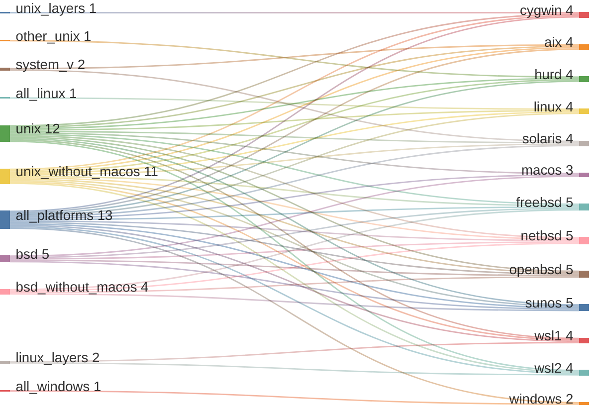
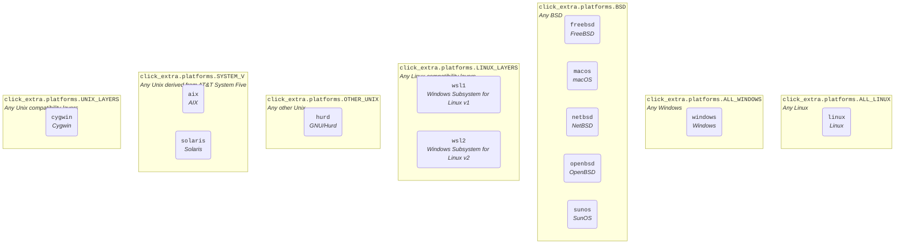
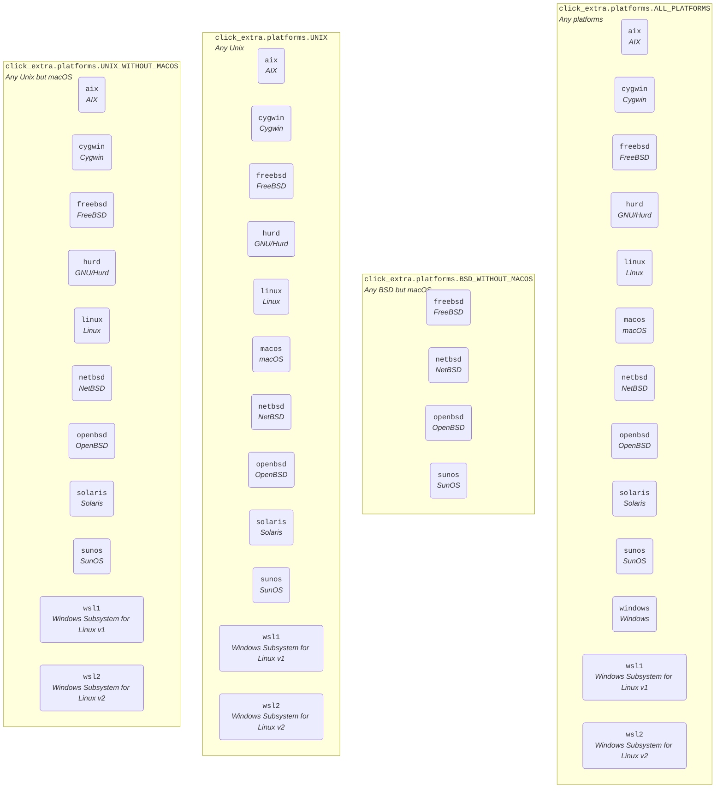

# Platform detection

Relationships between groups and platforms:

<!-- platform-sankey-start -->



<!-- platform-sankey-end -->

## OS families

All platforms are grouped in sets of non-overlpaping families:

<!-- NON_OVERLAPPING_GROUPS-graph-start -->

{caption="`click_extra.platforms.NON_OVERLAPPING_GROUPS` - Non-overlapping groups."}


<!-- NON_OVERLAPPING_GROUPS-graph-end -->

## Other groups

Other groups are available for convenience, but these overlaps:

<!-- EXTRA_GROUPS-graph-start -->

{caption="`click_extra.platforms.EXTRA_GROUPS` - Overlapping groups, defined for convenience."}


<!-- EXTRA_GROUPS-graph-end -->

```{important}
All the graphs above would be better off and user-friendly if merged together. Unfortunately Graphviz is not capable of producing [Euler diagrams](https://xkcd.com/2721/). Only non-overlapping clusters can be rendered.

There's still a chance to [have them supported by Mermaid](https://github.com/mermaid-js/mermaid/issues/2583) so we can switch to that if the feature materialize.
```

## `click_extra.platforms` API

```{eval-rst}
.. autoclasstree:: click_extra.platforms
   :strict:
```

```{eval-rst}
.. automodule:: click_extra.platforms
   :members:
   :undoc-members:
   :show-inheritance:
```
