# {octicon}`device-camera` CLI screenshots

click-extra produces colored terminal output, and inside this Sphinx documentation the [`click:run`](sphinx.md) directive executes each CLI and renders its real output at build time, so these pages need no screenshots. A README on GitHub or PyPI, a slide, a social post or a page of your own cannot run code, and those surfaces need a capture instead. click-extra ships the command that produces one, as an image or as HTML:

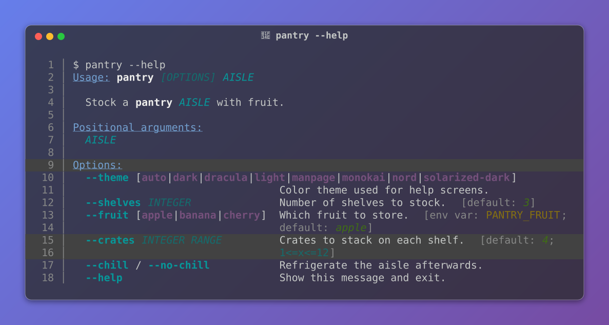

Every part of that window answers to an option: the [terminal it is drawn as](#terminal-presets), the [chrome under its colors](#light-and-dark-chrome), the backdrop, the caption, the line numbers, the transparency, the border, the shadow, the corner radius and the room around it. The [block that produced it](#all-of-it-at-once) sits further down this page, and rewrites the image on every build.

## The `screenshot` command

`click-extra screenshot` runs a CLI, captures its colored output and writes it out. Point it at any command, with `--` separating your CLI's own options from the ones above:

```shell-session
$ click-extra screenshot --output cli-help.svg -- my-cli --help
```

### Two formats, two surfaces

The extension of `--output` picks what gets written, and the two are not interchangeable:

| Format  | Text is                          | Goes where                                                    |
| :------ | :------------------------------- | :------------------------------------------------------------ |
| `.svg`  | a picture                        | a surface that strips inline HTML: a README on GitHub or PyPI |
| `.html` | selectable, searchable, copyable | a page you own: your site, a blog post, a slide deck          |

So the choice is really made for you. GitHub and PyPI render an image and drop inline styling, which leaves a README no option but SVG. Everywhere you control the markup, HTML is the better artifact: a reader can select a flag out of the help screen and paste it into their terminal, and search finds it.

Neither format needs an optional dependency. Both read the same {func}`click_extra.styling.split_ansi` stream: SVG is laid out on a character grid by {func}`click_extra.screenshot.render_svg`, HTML is inline-styled markup from {func}`click_extra.styling.ansi_to_html`.

```shell-session
$ click-extra screenshot --output cli-help.html -- my-cli --help
```

That writes a standalone document. Add `--fragment` to get the bare `<pre>` instead, styled inline so it needs no stylesheet from the page you paste it into.

```{click:run}
from click_extra.cli import demo
result = invoke(demo, args=["screenshot", "--help"])
assert result.exit_code == 0
assert "--columns" in result.stdout
assert "--merge-stderr" in result.stdout
```

Three things it settles that a general-purpose capture tool leaves to you:

- Colors, which a command strips on its own the moment its output is a pipe rather than a terminal. The capture runs under {func}`click_extra.color.forced_color`, setting the `FORCE_COLOR` lever every mainstream color system obeys and clearing any `NO_COLOR` the environment carries.
- Width, where `--columns` pins what the command wraps to *and* what the image is drawn at. Let those two disagree and the rendered lines overrun the image.
- `stderr`, which stays out of the capture unless `--merge-stderr` asks for it. That is what keeps a wrapper's build chatter out of the picture with no shell redirection to remember.

Every SVG it writes also gives each *column* its own offset, rather than padding a line with spaces and leaning on `textLength` to hold the rest of it in place. Written the other way, a column only lands where it belongs if the reader's renderer both honors `textLength` and resolves the font the file names. A web browser does both; `librsvg` (and through it `rsvg-convert` and ImageMagick) ignores `textLength` outright, and a file manager, a git client or a thumbnailer commonly falls back to a proportional font. Either way a gutter paid for in glyphs collapses and the columns slide onto each other. {func}`click_extra.screenshot.column_segments` documents where the cut falls.

Three smaller things travel with that, each one a way a capture used to depend on the reader being a browser:

- **Nothing is fetched.** The text is set in the first family of {data}`click_extra.screenshot.CAPTURE_FONT_STACK` the reader already has, so a capture renders the same offline and on a page that forbids third-party requests.
- **The encoding is declared outright.** A standalone SVG carries no HTTP header to state it, and a reader that assumes the platform's own turns every multi-byte character into mojibake, a full block becoming `â`.
- **Nothing important is left to a stylesheet or a filter.** The terminal text names its face, size and color as attributes as well as in the stylesheet, because a renderer that ignores a `<style>` block would otherwise fall back to a proportional face in default black. And the window's drop shadow is cast by a rectangle of its own rather than by a filter on the window: an element whose filter a renderer cannot resolve is an element *in error*, which the spec answers by not drawing it at all, so a filter hung on the window would take the background and the frame down with it. macOS Finder's thumbnailer and ImageMagick both do exactly that.

### Capturing a CLI that is not yours

`screenshot` runs whatever the shell runs, Click CLI or not, so `git --help` and `docker ps` capture as readily as your own tool. What it captures is what the command prints: a Click CLI that is not built on Click Extra prints its help uncolored, and that is what lands in the file.

To picture it *with* colors, run it through [`wrap`](wrap.md) first, which patches Click's help rendering without touching the target's code. `--wrap` does that for you:

```shell-session
$ click-extra screenshot --output flask-help.svg --wrap -- flask --help
```

which is the shorthand for composing the two commands by hand:

```shell-session
$ click-extra screenshot --output flask-help.svg --prompt "click-extra wrap -- flask --help" -- click-extra wrap -- flask --help
```

The prompt drawn above the output is the `wrap` invocation, not the bare command, because that is what reproduces the colored screen: running `flask --help` on its own gives back the plain one.

```{note}
The two commands stay separate because they answer different questions. `wrap` decides *how a CLI renders*, and only reaches Click commands it can import: a `module:function`, a project directory, a `.py` file, an entry point. `screenshot` decides *where the output goes*, and reaches anything executable. Composing them covers the overlap; merging them would cost every CLI that `wrap` cannot import, which is most of what a README wants to show.

That separation is also why `--wrap` insists on the installed `click-extra` command rather than falling back to `python -m click_extra`: the two resolve a target differently, so the fallback would quietly capture a different CLI.
```

```{note}
HTML carries two limitations SVG does not. An [OSC 8 hyperlink](https://gist.github.com/egmontkob/eb114294efbcd5adb1944c9f3cb5feda) loses its URL and keeps its visible text, and the eight base ANSI colors render as their CSS names, so the browser's palette decides their exact shade rather than the terminal's. Neither shows up on a help screen, which is why the format is worth having anyway.
```

### Width

`--columns` pins the width twice over: the command wraps its output to it, and the image is laid out at the same one. They have to agree, or the rendered lines overrun the picture.

`--columns auto` pins neither. The command finds its own width (the terminal it runs in, or Click's own 80 through a pipe), and the image is laid out at the longest line that came back:

```shell-session
$ click-extra screenshot --output params.svg --columns auto -- my-cli --params
```

Reach for it when the output holds a line the command does not wrap on its own, which a pinned width folds mid-word: a long invocation drawn as the prompt, a wide table, a machine-readable dump. The trade-off is that the picture stops being a fixed-width terminal, so captures meant to sit side by side at the same width should name that width instead.

### Wide glyphs and writing systems

A terminal cell is not a character. A Chinese ideograph, a Hangul syllable, a fullwidth Latin letter and most emoji are each drawn two cells wide, while a combining accent is drawn in none at all. A capture measures its runs in cells, through {func}`click_extra.screenshot.cell_width`, which is the same [`wcwidth`](https://github.com/jquast/wcwidth) measurement click-extra already uses to align [tables](table.md) and the [command tree](commands.md#command-tree).

The CLI below pads with that measurement, so every name lands on column 12 whatever script precedes it:

```{click:source}
from click_extra import command, echo
from click_extra.screenshot import cell_width

FRUITS = (
    ("苹果", "apple"),
    ("バナナ", "banana"),
    ("체리", "cherry"),
    ("ＫＩＷＩ", "kiwi"),
    ("🍎🍌🍒", "basket"),
    ("┌──┬──┐", "crate"),
    ("مشمش", "apricot"),
)

@command
def market():
    """List each fruit beside its name, aligned on a fixed column."""
    for glyphs, name in FRUITS:
        echo(f"{glyphs}{' ' * (12 - cell_width(glyphs))}{name}")
```

```{click:run}
:screenshot: unicode-market-screen
:screenshot-margin: 16
result = invoke(market)
assert result.exit_code == 0
assert "apricot" in result.stdout
```

Size a run by its character count instead and the picture drifts: the seven lines above would land on four different columns, the wide scripts drawn at half their width and stacking on each other. That is [`rich#2742`](https://github.com/Textualize/rich/issues/2742), open upstream since 2023 and one of the reasons this renderer is click-extra's own. The [upstream page](upstream.md#terminal-captures-as-svg) collects the rest.

```{note}
Right-to-left scripts are the case cell arithmetic cannot settle. Arabic and Hebrew are reordered by whoever draws them, and the cursive ones are *shaped*: a letter's form depends on the letters it joins. A run carrying any of them is therefore left to size itself, rather than pinned to an exact width that would pay for the difference in letter spacing and pull the word apart at its joins. The run still starts on its own column, so the grid around it holds; only its own width floats.

Box-drawing and block characters are not letters but *tiles*: a table's rule, a tree's elbow and a gradient's bar are drawn by butting them edge to edge. They are emitted in short groups, each landing on a stated offset, so a font drawing them a fraction of a pixel off the grid cannot accumulate that error across a rule and leave the table's corners missing their own border. What remains is whether two adjacent tiles *join* cleanly, which is the font's business and no renderer's: that one is [`rich#2536`](https://github.com/Textualize/rich/issues/2536), where the answer upstream is that it would take replacing the characters with drawn shapes. click-extra does not do that either.
```

### Light and dark chrome

A capture freezes the colors of the run it pictures, so the window it is drawn in has to answer to the theme that run rendered for. `--background light` swaps the dark chrome for white, along with the ANSI palette the capture's own colors resolve against:

```shell-session
$ click-extra screenshot --output light-help.svg --background light -- my-cli --theme light --help
```

Both halves are needed, and they are not the same half: `--theme light` is what the *CLI* renders with, `--background light` is what the *image* is drawn on. Pass one without the other and you get the washed-out screen the [theme gallery](theme.md#built-in-themes) warns about, in one direction or the other.

The prompt line follows the chrome on its own. It is the one line a capture draws itself rather than collects, so on white it would otherwise land in the dark theme's near-white `invoked_command` style and vanish.

So does a CLI that asks. A capture states its chrome to the command the way a terminal would, through the `CLITHEME` and `COLORFGBG` variables [background detection](theme.md#automatic-background-detection) reads, on top of the width it pins and the colors it forces. A CLI passing [`--theme auto`](theme.md#automatic-background-detection) then renders for the window it lands in, and needs telling only once:

```shell-session
$ click-extra screenshot --output light-help.svg --background light -- my-cli --theme auto --help
```

Here is that at work, on one of click-extra's own help screens. The two images below were shot from the same command line, `--background` apart, and the CLI picked its palette from the terminal each capture claimed to be:

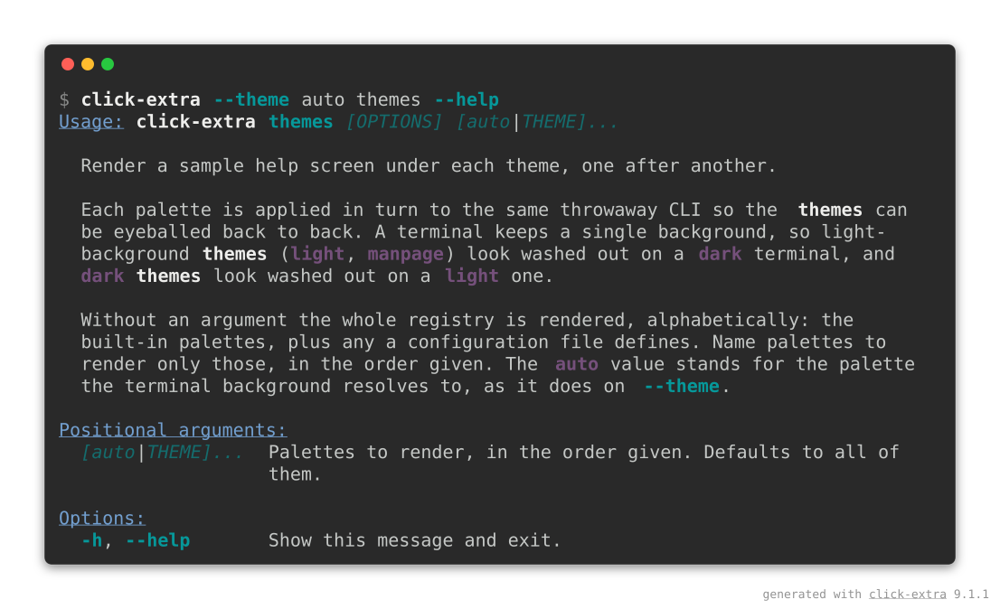

```shell-session
$ click-extra screenshot --output docs/assets/auto-theme-dark-screen.svg --prompt "click-extra --theme auto themes --help" -- uv run --frozen -- click-extra --theme auto themes --help
```

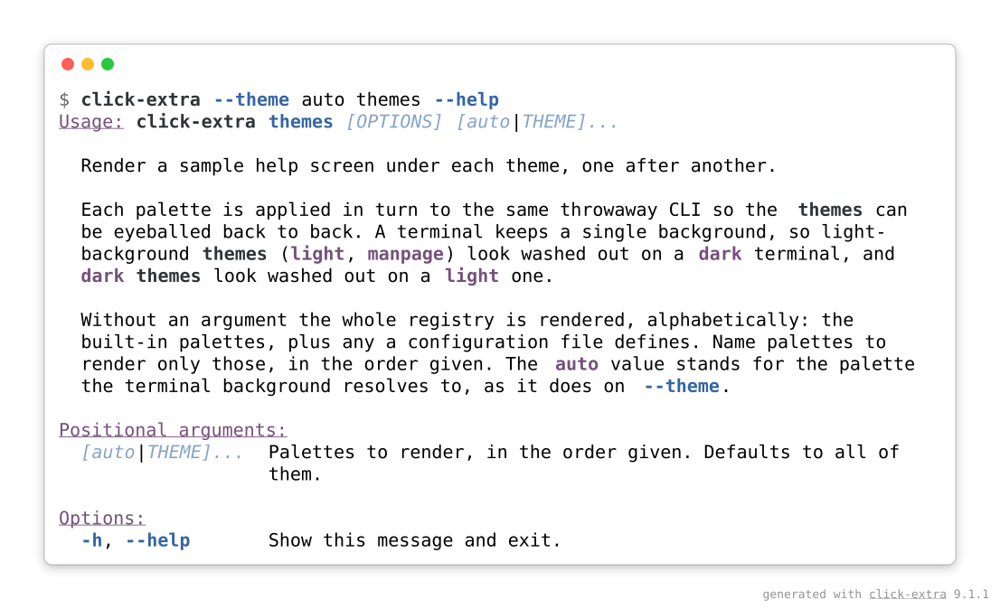

```shell-session
$ click-extra screenshot --output docs/assets/auto-theme-light-screen.svg --background light --prompt "click-extra --theme auto themes --help" -- uv run --frozen -- click-extra --theme auto themes --help
```

`auto` is not the default, and deliberately: a CLI that never asks for it keeps rendering exactly as it does everywhere else, which is why `--theme dark` and `--theme light` are spelled out below rather than left to detection.

Here is one help screen taken both ways, with the CLI's theme and the image's chrome moving together:

```{click:source}
:hide-source:
import click

from click_extra import Choice, IntRange, argument, option, theme_option
from click_extra.commands import ColorizedCommand

@click.command(cls=ColorizedCommand, name="pantry")
@theme_option
@option("--shelves", type=int, default=3, show_default=True,
        help="Number of shelves to stock.")
@option("--fruit", type=Choice(["apple", "banana", "cherry"]), default="apple",
        show_default=True, show_envvar=True, envvar="PANTRY_FRUIT",
        help="Which fruit to store.")
@option("--crates", type=IntRange(1, 12), default=4, show_default=True,
        help="Crates to stack on each shelf.")
@option("--chill/--no-chill", default=True, help="Refrigerate the aisle afterwards.")
@argument("aisle")
def pantry(**kwargs):
    """Stock a pantry AISLE with fruit."""
```

```{click:run}
:screenshot: chrome-dark-screen
:hide-results:
result = invoke(pantry, args=["--theme", "dark", "--help"])
assert result.exit_code == 0
assert "--crates" in result.stdout
```

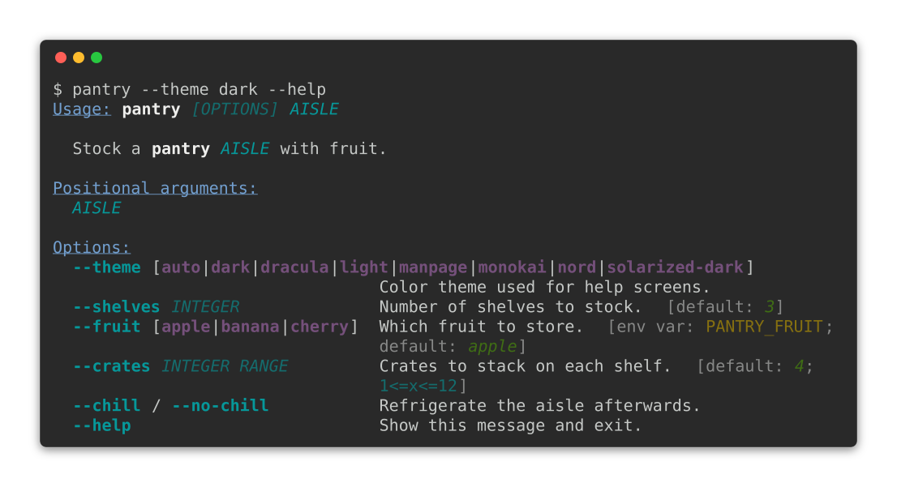

```{click:run}
:screenshot: chrome-light-screen
:screenshot-background: light
:hide-results:
result = invoke(pantry, args=["--theme", "light", "--help"])
assert result.exit_code == 0
assert "--crates" in result.stdout
```

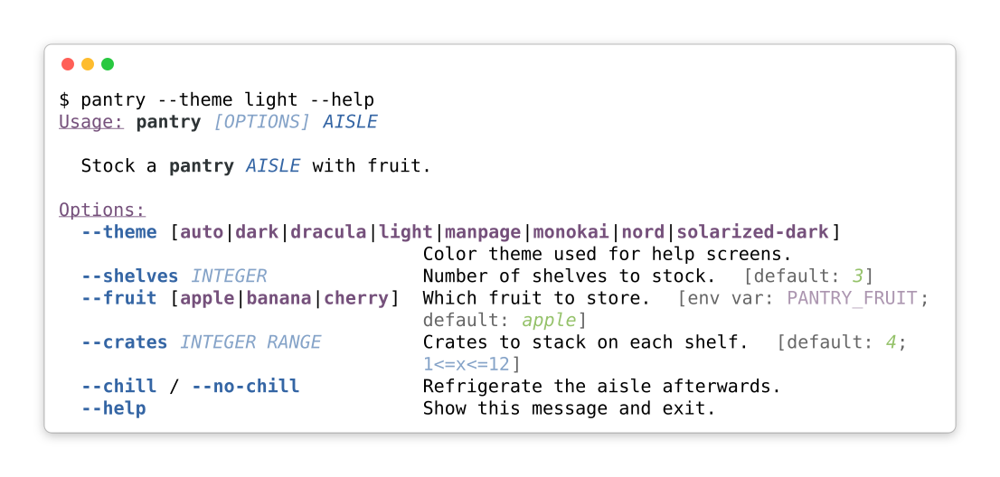

Both blocks hide their results, which is the exception to what [`:screenshot:`](sphinx.md#committed-captures) is usually for: a results block on this page is colored by the site's stylesheet and follows the reader's own theme, so the one thing being compared here is the one thing it cannot show.

### The window itself

A capture is drawn as a terminal window: a rounded rectangle in the chrome's background color, framed with a one-pixel border and lifted off the page by a drop shadow. Every part of that is an option:

```shell-session
$ click-extra screenshot --output shot.svg --title "my-cli --help" --backdrop "#1f6feb" --radius 0 --border-width 2 --margin 28 -- my-cli --help
```

| Option              | Takes      | Default                | Draws                                                                        |
| :------------------ | :--------- | :--------------------- | :--------------------------------------------------------------------------- |
| `--border`          | CSS color  | the chrome's           | The frame around the window. `none` leaves it bare.                          |
| `--border-width`    | pixels     | `1`                    | How thick that frame is.                                                     |
| `--radius`          | pixels     | `8`, or the preset's   | How round the window's corners are. `0` squares them.                        |
| `--shadow`          | CSS color  | the chrome's           | The drop shadow under the window. `none` leaves it flat.                     |
| `--backdrop`        | CSS color  | none                   | A page behind the window, margin included.                                   |
| `--margin`          | pixels     | `48`                   | Transparent space around the window.                                         |
| `--opacity`         | `0` to `1` | `1`                    | How solid the window's body is. Under `1` it lets what is behind it through. |
| `--watermark`       | text       | the click-extra credit | A credit line in the image's bottom-right corner. Empty draws none.          |
| `--watermark-color` | CSS color  | a neutral gray         | The ink that line is drawn in.                                               |
| `--padding`         | pixels     | `8`                    | Space inside it, on top of the renderer's own.                               |
| `--line-numbers`    | flag       | off                    | A dim gutter numbering the captured lines.                                   |
| `--title`           | text       | none                   | A caption centered in the window's title bar.                                |

Two of them carry a default that is not a fixed value but the chrome's own. That is the whole reason they are not constants: a renderer frames its window in a translucent white, and a light capture wearing it is a white window on a white page, its edge left for the reader to infer.

The rest answer to what the capture is *for*. A shadow needs `--margin` to fall into, since a filter paints outside the shape it is applied to and the image's own box cuts whatever lands past it. `--backdrop` fills that same space instead of leaving the page through, which is what turns a capture into a self-contained picture for a slide or a social card. `--radius 0` drops the desktop-window look, for a capture meant to read as a plain block of output.

Both formats take the same set of options ({func}`click_extra.screenshot.render_svg` draws them, {func}`click_extra.screenshot.render_html` translates them), so an HTML capture lands them on the block's `border`, `border-radius`, `box-shadow`, `margin`, `padding` and the page's `background`.

```{tip}
A shadow is an SVG filter. A renderer that skips filters, and a few outside the browser do, still draws the border, so the window keeps an edge either way.
```

#### Gradients

`--backdrop` also takes a CSS gradient, which is what turns a capture into a picture that carries its own page:

```shell-session
$ click-extra screenshot --output card.svg --backdrop "linear-gradient(135deg, #667eea, #764ba2)" -- my-cli --help
```

An SVG `fill` has no syntax for that, so the CSS is read and re-emitted as the paint server SVG does understand ({func}`click_extra.screenshot.gradient_svg`), placed in user space rather than approximated: the gradient line runs through the image's center at the angle asked for, as long as the image measures along it, and a radial one reaches the farthest corner. Understood are `linear-gradient`, opening with an angle (`135deg`) or a side keyword (`to bottom right`), and `radial-gradient`, both followed by two or more color stops, each pinnable at a percentage (`#667eea 30%`). Anything else is taken for the plain color it presumably is, and HTML captures pass the value through to CSS untouched either way.

#### Transparency

`--opacity` thins the window's body out, the way a terminal set to transparency does. Below `1`, whatever the capture sits on comes through it, while its text, frame and title bar keep their own paint:

```shell-session
$ click-extra screenshot --output glass.svg --opacity 0.7 --backdrop "linear-gradient(135deg, #667eea, #764ba2)" -- my-cli --help
```

Over a backdrop it reads as frosted glass, the gradient tinting the terminal instead of stopping at its edge. With no backdrop it is the page that comes through, which is what a capture dropped on a surface you do not control wants: an image holding no opinion on the color behind it. What limits the value is legibility, and that is the reader's screen deciding, not the capture: a body much under half solid hands the text whatever contrast the backdrop happens to have.

An HTML capture thins the block's background color with CSS `color-mix()` rather than a rectangle's fill, so the page it is pasted into shows through the same way.

#### Line numbers

`--line-numbers` draws each line's number in a dim gutter, the way Pygments does inline. Line 1 is the prompt, the invocation everything under it came from:

```shell-session
$ click-extra screenshot --output numbered.svg --line-numbers -- my-cli --help
```

The numbers land in the terminal text rather than in a column of their own, which is the same trade Pygments makes: every renderer places them for free, and a reader copying an HTML capture copies them too.

It also means the gutter spends columns the command already used: a screen wrapped at 80 comes back a few characters too wide, and folds. Pair the flag with [`--columns auto`](#width), or with a width that leaves room for the gutter, so the image grows instead of the lines breaking.

#### The credit line

Every capture the command writes carries a credit in its bottom-right corner, in the margin around the window. Here is one, reading `generated with pantry 1.4.2` because that is what shot it:

```{click:run}
:screenshot: watermark-screen
:screenshot-watermark: generated with pantry 1.4.2
:hide-results:
result = invoke(pantry, args=["--theme", "dark", "--help"])
assert result.exit_code == 0
```

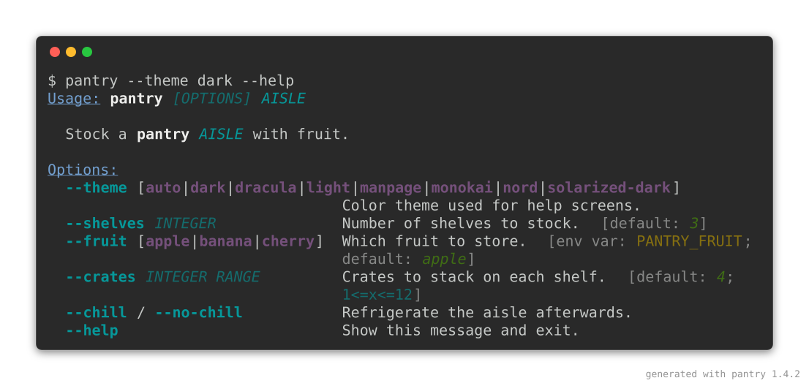

Left alone, the line names click-extra and the release that drew the image, which is what a capture needs once it has travelled: on a slide, in a README or on a social card it is a long way from the page that explains where it came from. `--watermark` replaces the text, and an empty string draws none at all:

```shell-session
$ click-extra screenshot --output shot.svg --watermark "pantry 1.4.2 · example.com" -- my-cli --help
$ click-extra screenshot --output shot.svg --watermark "" -- my-cli --help
```

Crediting your own project rather than the tool that drew it is the expected case, not an exception. Set it once in your [configuration file](#stating-a-default-once) and every capture carries it.

The mark is the one thing in a capture drawn outside the window, so it is also the one paint that cannot answer to the chrome: the margin is transparent, and what sits behind it is a page this command never sees. Hence a neutral gray, which reads on a white README and a dark one alike, and `--watermark-color` for a capture whose backdrop it has to sit on.

A capture written by a [`click:run` block](sphinx.md#committed-captures) carries none of this by default. That image is regenerated and committed on every documentation build, so a release number in it would rewrite every asset the day the release changes, and the page around it already says what drew it. `:screenshot-watermark:`, or the `click_extra_screenshot_watermark` `conf.py` value, turns it on for a project that wants it anyway.

#### All of it at once

Here is the `pantry` screen again, on a gradient, captioned, numbered, rounded, given room to breathe, and left see-through enough for the gradient to tint it. The second tab is the block that wrote it, options and assertions included:

```{click:run}
:screenshot: styled-window-screen
:screenshot-columns: auto
:screenshot-title: 🍎 pantry --help
:screenshot-backdrop: 'linear-gradient(135deg, #667eea, #764ba2)'
:screenshot-line-numbers:
:screenshot-opacity: 0.75
:screenshot-radius: 12
:screenshot-padding: 24
:hide-results:
result = invoke(pantry, args=["--help"])
assert result.exit_code == 0
assert "--crates" in result.stdout
```

``````{tab-set}
`````{tab-item} Captured image
:sync: captured-image

`````

`````{tab-item} The block behind it
:sync: block-source
````{code-block} markdown
```{click:run}
:screenshot: styled-window-screen
:screenshot-columns: auto
:screenshot-title: 🍎 pantry --help
:screenshot-backdrop: 'linear-gradient(135deg, #667eea, #764ba2)'
:screenshot-line-numbers:
:screenshot-opacity: 0.75
:screenshot-radius: 12
:screenshot-padding: 24
:hide-results:
result = invoke(pantry, args=["--help"])
assert result.exit_code == 0
assert "--crates" in result.stdout
```
````

A caption takes any text a terminal can draw, emoji included. `:hide-results:` is this page's own choice, the window being the thing on show here: leave it out and the block renders its live text below the fence as well.
`````
``````

### Terminal presets

A capture is a picture of a terminal, and terminals do not look alike. `--preset` draws one as a named desktop's:

```shell-session
$ click-extra screenshot --output shot.svg --preset windows -- my-cli --help
```

Each preset carries the four things that make a terminal recognizable: its window decorations, the palette its colors resolve against, the font it ships with, and the sigil its usual shell prompts with. Anything stated alongside wins, so `--preset windows --radius 8` rounds the corners Windows squares.

A preset also paints the strip its buttons and caption sit in, a shade off the terminal's own background, because that strip belongs to the desktop rather than to the terminal. Which is what makes the fourth preset the odd one out: `plain` mimics no desktop, wears no buttons, and drops the strip entirely unless a `--title` gives it something to hold.

``````{tab-set}
`````{tab-item} macos
:sync: preset-macos
```{click:run}
:screenshot: preset-macos-screen
:screenshot-preset: macos
:hide-results:
result = invoke(pantry, args=["--theme", "dark", "--help"])
assert result.exit_code == 0
```

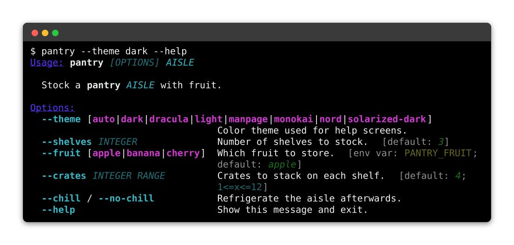

Round buttons on the left, Apple's `Pro` and `Basic` palettes, SF Mono, and a `$` prompt.
`````

`````{tab-item} windows
:sync: preset-windows
```{click:run}
:screenshot: preset-windows-screen
:screenshot-preset: windows
:hide-results:
result = invoke(pantry, args=["--theme", "dark", "--help"])
assert result.exit_code == 0
```

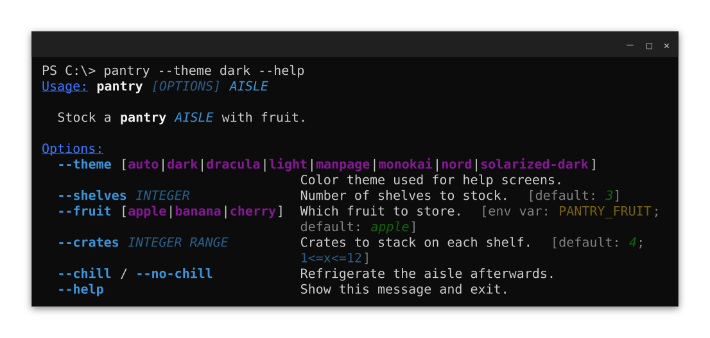

Minimize, maximize and close on the right, square corners, the `Campbell` and `One Half Light` schemes, Cascadia Code, and a `PS C:\>` prompt.
`````

`````{tab-item} linux
:sync: preset-linux
```{click:run}
:screenshot: preset-linux-screen
:screenshot-preset: linux
:hide-results:
result = invoke(pantry, args=["--theme", "dark", "--help"])
assert result.exit_code == 0
```

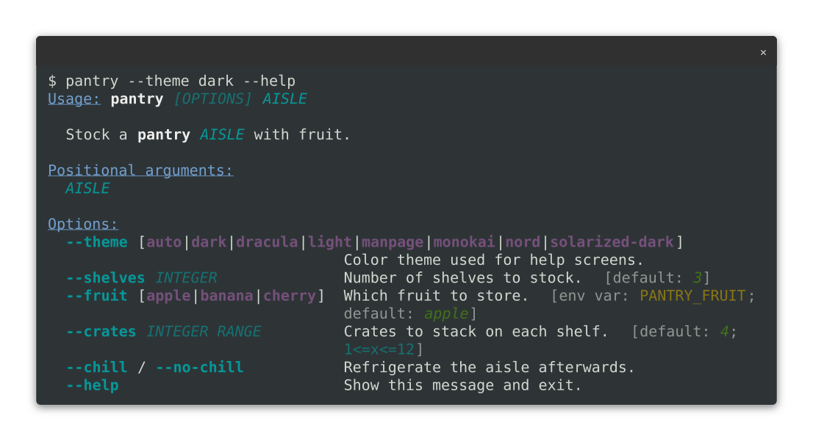

A single close button, the Tango palette GNOME Terminal ships, Ubuntu Mono, and a `$` prompt.
`````

`````{tab-item} plain
:sync: preset-plain
```{click:run}
:screenshot: preset-plain-screen
:screenshot-preset: plain
:hide-results:
result = invoke(pantry, args=["--theme", "dark", "--help"])
assert result.exit_code == 0
```

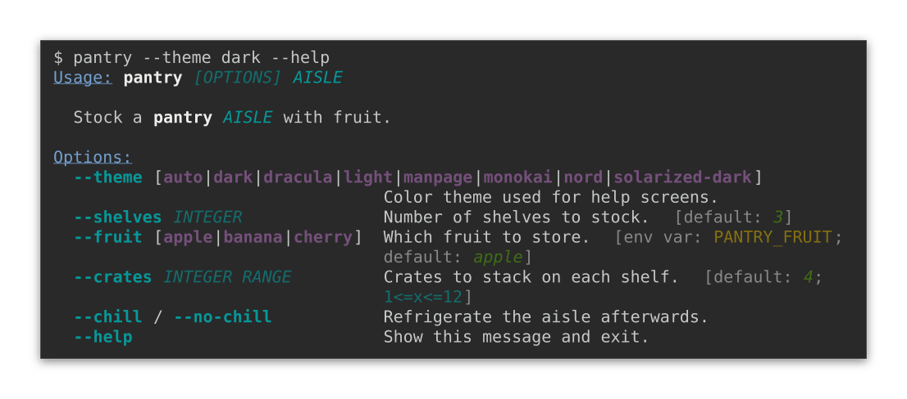

No buttons, no rounded corners, no title bar: for a capture that has to read as a block of output rather than as a window, on a slide or in a paper.
`````
``````

```{caution}
A preset's palette is the scheme its terminal *ships with*, not the one your reader has configured theirs to. It also decides how the captured CLI's own colors land: a screen rendered for a dark theme on a light preset washes out exactly as [the chrome section](#light-and-dark-chrome) describes, since the two halves have to agree either way.
```

### Animated captures

An SVG capture can hold more than one frame. Pass `frames` a sequence of captured texts and `interval` how long each is shown: the window, its caption and its clip path are drawn once, and every frame is stacked inside them.

```python
from pathlib import Path

from click_extra.screenshot import render_svg
from click_extra.spinner_presets import SPINNERS
from click_extra.styling import Style

preset = SPINNERS["moon"]
lemon = Style(fg="#f1fa8c")
Path("brewing.svg").write_text(
    render_svg(
        columns=34,
        title="brewing",
        unique_id="brewing",
        frames=[lemon(f"{frame}  brewing tea…") for frame in preset.frames],
        interval=preset.interval,
    ),
    encoding="utf-8",
)
```

One number for `interval` times every frame alike, which is what a spinner asks for. A sequence gives each frame its own, which is what a recording asks for.

Because the frames differ in nothing but their text, one stylesheet covers the lot: a color two frames share is written as a single rule, and no frame can name a class the document leaves undefined. Everything is namespaced by `unique_id`, keyframes included, so two animations inlined into one page keep their own timing instead of the shorter one running on the longer one's clock.

A row drawn the same in every frame is drawn once, outside them, and only the rows that actually move are copied per frame. A spinner moves its one line, so nothing is shared and the picture is the same either way. A recording of a screen where one line advances under twenty that do not is where this tells: those twenty are written once instead of once per frame, which on a ten-frame recording is around 80% of the file.

One frame stays visible wherever the animation does not run, and the rest carry `visibility="hidden"` as a presentation attribute rather than as a rule. That covers three readers at once: a viewer that speaks no CSS animation, one that ignores the stylesheet altogether and would otherwise draw every frame stacked on the last, and a reader whose system asks for reduced motion, which the capture honors by keeping every animation rule behind a [`prefers-reduced-motion`](https://developer.mozilla.org/en-US/docs/Web/CSS/@media/prefers-reduced-motion) guard.

A recorded animation also **pauses on its last frame** and then **closes on an empty beat**, two seconds and six tenths by default. An animation that ends somewhere is usually there for the end (a trail filled in, a bar run out, an outcome landed), and a loop restarting the instant it arrives gives a reader no time to read any of it. The empty beat then says plainly that this is where the loop comes round, rather than leaving the jump back to the first frame to read as the command doing something strange.

Three knobs state all of it, on `render_svg` and on a documentation block alike:

| `render_svg` | Directive             | What it sets                                                     |
| :----------- | :-------------------- | :--------------------------------------------------------------- |
| `hold`       | `:screenshot-hold:`   | Extra seconds on the last frame.                                 |
| `blank`      | `:screenshot-blank:`  | Seconds of empty screen closing the cycle.                       |
| `speed`      | `:screenshot-speed:`  | How much faster to play than recorded: `2` halves every frame.   |

`speed` scales the replay only. The two pauses are stated in real seconds and are left alone, being how long a reader is given rather than part of what is replayed. A declared spinner cycles in place and ends nowhere, so it holds and blanks for nothing unless a page asks.

The frame left visible is the **last** one. An animation that accumulates says most once it has finished: a trail filled up, a bar advanced, an outcome landed. A spinner cycling in place reads the same whichever frame is picked, so nothing is lost there. An animated capture is therefore always a still as well, and never a blank rectangle.

### Recording an animation

The frames above were declared. They can also be *recorded*, from a command that draws them.

This is the one thing a pipe cannot capture. A spinner asks whether its stream is a terminal and stays silent when it is not, so a command run the ordinary way prints its result and none of the frames leading to it. Forcing color through the environment does not help, because that answers a different question.

For a spinner this process hosts, hand it a `ScreenRecorder`. It answers that question in the affirmative without being a terminal, so no pseudo-terminal is involved and it works on every platform:

```python
from click_extra import SPINNERS, Spinner
from click_extra.recording import ScreenRecorder

recorder = ScreenRecorder()
with Spinner("Brewing tea", spinner=SPINNERS["moon"], stream=recorder):
    steep()
frames = recorder.frames()
```

For a command this process does not host, `record_command` runs it under a pseudo-terminal and reads both its output and its errors, the spinner drawing on the latter:

```python
from click_extra.recording import record_command

frames = record_command(("kettle", "boil", "--slowly"), columns=60, duration=5.0)
```

That path is Unix only: a pseudo-terminal is `termios` and `pty`, neither of which Windows ships, and reaching ConPTY would mean a dependency. The in-process recorder above covers Windows.

Each `Frame` carries the screen it held and how long it held it, so `render_svg` takes them directly:

```python
render_svg(
    columns=60,
    frames=[frame.text for frame in frames],
    interval=[frame.duration for frame in frames],
)
```

```{caution}
A recording is timed by the wall clock, so the same command records slightly different durations every run. That is fine for a one-off image, and a problem for a committed one that is rewritten on every build: see [keeping a recording committable](#keeping-a-recording-committable).
```

### Keeping a recording committable

A committed capture is rewritten on every build, which is what keeps it from drifting away from the CLI. A recording cannot live that way, and not because of its timings: **which spinner glyph pairs with which screen is settled by the scheduler**, so the same command records a different set of frames every other run. Rounding the durations with `quantize` settles the jitter and cannot touch that.

So a recording is written once and then kept. `:screenshot-record:` writes the asset the first time and leaves it alone afterwards, and does not even evaluate its expression once the file exists, which keeps the command it records off every later build's clock. To take a fresh recording, delete the file and build again.

An animated capture states what it is on a line beside its generator tag, which is how a recording says what it pictures:

```xml
<!-- @generated by Click Extra 9.0.0 -->
<!-- @recording frames=49 period=6.57s digest=2b5a410759b29890 -->
```

The digest covers the frames a cycle holds and the beat it holds them on, not their order or their count.

```{caution}
Written once means frozen: nothing re-checks a recording against the code it pictures, so it rots the way any hand-made screenshot does. A declared animation has no such problem, being composed rather than timed, and is regenerated on every build like every other capture.
```

### Stating a default once

`screenshot` is itself a Click Extra CLI, so every option above is also a configuration key. A project drawing all of its captures the same way says so once, in the `pyproject.toml` [click-extra finds by walking up from the working directory](config.md#pyproject-toml):

```toml
[tool.click-extra.screenshot]
preset = "macos"
margin = 64
opacity = 0.85
watermark = "pantry 1.4.2 · example.com"
```

Any [dedicated configuration file](config.md) does the same under a `[click-extra.screenshot]`{l=toml} table. A flag on the command line still wins over both, following the [usual precedence](config.md#precedence), so a single capture can break the house style without editing anything.

Inside a Sphinx documentation the captures are written by [`click:run` blocks](sphinx.md#committed-captures) rather than by the command, so the same wish is a `conf.py` value:

```python
click_extra_screenshot_preset = "macos"
```

It covers every block whose `:screenshot:` names no preset of its own, which leaves `:screenshot-preset:` for the pages that mean to depart from it. A project keeping its settings in one place can read the value back out of its `pyproject.toml`, `conf.py` being Python:

```python
import tomllib
from pathlib import Path

pyproject = tomllib.loads(Path("../pyproject.toml").read_text(encoding="utf-8"))
click_extra_screenshot_preset = pyproject["tool"]["click-extra"]["screenshot"]["preset"]
```

### The captures on this page

Here is the command turned on click-extra itself, whose [bundled CLI](cli.md) doubles as a live demo of the rendering features. Each image below was produced by the line printed under it, run from a checkout.

`gradient` puts 24-bit ramps next to their 256-color quantized equivalents, so the stepping the smaller palette introduces is there to see:

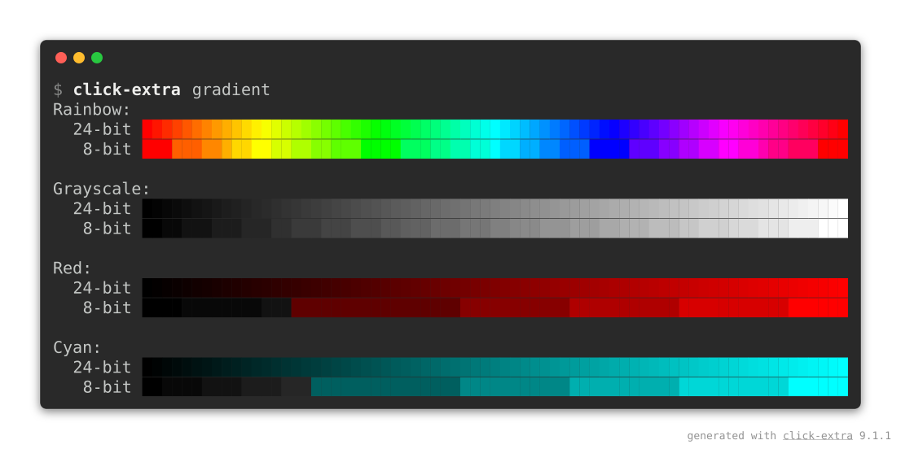

```shell-session
$ click-extra screenshot --output docs/assets/color-gradient-screen.svg --prompt "click-extra gradient" -- uv run --frozen -- click-extra gradient
```

`styles` crosses every color with every text style. Its table wants far more than 80 columns, so the capture is taken at the width it actually needs:

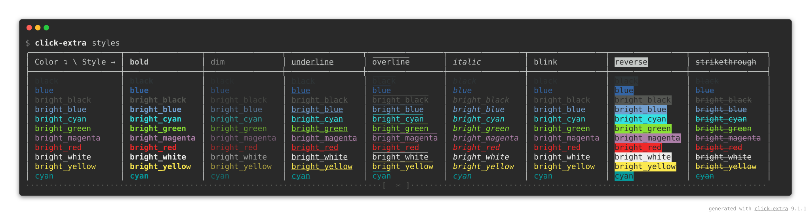

```shell-session
$ click-extra screenshot --output docs/assets/text-styles-screen.svg --columns 160 --head 14 --prompt "click-extra styles" -- uv run --frozen -- click-extra styles
```

`themes` renders a sample help screen under each built-in palette, and this capture keeps the first two of them, which is what `--theme` does to a screen:

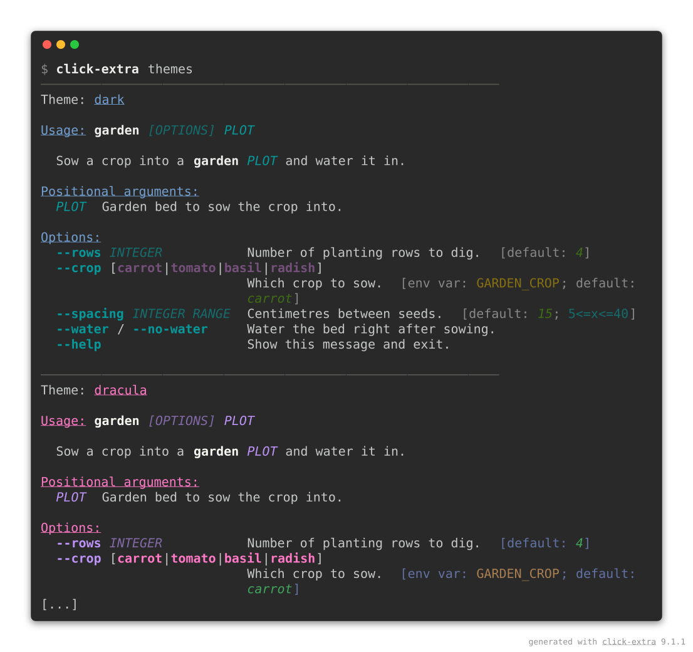

```shell-session
$ click-extra screenshot --output docs/assets/theme-gallery-screen.svg --head 34 --prompt "click-extra themes" -- uv run --frozen -- click-extra themes
```

`--prompt` is what makes each image show the bare `click-extra …` a reader would type, while `uv run --frozen --` is what actually ran: the plumbing that reaches a checkout's copy of the CLI is not worth picturing. `--head` bounds the two long ones, and the `[...]` marker admits that the rest was cut.

The before/after pair opening the [readme](https://github.com/kdeldycke/click-extra#example) takes the other route. Those two screens already exist as live [`click:run`](sphinx.md#committed-captures) blocks in the [tutorial](tutorial.md), so rather than shoot them again, the blocks maintain them: a `:screenshot:` option writes each image on every documentation build, which is what keeps the readme's front page in step with the code nobody thought to re-check.

Reach for the command when the CLI you want to picture has no live block, and for the directive when it does.

Whichever route, a full click-extra help screen carries `--table-format`, whose choice list is a single 463-character line. Click never wraps an option's own term, so the renderer folds it across six rows, exactly as a terminal would.

### Keeping a capture honest

Once committed, an image goes stale the first time the CLI's help changes, and nothing about it complains. `tests/test_screenshots.py` reads the SVG back, rebuilds the terminal text from the glyph coordinates, and compares it to what the command prints today, failing on the first line that diverged. Re-running the command above is then all it takes to refresh the picture.

## GitHub integration

A README can track the reader's theme. Capture the same screen twice, once per [chrome](#light-and-dark-chrome), with the CLI's own theme moving along:

```shell-session
$ click-extra screenshot --output docs/assets/help-dark.svg -- my-cli --theme dark --help
$ click-extra screenshot --output docs/assets/help-light.svg --background light -- my-cli --theme light --help
```

Then hand both to a `<picture>` element, which GitHub renders in a README and which picks between them on `prefers-color-scheme`:

```html
<picture>
 <source media="(prefers-color-scheme: dark)" srcset="https://raw.githubusercontent.com/me/my-cli/main/docs/assets/help-dark.svg"/>
 
</picture>
```

The `` is not a spare tyre: it is what every surface without the switch shows, PyPI and most editors' previews included, so it holds the capture that reads on the light background those default to. The `<source>` is the one a reader in dark mode gets instead.

Both URLs are absolute on purpose. A README is read on PyPI and in a hundred forks of the page, none of which resolve a repository-relative path, which is why every capture in [this project's own README](https://github.com/kdeldycke/click-extra#documentation-tooling) is addressed through `raw.githubusercontent.com`.

```{note}
The switch keys on the *browser's* color scheme, not on the theme toggle of a documentation site, so it belongs to a README rather than to these pages: Furo's own switch would leave it unmoved.
```

## `click_extra.screenshot` API

```{eval-rst}
.. automodule:: click_extra.screenshot
   :no-index:
   :members:
   :show-inheritance:
   :undoc-members:
```

## `click_extra.screenshot_presets` API

```{eval-rst}
.. automodule:: click_extra.screenshot_presets
   :no-index:
   :members:
   :show-inheritance:
   :undoc-members:
```
