# {octicon}`device-camera` CLI screenshots

You can produce this screenshot of a `git diff`:

```{python:render}
import subprocess
import sys
from pathlib import Path
from tempfile import TemporaryDirectory

# The picture opening this page, shot from the command printed beneath it. Two
# throwaway files give `git` something to compare, and running it in their own
# directory is what keeps the paths it prints short enough to read.
BEFORE = "apples: 3\nbananas: 6\ncherries: 12\nplums: 4\n"
AFTER = "apples: 5\nbananas: 6\ncherries: 12\nfigs: 2\n"
target = Path(__srcdir__) / "assets" / "git-diff-screen.svg"
with TemporaryDirectory() as basket:
    Path(basket, "basket.txt").write_text(BEFORE, encoding="utf-8")
    Path(basket, "basket.new.txt").write_text(AFTER, encoding="utf-8")
    subprocess.run(
        (
            sys.executable,
            "-m",
            "click_extra",
            "screenshot",
            "--output",
            str(target),
            "--preset",
            "macos",
            "--",
            "git",
            "diff",
            "--color=always",
            "--no-index",
            "basket.txt",
            "basket.new.txt",
        ),
        cwd=basket,
        check=True,
        capture_output=True,
    )
```

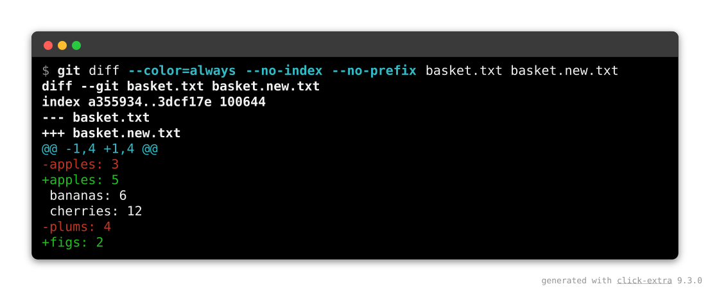

By invoking `click-extra screenshot` in your terminal, without installing it:

```shell-session
$ uvx click-extra screenshot --output git-diff.svg --preset macos -- git diff --color=always --no-index basket.txt basket.new.txt
```

The screenshot is written to an SVG file, where:

- `--output git-diff.svg` names the file to write.
- `--preset macos` sets the window's chrome to the macOS style.
- `--` separates those options from the command to capture.
- `--color=always` keeps `git` printing colors even though its output is a pipe.
- `--no-index` lets `git diff` compare two plain files instead of a repository.

## Capture a command

### The `screenshot` command

`click-extra screenshot` runs a command and writes its colored output to a file. Use `--` to separate the screenshot options from the command's own options:

```shell-session
$ click-extra screenshot --output cli-help.svg -- my-cli --help
```

```{click:run}
from click_extra.cli import demo
result = invoke(demo, args=["screenshot", "--help"])
assert result.exit_code == 0
assert "--columns" in result.stdout
assert "--merge-stderr" in result.stdout
```

It settles three things a general capture tool leaves to you:

- Colors. A command strips colors as soon as its output is a pipe. The capture runs under {func}`click_extra.color.forced_color`, which sets `FORCE_COLOR` and clears any `NO_COLOR` in the environment.
- Width. `--columns` sets what the command wraps to *and* what the image is drawn at. If the two disagree, the rendered lines overrun the image.
- `stderr`. It stays out of the capture unless `--merge-stderr` asks for it, which keeps a wrapper's build chatter out of the picture.

### SVG or HTML

The extension of `--output` selects the format:

| Format  | Text is                          | Goes where                                                    |
| :------ | :------------------------------- | :------------------------------------------------------------ |
| `.svg`  | a picture                        | a surface that strips inline HTML: a README on GitHub or PyPI |
| `.html` | selectable, searchable, copyable | a page you own: your site, a blog post, a slide deck          |

GitHub and PyPI render SVG as an image and strip inline styling, so a README needs SVG, and the capture's text becomes pixels there: no page search, no copy. Where you control the markup, HTML keeps the text as text, so a reader can find a flag with the page's own search and copy it straight into a terminal.

Neither format needs an optional dependency.

```shell-session
$ click-extra screenshot --output cli-help.html -- my-cli --help
```

That writes a standalone document. Add `--fragment` to get a bare `<pre>` with inline styles, so it needs no stylesheet.

```{tip}
An SVG capture needs no web font and no HTTP request to render, and it looks the same in a browser, a file manager, a git client and a thumbnailer.
```

```{note}
HTML has two limitations SVG does not. An [OSC 8 hyperlink](https://gist.github.com/egmontkob/eb114294efbcd5adb1944c9f3cb5feda) loses its URL and keeps its visible text. The eight base ANSI colors render as their CSS names, so the browser's palette decides their shade, not the terminal's. Neither shows up on a help screen, which is why the format is worth having anyway.
```

### Straight to the terminal

`--output -` draws no window and prints the captured escape sequences, so you can see what a capture holds before committing it to a file. `--output shot.ansi` writes the same thing out.

```shell-session
$ click-extra screenshot --output - -- my-cli --help
```

The escapes are dropped when the destination turns out to be a pipe, unless `--color=always` keeps them. Nothing describing a window applies here, so the frame, the chrome and the credit line are all ignored.

```{seealso}
To picture source code instead of a command's output, see [code snippets](snippets.md). Both are drawn in the same window, and the whole styling vocabulary below applies to either.
```

### Any command, any CLI

`screenshot` runs anything the shell runs, Click CLI or not. `git --help` and `docker ps` capture as readily as your own tool. The file holds exactly what the command prints, so a Click CLI not built on Click Extra lands in it uncolored.

To capture it *with* colors, run it through [`wrap`](wrap.md) first. `wrap` patches Click's help rendering without touching the target's code. `--wrap` does that for you:

```shell-session
$ click-extra screenshot --output flask-help.svg --wrap -- flask --help
```

This is shorthand for composing the two commands by hand:

```shell-session
$ click-extra screenshot --output flask-help.svg --prompt "click-extra wrap -- flask --help" -- click-extra wrap -- flask --help
```

The prompt line shows the `wrap` invocation, not the bare command. The `wrap` invocation is what reproduces the colored screen: `flask --help` on its own prints the plain one.

`--prompt` also stands on its own. It draws its text as the command line above the output. Use it when the invocation you ran is not the one the reader should type.

```{note}
`wrap` decides *how a CLI renders*, and reaches only the Click commands it can import. `screenshot` decides *where the output goes*, and reaches anything executable. Composing the two covers the overlap. This is also why `--wrap` insists on the installed `click-extra` command rather than falling back to `python -m click_extra`: the two resolve a target differently, so the fallback would quietly capture a different CLI.
```

## Style the capture

### Width

`--columns` pins the width twice: the command wraps its output to it, and the image is laid out at the same width. The two must agree, or the rendered lines overrun the picture.

`--columns auto` pins neither. The command finds its own width (the terminal it runs in, or Click's default of 80 through a pipe). The image is laid out at the longest line that came back:

```shell-session
$ click-extra screenshot --output params.svg --columns auto -- my-cli --params
```

Use it when the output holds a line the command does not wrap on its own: a long invocation drawn as the prompt, a wide table, a machine-readable dump. A pinned width folds such a line mid-word. The trade-off: the picture stops being a fixed-width terminal, so captures meant to sit side by side should name a width instead.

### A long invocation

The prompt is a line like any other, so it counts toward the picture's width. A script passed inline is the usual cause: the command line ends up longer than anything it prints. `--columns auto` then lays the image out at the invocation instead of at the output, and a pinned width folds that invocation across several rows.

`--prompt` settles it. It states the line a reader would type, in place of the one that ran:

```shell-session
$ click-extra screenshot --output market.svg --prompt "python market.py" -- python -c 'print("苹果    apple")'
```

Only the drawn line changes. The capture still holds what the inline script printed, so the image is laid out at that output alone. This is the same option [a foreign CLI](#any-command-any-cli) uses to hide the wrapper it was reached through.

Each argument is quoted as a shell needs it, so the drawn line pastes back as the command it pictures. An argument holding a space stays one argument, rather than spilling into the line as several.

`--prompt ""` draws no prompt at all. Reach for it when the prose around the capture already carries the command. A documentation block spells that one [`:hide-prompt:`](sphinx.md#hiding-the-prompt).

### Light and dark chrome

A capture freezes the colors of the run it shows, so the window must match the theme that run rendered for. `--background light` swaps the dark chrome for white, along with the ANSI palette the capture's colors resolve against:

```shell-session
$ click-extra screenshot --output light-help.svg --background light -- my-cli --theme light --help
```

Both halves are needed, and they are different halves: `--theme light` is what the *CLI* renders with, `--background light` is what the *image* is drawn on. Pass one without the other and you get the washed-out screen the [theme gallery](theme.md#built-in-themes) warns about.

The prompt line follows the chrome on its own. It is the one line a capture draws rather than collects, so on white it would otherwise vanish in the dark theme's near-white `invoked_command` style.

A CLI that asks gets the same answer. A capture states its chrome to the command the way a terminal would, through the `CLITHEME` and `COLORFGBG` variables that [background detection](theme.md#automatic-background-detection) reads. A CLI with [`--theme auto`](theme.md#automatic-background-detection) then renders for the window it lands in:

```shell-session
$ click-extra screenshot --output light-help.svg --background light -- my-cli --theme auto --help
```

Here is that at work on one of click-extra's own help screens. The two images below came from the same command line, `--background` apart. The CLI picked its palette from the terminal each capture claimed to be:


```shell-session
$ click-extra screenshot --output docs/assets/auto-theme-dark-screen.svg --prompt "click-extra --theme auto themes --help" -- uv run --frozen -- click-extra --theme auto themes --help
```


```shell-session
$ click-extra screenshot --output docs/assets/auto-theme-light-screen.svg --background light --prompt "click-extra --theme auto themes --help" -- uv run --frozen -- click-extra --theme auto themes --help
```

`auto` is not the default, on purpose. A CLI that never asks for it keeps rendering exactly as it does everywhere else. That is why the examples below spell out `--theme dark` and `--theme light` rather than rely on detection.

Here is one help screen taken both ways, with the CLI's theme and the image's chrome moving together:

```{click:source}
:hide-source:
import click

from click_extra import Choice, IntRange, argument, option, theme_option
from click_extra.commands import ColorizedCommand

@click.command(cls=ColorizedCommand, name="pantry")
@theme_option
@option("--shelves", type=int, default=3, show_default=True,
        help="Number of shelves to stock.")
@option("--fruit", type=Choice(["apple", "banana", "cherry"]), default="apple",
        show_default=True, show_envvar=True, envvar="PANTRY_FRUIT",
        help="Which fruit to store.")
@option("--crates", type=IntRange(1, 12), default=4, show_default=True,
        help="Crates to stack on each shelf.")
@option("--chill/--no-chill", default=True, help="Refrigerate the aisle afterwards.")
@argument("aisle")
def pantry(**kwargs):
    """Stock a pantry AISLE with fruit."""
```

```{click:run}
:screenshot: chrome-dark-screen
:hide-results:
result = invoke(pantry, args=["--theme", "dark", "--help"])
assert result.exit_code == 0
assert "--crates" in result.stdout
```


```{click:run}
:screenshot: chrome-light-screen
:screenshot-background: light
:hide-results:
result = invoke(pantry, args=["--theme", "light", "--help"])
assert result.exit_code == 0
assert "--crates" in result.stdout
```


Both blocks hide their results, an exception to what [`:screenshot:`](sphinx.md#committed-captures) is usually for. A results block on this page takes its colors from the site's stylesheet and follows the reader's own theme, so it cannot show the one thing being compared here.

### The window

A capture is drawn as a terminal window: a rounded rectangle, framed with a border and lifted off the page by a drop shadow. Every part of it is an option:

```shell-session
$ click-extra screenshot --output shot.svg --title "my-cli --help" --backdrop "#1f6feb" --radius 0 --border-width 2 --margin 28 -- my-cli --help
```

| Option              | Takes      | Default                | Draws                                                                        |
| :------------------ | :--------- | :--------------------- | :--------------------------------------------------------------------------- |
| `--border`          | CSS color  | the chrome's           | The frame around the window. `none` leaves it bare.                          |
| `--border-width`    | pixels     | `1`                    | How thick that frame is.                                                     |
| `--radius`          | pixels     | `8`, or the preset's   | How round the window's corners are. `0` squares them.                        |
| `--shadow`          | CSS color  | the chrome's           | The drop shadow under the window. `none` leaves it flat.                     |
| `--backdrop`        | CSS color  | none                   | A page behind the window, margin included.                                   |
| `--margin`          | pixels     | `48`                   | Transparent space around the window.                                         |
| `--opacity`         | `0` to `1` | `1`                    | How solid the window's body is. Under `1` it lets what is behind it through. |
| `--watermark`       | text       | the click-extra credit | A credit line in the image's bottom-right corner. Empty draws none.          |
| `--watermark-color` | CSS color  | a neutral gray         | The ink that line is drawn in.                                               |
| `--padding`         | pixels     | `8`                    | Space inside it, on top of the renderer's own.                               |
| `--line-numbers`    | flag       | off                    | A dim gutter numbering the captured lines.                                   |
| `--title`           | text       | none                   | A caption centered in the window's title bar.                                |

Two of them default to the chrome's own value rather than a fixed one. That is why they are not constants: a fixed translucent white would make a light capture a white window on a white page, with no visible edge.

The rest depend on what the capture is *for*. A shadow needs `--margin` to fall into, because the image's own box cuts whatever lands past it. `--backdrop` fills that same space instead of leaving it transparent, which turns a capture into a self-contained picture for a slide or a social card. `--radius 0` drops the desktop-window look, for a capture meant to read as a plain block of output.

Both formats take the same options. An HTML capture lands them on the block's `border`, `border-radius`, `box-shadow`, `margin`, `padding` and the page's `background`.

```{tip}
A shadow is an SVG filter. Some renderers skip filters, but they still draw the border, so the window keeps an edge either way.
```

#### Gradients

`--backdrop` also takes a CSS gradient, which gives a capture its own page:

```shell-session
$ click-extra screenshot --output card.svg --backdrop "linear-gradient(135deg, #667eea, #764ba2)" -- my-cli --help
```

Understood are `linear-gradient`, opening with an angle (`135deg`) or a side keyword (`to bottom right`), and `radial-gradient`. Both take two or more color stops, each pinnable at a percentage (`#667eea 30%`). Anything else is treated as a plain color. HTML captures pass the value through to CSS untouched.

#### Transparency

`--opacity` makes the window's body translucent, the way a terminal set to transparency does. Below `1`, whatever sits behind the capture shows through, while its text, frame and title bar keep their own paint:

```shell-session
$ click-extra screenshot --output glass.svg --opacity 0.7 --backdrop "linear-gradient(135deg, #667eea, #764ba2)" -- my-cli --help
```

Over a backdrop it reads as frosted glass: the gradient tints the terminal instead of stopping at its edge. With no backdrop, the page shows through, which is what a capture dropped on a surface you do not control wants. What limits the value is legibility: a body much under half solid gives the text whatever contrast the backdrop happens to have.

An HTML capture thins the block's background color with CSS `color-mix()`, so the page it is pasted into shows through the same way.

#### Line numbers

`--line-numbers` draws each line's number in a dim gutter, the way Pygments does inline. Line 1 is the prompt:

```shell-session
$ click-extra screenshot --output numbered.svg --line-numbers -- my-cli --help
```

The numbers land in the terminal text rather than in a column of their own, the same trade Pygments makes: every renderer places them for free, and a reader copying an HTML capture copies them too.

It also means the gutter spends columns the command already used: a screen wrapped at 80 comes back a few characters too wide and folds. Pair the flag with [`--columns auto`](#width), or with a width that leaves room for the gutter, so the image grows instead of the lines breaking.

#### Emphasized lines

`--emphasize-lines` draws a band behind the lines it names, the way Pygments marks a highlighted line in a code block. Line 1 is the prompt, the same line the gutter counts first:

```shell-session
$ click-extra screenshot --output marked.svg --emphasize-lines 2,4-5 -- my-cli --help
```

The band is mixed from the chrome it is drawn on rather than stated outright, so one setting serves both: a shade lighter than a dark terminal, a shade darker than a light one. It runs from one edge of the window to the other, because what is emphasized is the row, not the column of text in it. It sits behind the text and follows the window's own [rounding](#the-window), so a band on the last line cannot square off the corners.

```{click:run}
:screenshot: emphasized-screen
:screenshot-columns: auto
:screenshot-emphasize-lines: 9,15-16
:screenshot-margin: 16
:hide-results:
result = invoke(pantry, args=["--help"])
assert result.exit_code == 0
assert "--crates" in result.stdout
```

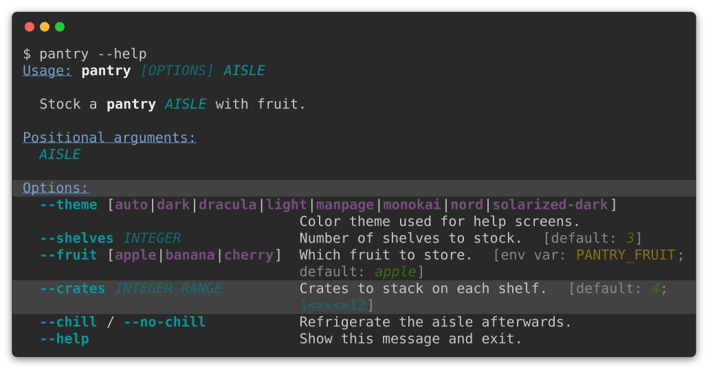

Lines are counted on the *canvas*, blanks included, the way a gutter numbers them. Turn `:screenshot-line-numbers:` on while choosing them and the two counts agree.

Ranges on the command line are closed, so state both ends: the capture's height is only known once the command has run, too late for `4-` to mean anything. Inside a documentation block the height *is* known, so [`:screenshot-emphasize-lines:`](sphinx.md#committed-captures) takes the open-ended form too.

An [animated capture](#animated-captures) bands the same way, one frame at a time. A band appears with the frame that first draws the row it marks, and it is gone wherever the row is. The empty beat closing a cycle carries none: banding a row before the animation reaches it would read as a stray rectangle in blank space.

#### The credit line

Every capture the command writes carries a credit line in the margin at its bottom-right corner. Here is one, reading `generated with pantry 1.4.2`:

```{click:run}
:screenshot: watermark-screen
:screenshot-watermark: generated with pantry 1.4.2
:hide-results:
result = invoke(pantry, args=["--theme", "dark", "--help"])
assert result.exit_code == 0
```


By default, the line names click-extra and the release that drew the image. A capture needs that once it has travelled: on a slide, in a README or on a social card it sits far from the page that explains where it came from. `--watermark` replaces the text, and an empty string draws none:

```shell-session
$ click-extra screenshot --output shot.svg --watermark "pantry 1.4.2 · example.com" -- my-cli --help
$ click-extra screenshot --output shot.svg --watermark "" -- my-cli --help
```

Crediting your own project rather than the tool that drew it is the expected case, not an exception. Set it once in your [configuration file](#stating-a-default-once) and every capture carries it.

The mark is the one thing drawn outside the window, so it is also the one paint that cannot follow the chrome: the margin is transparent, and behind it sits a page this command never sees. Hence a neutral gray, which reads on a white README and a dark one alike. `--watermark-color` covers a capture whose backdrop it has to sit on.

A capture written by a [`click:run` block](sphinx.md#committed-captures) carries no watermark by default. That image is regenerated on every documentation build, so a release number in it would rewrite every asset on release day, and the page around it already says what drew it. `:screenshot-watermark:`, or the `click_extra_screenshot_watermark` `conf.py` value, turns it on for a project that wants it anyway.

#### All of it at once

Here is the `pantry` screen again, wearing every option above: on a gradient, captioned, numbered, rounded, padded, see-through enough for the gradient to tint it, and with its `Options:` heading and its `--crates` entry picked out. The second tab shows the block that wrote it:

```{click:run}
:screenshot: styled-window-screen
:screenshot-columns: auto
:screenshot-title: 🍎 pantry --help
:screenshot-backdrop: 'linear-gradient(135deg, #667eea, #764ba2)'
:screenshot-emphasize-lines: 9,15-16
:screenshot-line-numbers:
:screenshot-opacity: 0.75
:screenshot-radius: 12
:screenshot-padding: 24
:hide-results:
result = invoke(pantry, args=["--help"])
assert result.exit_code == 0
assert "--crates" in result.stdout
```

``````{tab-set}
`````{tab-item} Captured image
:sync: captured-image

`````

`````{tab-item} The block behind it
:sync: block-source
````{code-block} markdown
```{click:run}
:screenshot: styled-window-screen
:screenshot-columns: auto
:screenshot-title: 🍎 pantry --help
:screenshot-backdrop: 'linear-gradient(135deg, #667eea, #764ba2)'
:screenshot-emphasize-lines: 9,15-16
:screenshot-line-numbers:
:screenshot-opacity: 0.75
:screenshot-radius: 12
:screenshot-padding: 24
:hide-results:
result = invoke(pantry, args=["--help"])
assert result.exit_code == 0
assert "--crates" in result.stdout
```
````

A caption takes any text a terminal can draw, emoji included. `:hide-results:` is this page's choice, since the window is the thing on show: leave it out and the block renders its live text below the fence as well.
`````
``````

None of that is limited to the still. An [animated capture](#animated-captures) is drawn through the same window, so it carries the gradient, the caption, the rounding, the transparency and the gutter exactly as a screenshot does. Here is a pantry being restocked, wearing everything above:

```{click:source}
:hide-source:
from time import sleep

from click_extra import SPINNERS, Spinner, Style
from click_extra.recording import ScreenRecorder


def restock(stream=None):
    """Shelve four crates, tracing each one as it lands."""
    crates = ["apricots", "biscuits", "coffee", "damsons"]
    style = Style(fg="bright_cyan")
    with Spinner("Restocking pantry", spinner=SPINNERS["moon"], style=style,
                 stream=stream) as spinner:
        for crate in crates:
            sleep(1.1)
            spinner.echo(style(f"shelved {crate}"))


def record(demo):
    """Run a demo against a recorder, and keep the screens it drew."""
    recorder = ScreenRecorder()
    demo(stream=recorder)
    return recorder.frames()
```

```{click:run}
:screenshot: styled-window-animated-screen
:screenshot-record: record(restock)
:screenshot-columns: auto
:screenshot-title: 🍎 pantry restock
:screenshot-backdrop: 'linear-gradient(135deg, #667eea, #764ba2)'
:screenshot-emphasize-lines: 3
:screenshot-line-numbers:
:screenshot-opacity: 0.75
:screenshot-radius: 12
:screenshot-padding: 24
:hide-results:
assert callable(restock)
```


The gutter counts each frame's own rows, so it grows as the trail does, and the band on the third line arrives on the same frame its number does.

### Terminal presets

A capture is a picture of a terminal, and terminals do not look alike. `--preset` styles the window as a named desktop's terminal:

```shell-session
$ click-extra screenshot --output shot.svg --preset windows -- my-cli --help
```

Each preset carries the four things that make a terminal recognizable: its window decorations, the palette its colors resolve against, the font it ships with, and the prompt sigil of its usual shell. An option stated alongside wins, so `--preset windows --radius 8` rounds the corners Windows squares.

A preset also paints the strip its buttons and caption sit in, a shade off the terminal's own background, because that strip belongs to the desktop. That makes `plain` the odd one out: it mimics no desktop, wears no buttons, and drops the strip entirely unless a `--title` gives it something to hold.

Each tab below shows its preset twice: bare, and then wearing everything else this page offers. The second picture states no `--radius`, so each terminal keeps its own corners: Windows stays square under the same gradient that rounds the other three.

Transparency lands least alike across them, because each preset brings its own background for the gradient to show through. At 75% it barely lifts Apple Terminal's black and visibly lifts GNOME's lighter `#2e3436`. All four still clear [WCAG AA](https://www.w3.org/TR/WCAG21/#contrast-minimum) for their text, from 14.4:1 down to 6.4:1, so what changes is the character of the window, not whether it can be read.

``````{tab-set}
`````{tab-item} macos
:sync: preset-macos
```{click:run}
:screenshot: preset-macos-screen
:screenshot-preset: macos
:hide-results:
result = invoke(pantry, args=["--theme", "dark", "--help"])
assert result.exit_code == 0
```


Round buttons on the left, Apple's `Pro` and `Basic` palettes, SF Mono, and a `$` prompt.

```{click:run}
:screenshot: preset-macos-full-screen
:screenshot-preset: macos
:screenshot-columns: auto
:screenshot-title: 🍎 pantry --help
:screenshot-backdrop: 'linear-gradient(135deg, #667eea, #764ba2)'
:screenshot-emphasize-lines: 9,15-16
:screenshot-line-numbers:
:screenshot-opacity: 0.75
:screenshot-padding: 24
:hide-results:
result = invoke(pantry, args=["--theme", "dark", "--help"])
assert result.exit_code == 0
```

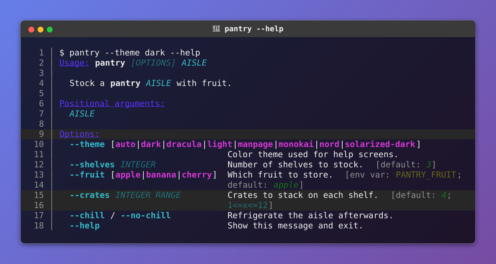
`````

`````{tab-item} windows
:sync: preset-windows
```{click:run}
:screenshot: preset-windows-screen
:screenshot-preset: windows
:hide-results:
result = invoke(pantry, args=["--theme", "dark", "--help"])
assert result.exit_code == 0
```


Minimize, maximize and close on the right, square corners, the `Campbell` and `One Half Light` schemes, Cascadia Code, and a `PS C:\>` prompt.

```{click:run}
:screenshot: preset-windows-full-screen
:screenshot-preset: windows
:screenshot-columns: auto
:screenshot-title: 🍎 pantry --help
:screenshot-backdrop: 'linear-gradient(135deg, #667eea, #764ba2)'
:screenshot-emphasize-lines: 9,15-16
:screenshot-line-numbers:
:screenshot-opacity: 0.75
:screenshot-padding: 24
:hide-results:
result = invoke(pantry, args=["--theme", "dark", "--help"])
assert result.exit_code == 0
```

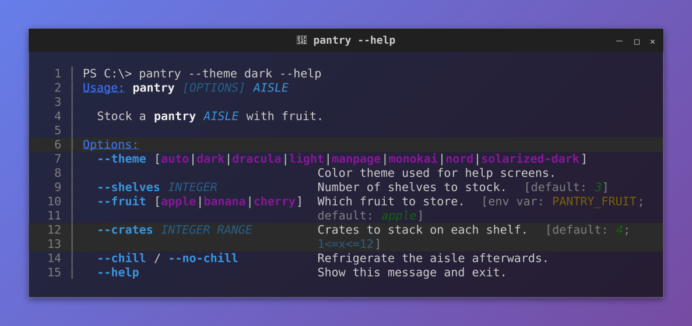
`````

`````{tab-item} linux
:sync: preset-linux
```{click:run}
:screenshot: preset-linux-screen
:screenshot-preset: linux
:hide-results:
result = invoke(pantry, args=["--theme", "dark", "--help"])
assert result.exit_code == 0
```


A single close button, the Tango palette GNOME Terminal ships, Ubuntu Mono, and a `$` prompt.

```{click:run}
:screenshot: preset-linux-full-screen
:screenshot-preset: linux
:screenshot-columns: auto
:screenshot-title: 🍎 pantry --help
:screenshot-backdrop: 'linear-gradient(135deg, #667eea, #764ba2)'
:screenshot-emphasize-lines: 9,15-16
:screenshot-line-numbers:
:screenshot-opacity: 0.75
:screenshot-padding: 24
:hide-results:
result = invoke(pantry, args=["--theme", "dark", "--help"])
assert result.exit_code == 0
```

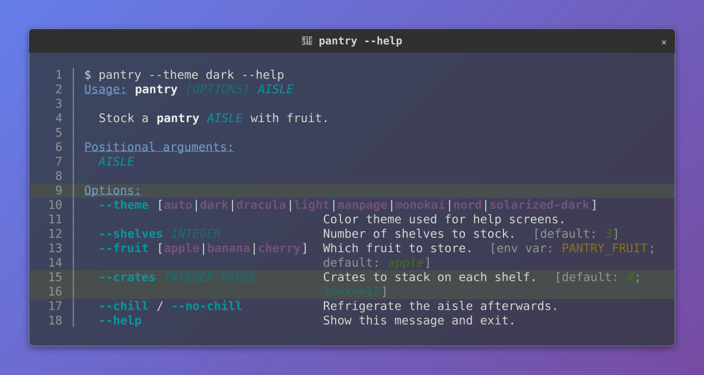
`````

`````{tab-item} plain
:sync: preset-plain
```{click:run}
:screenshot: preset-plain-screen
:screenshot-preset: plain
:hide-results:
result = invoke(pantry, args=["--theme", "dark", "--help"])
assert result.exit_code == 0
```


No buttons, no rounded corners, no title bar: for a capture that has to read as a block of output rather than as a window, on a slide or in a paper.

```{click:run}
:screenshot: preset-plain-full-screen
:screenshot-preset: plain
:screenshot-columns: auto
:screenshot-title: 🍎 pantry --help
:screenshot-backdrop: 'linear-gradient(135deg, #667eea, #764ba2)'
:screenshot-emphasize-lines: 9,15-16
:screenshot-line-numbers:
:screenshot-opacity: 0.75
:screenshot-padding: 24
:hide-results:
result = invoke(pantry, args=["--theme", "dark", "--help"])
assert result.exit_code == 0
```

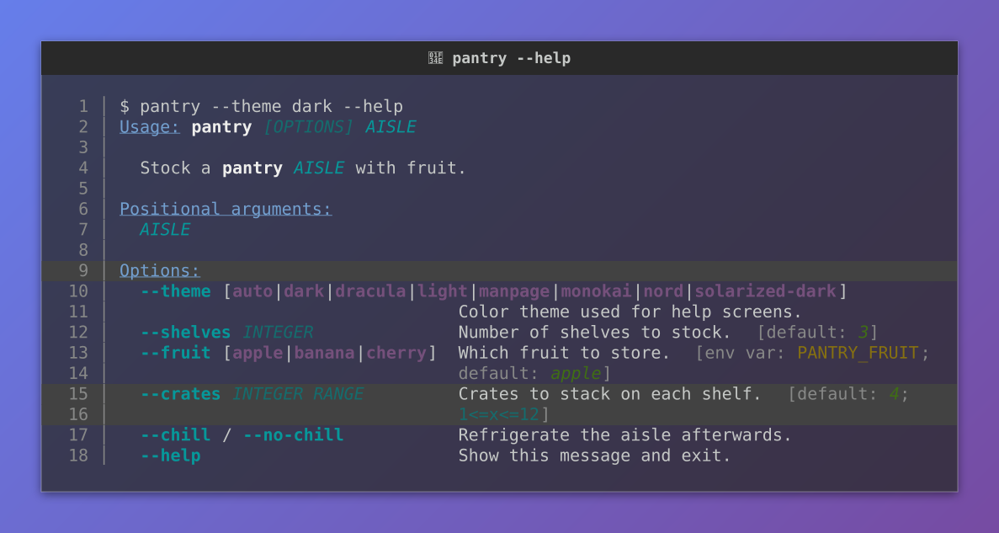
`````
``````

```{caution}
A preset's palette is the scheme its terminal *ships with*, not the one your reader configured. It also decides how the captured CLI's colors land: a screen rendered for a dark theme on a light preset washes out, exactly as [the chrome section](#light-and-dark-chrome) describes.
```

### Wide glyphs and writing systems

A terminal cell is not a character. A Chinese ideograph, a Hangul syllable, a fullwidth Latin letter and most emoji are each drawn two cells wide, while a combining accent is drawn in none at all. A capture measures its runs in cells, through {func}`click_extra.screenshot.cell_width`, which is the same [`wcwidth`](https://github.com/jquast/wcwidth) measurement click-extra already uses to align [tables](table.md) and the [command tree](tree.md#command-tree).

The CLI below pads with that measurement, so every name lands on column 12 whatever script precedes it:

```{click:source}
from click_extra import command, echo
from click_extra.screenshot import cell_width

FRUITS = (
    ("苹果", "apple"),
    ("バナナ", "banana"),
    ("체리", "cherry"),
    ("ＫＩＷＩ", "kiwi"),
    ("🍎🍌🍒", "basket"),
    ("┌──┬──┐", "crate"),
    ("مشمش", "apricot"),
)

@command
def market():
    """List each fruit beside its name, aligned on a fixed column."""
    for glyphs, name in FRUITS:
        echo(f"{glyphs}{' ' * (12 - cell_width(glyphs))}{name}")
```

```{click:run}
:screenshot: unicode-market-screen
:screenshot-margin: 16
result = invoke(market)
assert result.exit_code == 0
assert "apricot" in result.stdout
```

Size a run by its character count instead and the picture drifts: the seven lines above would land on four different columns, the wide scripts drawn at half their width and stacking on each other. That is [`rich#2742`](https://github.com/Textualize/rich/issues/2742), open upstream since 2023 and one of the reasons this renderer is click-extra's own. The [upstream page](upstream.md#terminal-captures-as-svg) collects the rest.

Two spaces are what mark a column. A capture cuts each line at its gutters ({func}`click_extra.screenshot.column_segments`), then pins every piece to its own offset. One space is ordinary word spacing rather than a gutter, so a wide glyph and the word after it stay a single run, and where that word sits inside the run is left to the font. Pad a column to a fixed width, the way `market` does above, instead of separating it by one space. Captured output rarely trips on this: a table or a help screen already leaves two spaces or a rule between its columns. A hand-written example is where it shows.

```{note}
Right-to-left scripts are the case cell arithmetic cannot settle. Arabic and Hebrew are reordered by whoever draws them, and the cursive ones are *shaped*: a letter's form depends on the letters it joins. A run carrying any of them is therefore left to size itself, rather than pinned to an exact width that would pay for the difference in letter spacing and pull the word apart at its joins. The run still starts on its own column, so the grid around it holds; only its own width floats.

Box-drawing and block characters are not letters but *tiles*: a table's rule, a tree's elbow and a gradient's bar are drawn by butting them edge to edge. They are emitted in short groups, each landing on a stated offset, so a font drawing them a fraction of a pixel off the grid cannot accumulate that error across a rule and leave the table's corners missing their own border. What remains is whether two adjacent tiles *join* cleanly, which is the font's business and no renderer's: that one is [`rich#2536`](https://github.com/Textualize/rich/issues/2536), where the answer upstream is that it would take replacing the characters with drawn shapes. click-extra does not do that either.
```

## Animate a capture

### Animated captures

An SVG capture can hold more than one frame. Pass `frames` a sequence of captured texts and `interval` how long each is shown. The window and its caption are drawn once, and every frame is stacked inside them.

```python
from pathlib import Path

from click_extra.screenshot import render_svg
from click_extra.spinner_presets import SPINNERS
from click_extra.styling import Style

preset = SPINNERS["moon"]
lemon = Style(fg="#f1fa8c")
Path("brewing.svg").write_text(
    render_svg(
        columns=34,
        title="brewing",
        unique_id="brewing",
        frames=[lemon(f"{frame}  brewing tea…") for frame in preset.frames],
        interval=preset.interval,
    ),
    encoding="utf-8",
)
```

One number for `interval` times every frame alike, which is what a spinner asks for. A sequence gives each frame its own, which is what a recording asks for.

The frames differ in nothing but their text, so one stylesheet covers all of them. Everything is namespaced by `unique_id`, keyframes included, so two animations inlined into one page keep their own timing.

A row drawn the same in every frame is drawn once. Only the rows that move are copied per frame, which keeps a recording with little motion small.

One frame stays visible wherever the animation does not run, so a capture is never a blank rectangle. The capture also honors a system asking for reduced motion, by keeping every animation rule behind a [`prefers-reduced-motion`](https://developer.mozilla.org/en-US/docs/Web/CSS/@media/prefers-reduced-motion) guard.

A recorded animation also **pauses on its last frame** and then **closes on an empty beat**, 2.6 seconds by default. A loop restarting the instant it arrives gives a reader no time to read the end. The empty beat says plainly where the loop comes round.

Three knobs state all of it, on `render_svg`, on the `--record` command line and on a documentation block alike:

| `render_svg` | CLI       | Directive            | What it sets                                                   |
| :----------- | :-------- | :------------------- | :------------------------------------------------------------- |
| `hold`       | `--hold`  | `:screenshot-hold:`  | Extra seconds on the last frame, or `auto`.                    |
| `blank`      | `--blank` | `:screenshot-blank:` | Seconds of empty screen closing the cycle.                     |
| `speed`      | `--speed` | `:screenshot-speed:` | How much faster to play than recorded: `2` halves every frame. |

`speed` scales the replay only. The two pauses are stated in real seconds and stay untouched. A declared spinner cycles in place and ends nowhere, so it holds and blanks for nothing unless a page asks.

`hold` also takes `auto`, which scales the pause to the final frame itself: a quarter second per populated line, clamped between 2 and 30 seconds. A fixed number serves an ending the author has seen; `auto` serves one that changes with every retake, like a recorded command whose closing report grows with what there is to report. A `:screenshot-record:` block and a `--record` capture therefore default to it, and a stated number overrides it.

The frame left visible is the **last** one, because an animation that accumulates says most once it has finished. An animated capture is therefore always a still as well.

### A blinking cursor

A capture draws no cursor unless it is asked for one. Pass a `Cursor` and it draws one:

```python
from click_extra.screenshot import render_svg
from click_extra.screenshot_presets import Cursor, CursorShape

render_svg("$ pantry restock --crates 4", columns=44, cursor=Cursor())
```

Where the cursor stands is never stated: it is read off each frame's own text. A screen ends with whatever was written to it last, so the cursor sits after that. Output closing on a newline puts it on the row underneath, and the window grows a line to hold it, the way a terminal's does.

Three fields say what it looks like:

| Field   | What it sets                                                    |
| :------ | :-------------------------------------------------------------- |
| `shape` | `BLOCK`, `BAR` or `UNDERLINE`. `None` takes the preset's own.   |
| `blink` | Seconds one blink takes. `0` draws a steady cursor.             |
| `color` | Paint it is drawn with. `None` takes the terminal's foreground. |

A preset names the shape its terminal draws, so `--preset windows` gets Windows Terminal's bar and the rest get a block. `Cursor(CursorShape.BAR)` overrides that.

The blink runs on a clock of its own rather than on the animation's. The two drift against each other across a loop, which is what a terminal showing a cursor over a running command looks like.

```{caution}
Blinking is motion. The rule sits behind the same [`prefers-reduced-motion`](https://developer.mozilla.org/en-US/docs/Web/CSS/@media/prefers-reduced-motion) guard as every other animation here, so a reader who asked their system for less of it gets a cursor that is lit and still.
```

A still capture takes a cursor too, and leaves it after the last thing the command printed, which is where the shell finds it. `:screenshot-cursor:` asks a documentation block for one, and `:screenshot-blink:` says how fast. A block draws its own invocation already, so nothing else is needed:

```{click:source}
:hide-source:
from click_extra import command, echo, option


@command
@option("--crates", type=int, default=4, help="How many crates to shelve.")
def pantry(crates):
    """Shelve a pantry's incoming crates."""
    echo(f"Shelved {crates} crates.")
```

```{click:run}
:screenshot: cursor-still-screen
:screenshot-columns: auto
:screenshot-cursor:
:screenshot-margin: 16
:hide-results:
result = invoke(pantry, args=["--crates", "4"])
assert result.exit_code == 0
assert result.stdout == "Shelved 4 crates.\n"
```


The cursor sits on the row under the output, because the command's last line ended on a newline. That is where a terminal leaves it, so the window grows a line to hold it.

### The shell coming back

A command exits and the shell prints its prompt again. `--closing-prompt`, and `:screenshot-closing-prompt:` on a documentation block, draw that last row:

```{click:run}
:screenshot: closing-prompt-screen
:screenshot-columns: auto
:screenshot-cursor:
:screenshot-closing-prompt:
:screenshot-margin: 16
:hide-results:
result = invoke(pantry, args=["--crates", "4"])
assert result.exit_code == 0
```


Alongside a cursor it is free. Output ending on a newline already leaves the row the cursor waits on, and the sigil fills it instead of leaving it blank. A command that never ended its line is given one, exactly as a shell prints its own newline before prompting.

An animation closes its **last frame** and no other. The shell has not come back while the command is still drawing, and a sigil on an earlier frame would say it had.

### Recording an animation

The frames above were declared. They can also be *recorded*, from a command that draws them.

This is the one thing a pipe cannot capture. A spinner asks whether its stream is a terminal and stays silent when it is not, so a command run the ordinary way prints its result and none of the frames leading to it. Forcing color through the environment does not help, because that answers a different question.

For a spinner this process hosts, hand it a `ScreenRecorder`. It claims to be a terminal without being one, so no pseudo-terminal is involved and it works on every platform:

```python
from click_extra import SPINNERS, Spinner
from click_extra.recording import ScreenRecorder

recorder = ScreenRecorder()
with Spinner("Brewing tea", spinner=SPINNERS["moon"], stream=recorder):
    steep()
frames = recorder.frames()
```

For a command this process does not host, `record_command` runs it under a pseudo-terminal and reads both its output and its errors, the spinner drawing on the latter:

```python
from click_extra.recording import record_command

frames = record_command(("kettle", "boil", "--slowly"), columns=60, duration=5.0)
```

That path is Unix only: a pseudo-terminal is `termios` and `pty`, neither of which Windows ships, and reaching ConPTY would mean a dependency. The in-process recorder above covers Windows.

Each `Frame` carries the screen it held and how long it held it, so `render_svg` takes them directly:

```python
render_svg(
    columns=60,
    frames=[frame.text for frame in frames],
    interval=[frame.duration for frame in frames],
)
```

```{caution}
A recording is timed by the wall clock, so the same command records slightly different durations every run. That is fine for a one-off image, and a problem for a committed one that is rewritten on every build: see [keeping a recording committable](#keeping-a-recording-committable).
```

### Type the command first

A recording holds what a command drew and never the invocation that drew it, so an animation opens on output arriving from nowhere. `typing` types the command line out first, one character per frame:

```python
from click_extra.recording import record_and_render
from click_extra.screenshot_presets import Cursor

svg, returncode = record_and_render(
    ("pantry", "restock", "--crates", "4"),
    columns=44,
    typing=0.05,
    submit=0.45,
    cursor=Cursor(),
)
```

`typing` is how long a character takes to appear, and `submit` is the beat the finished line waits before the output starts, which is the pause before the return key. Leave `typing` out and the prompt stands there from the first frame, which is what a recording shows without it.

The typed screens are ordinary frames. Everything the picture does for a frame therefore reaches them: a gutter numbers them, and the cursor walks along the line with no caret of its own to state.

For an animation assembled by hand, `type_line` makes those frames from a prompt line and nothing else:

```python
from click_extra.recording import type_line

opening = type_line("$ pantry restock --crates 4", typing=0.05)
```

A documentation block asks for the same with three options. `:screenshot-prompt:` states the invocation to draw, `:screenshot-typing:` types it, and `:screenshot-submit:` sets the beat before the output starts:

```{click:source}
:hide-source:
from click_extra import SPINNERS, Spinner, Style

restocking = Spinner(
    "Restocking pantry", spinner=SPINNERS["moon"], style=Style(fg="bright_cyan")
)
```

```{click:run}
:screenshot: typed-spinner-screen
:screenshot-animate: restocking
:screenshot-columns: auto
:screenshot-prompt: pantry --crates 4
:screenshot-typing: 0.06
:screenshot-submit: 0.45
:screenshot-cursor:
:screenshot-margin: 16
:hide-results:
assert restocking.frames == SPINNERS["moon"].frames
```


The cursor walks the line as it is typed, then drops to the spinner it started. Nothing states that: the cursor is read off each frame's text, so it follows whatever the frame last drew.

```{tip}
A typed opening costs one frame per character. Those frames differ by a single character each, so they compress to almost nothing over the wire: the raw file roughly doubles while the gzipped one grows about a kilobyte.
```

### Keeping a recording committable

A committed capture is rewritten on every build, which keeps it from drifting away from the CLI. A recording cannot live that way, and not because of its timings: **the scheduler decides which spinner glyph pairs with which screen**, so the same command records a different set of frames on every other run. Rounding the durations with `quantize` settles the jitter but cannot touch that.

So a recording is written once and then kept. `:screenshot-record:` writes the asset the first time and leaves it alone afterwards. It does not even evaluate its expression once the file exists. To take a fresh recording, delete the file and build again.

A recording states what it pictures on a line beside the generator tag:

```xml
<!-- @generated by Click Extra 9.0.0.dev0 -->
<!-- @recording frames=49 period=6.57s digest=2b5a410759b29890 -->
```

The digest covers the frames a cycle holds and the beat it holds them on, not their order or their count.

```{caution}
Written once means frozen: nothing re-checks a recording against the code it pictures, so it rots the way any hand-made screenshot does. A declared animation has no such problem, being composed rather than timed, and is regenerated on every build like every other capture.
```

### Recording from the command line

`--record` turns the `screenshot` command into a recorder: the command runs under a pseudo-terminal, so a spinner or a progress bar draws the frames it would draw for you, and every screen it leaves behind lands in one animated SVG.

```shell-session
$ click-extra screenshot --record --output recorded-trail-screen.svg -- click-extra trail
```


`--cursor` and `--typing` turn a recording into a session: the command line types itself at the prompt, a cursor follows it along, and the output arrives underneath.

```shell-session
$ click-extra screenshot --record --cursor --closing-prompt --typing 0.05 --columns 46 --output typed-trail-screen.svg -- click-extra trail
```


`--cursor` on its own takes the shape the `--preset` terminal draws, and `--cursor bar` or `--cursor underline` overrides it. `--blink 0` leaves the cursor lit and still. Both apply to a still capture as well, where the cursor lands after the last thing the command printed.

The invocation is drawn above every frame, exactly as a still capture draws its own prompt, and `--prompt` overrides or hides it the same way. `--rows` states the terminal's height, `--timeout` stops a recording that would run on, and the pacing knobs above apply as given. Two of a still capture's arrangements do not carry over: the width must be a number, since the pseudo-terminal exists before the command draws its first line, and `--head`/`--tail` stay out, a recording being made of whole screens.

```{caution}
Unix only, for the reasons {func}`~click_extra.recording.record_command` states. The same pipeline is scriptable through {func}`~click_extra.recording.record_and_render`.
```

## Publish and maintain

### Stating a default once

`screenshot` is itself a Click Extra CLI, so every option above is also a configuration key. To draw every capture the same way, state it once in the `pyproject.toml` [click-extra finds by walking up from the working directory](config-formats.md#pyproject-toml):

```toml
[tool.click-extra.screenshot]
preset = "macos"
margin = 64
opacity = 0.85
watermark = "pantry 1.4.2 · example.com"
```

Any [dedicated configuration file](config.md) does the same under a `[click-extra.screenshot]`{l=toml} table. A flag on the command line still wins over both, following the [usual precedence](config.md#precedence), so a single capture can break the house style without editing anything.

In Sphinx documentation, [`click:run` blocks](sphinx.md#committed-captures) write the captures rather than the command, so the same setting is a `conf.py` value:

```python
click_extra_screenshot_preset = "macos"
```

It covers every block whose `:screenshot:` names no preset of its own, leaving `:screenshot-preset:` for the pages that depart from it. A project keeping its settings in one place can read the value back out of its `pyproject.toml`, `conf.py` being Python:

```python
import tomllib
from pathlib import Path

pyproject = tomllib.loads(Path("../pyproject.toml").read_text(encoding="utf-8"))
click_extra_screenshot_preset = pyproject["tool"]["click-extra"]["screenshot"]["preset"]
```

### Keeping captures fresh

Here is the command pointed at click-extra itself. Its [bundled CLI](cli.md) doubles as a live demo of the rendering features. Each image below was produced by the line printed under it, run from a checkout.

`gradient` puts 24-bit ramps next to their 256-color quantized equivalents, so the stepping the smaller palette introduces is there to see:


```shell-session
$ click-extra screenshot --output docs/assets/color-gradient-screen.svg --prompt "click-extra gradient" -- uv run --frozen -- click-extra gradient
```

`styles` crosses every color with every text style. Its table wants far more than 80 columns, so the capture is taken at the width it actually needs:


```shell-session
$ click-extra screenshot --output docs/assets/text-styles-screen.svg --columns 160 --head 14 --prompt "click-extra styles" -- uv run --frozen -- click-extra styles
```

`themes` renders a sample help screen under each built-in palette, and this capture keeps the first two of them, which is what `--theme` does to a screen:


```shell-session
$ click-extra screenshot --output docs/assets/theme-gallery-screen.svg --head 34 --prompt "click-extra themes" -- uv run --frozen -- click-extra themes
```

`--prompt` makes each image show the bare `click-extra …` a reader would type, while `uv run --frozen --` is what actually ran. The plumbing that reaches a checkout's copy of the CLI is not worth picturing. `--head` bounds the two long ones, and the `[...]` marker says the rest was cut.

The before/after pair opening the [readme](https://github.com/kdeldycke/click-extra#example) takes the other route. Those two screens already exist as live [`click:run`](sphinx.md#committed-captures) blocks in the [tutorial](tutorial.md), so the blocks maintain them instead of shooting them again: a `:screenshot:` option writes each image on every documentation build. That keeps the readme's front page in step with the code.

Use the command when the CLI you want to picture has no live block, and the directive when it does.

Whichever route, a full click-extra help screen carries `--table-format`, whose choice list is a single 463-character line. Click never wraps an option's own term, so the renderer folds it across six rows, exactly as a terminal would.

Once committed, an image goes stale the first time the CLI's help changes. `tests/test_screenshots.py` reads the SVG back, rebuilds the terminal text from the glyph coordinates, and compares it to what the command prints today. It fails on the first line that diverged, and re-running the command above refreshes the picture.

## GitHub integration

A README can track the reader's theme. Capture the same screen twice, once per [chrome](#light-and-dark-chrome), with the CLI's own theme moving along:

```shell-session
$ click-extra screenshot --output docs/assets/help-dark.svg -- my-cli --theme dark --help
$ click-extra screenshot --output docs/assets/help-light.svg --background light -- my-cli --theme light --help
```

Then hand both to a `<picture>` element, which GitHub renders in a README and which picks between them on `prefers-color-scheme`:

```html
<picture>
 <source media="(prefers-color-scheme: dark)" srcset="https://raw.githubusercontent.com/me/my-cli/main/docs/assets/help-dark.svg"/>
 
</picture>
```

The `` is not a spare: every surface without the switch shows it, PyPI and most editors' previews included. So it holds the capture that reads on the light background those surfaces default to. The `<source>` is the one a reader in dark mode gets instead.

Both URLs are absolute on purpose. A README is read on PyPI and in many forks of the page, and none of them resolve a repository-relative path. That is why every capture in [this project's own README](https://github.com/kdeldycke/click-extra#documentation-tooling) is addressed through `raw.githubusercontent.com`.

```{note}
The switch keys on the *browser's* color scheme, not on the theme toggle of a documentation site, so it belongs to a README rather than to these pages: Furo's own switch would leave it unmoved.
```

## `click_extra.screenshot` API

```{eval-rst}
.. automodule:: click_extra.screenshot
   :no-index:
   :members:
   :show-inheritance:
   :undoc-members:
```

## `click_extra.screenshot_presets` API

```{eval-rst}
.. automodule:: click_extra.screenshot_presets
   :no-index:
   :members:
   :show-inheritance:
   :undoc-members:
```
