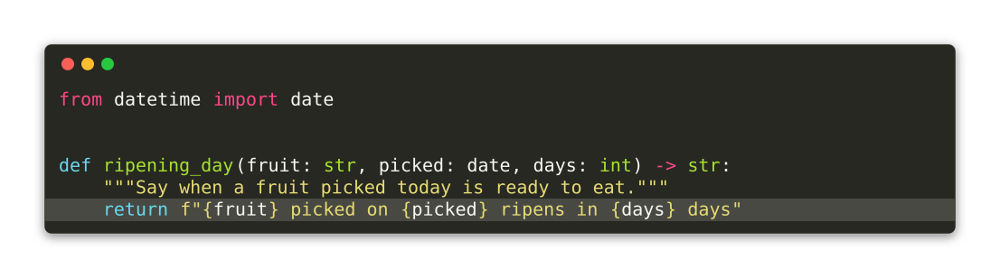
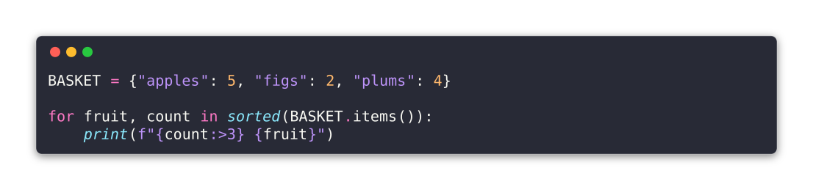
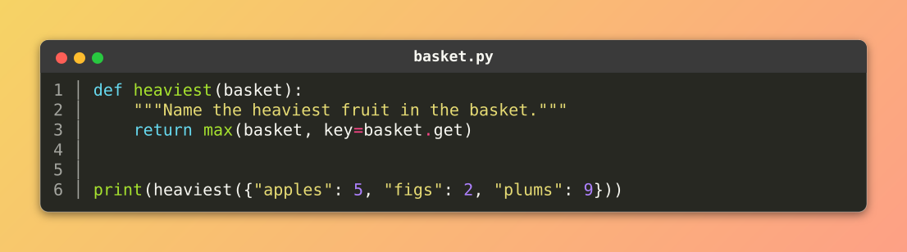

# {octicon}`file-code` Code snippets

A [screenshot](screenshots.md) pictures what a command printed. A snippet pictures what a file says:

```{click:source}
:screenshot: ripen-snippet
:mirror:
:emphasize-lines: 6
from datetime import date


def ripening_day(fruit: str, picked: date, days: int) -> str:
    """Say when a fruit picked today is ready to eat."""
    return f"{fruit} picked on {picked} ripens in {days} days"
```

<!-- screenshot -->



<!-- screenshot-end -->

That image was drawn by the block above it, at documentation build time. Both the code and the picture come from the same lines, so neither can go stale.

## Draw a file

`click-extra snippet` highlights a source file and writes the picture:

```shell-session
$ click-extra snippet --output ripen.svg ripen.py
```

```{click:run}
from click_extra.cli import demo
result = invoke(demo, args=["snippet", "--help"])
assert result.exit_code == 0
assert "--syntax-style" in result.stdout
assert "--language" in result.stdout
```

The command settles three things:

- Language. Guessed from the file name, then from the content. `--language` states it outright when neither can, and a name Pygments does not know is an error rather than a silent fallback to plain text.
- Colors. `--syntax-style` names any of the [Pygments styles](https://pygments.org/styles/).
- Width. The image is laid out at the longest line the file holds, so nothing folds. A file was never wrapped to a terminal's width, and code that soft-wrapped in the picture would lose the indentation a reader is there to read.

Pass `-` to read the source from stdin. There is no file name left to guess a language from, so `--language` is required:

```shell-session
$ pygmentize -l python ripen.py | click-extra snippet --output ripen.svg --language python -
```

Highlighting needs the `pygments` extra:

```shell-session
$ uv pip install click-extra[pygments]
```

## Where the code goes

The `--output` destination picks the format, exactly as it does for a screenshot:

| Destination | Text is           | Goes where                                                    |
| :---------- | :---------------- | :------------------------------------------------------------ |
| `-`         | escape sequences  | your terminal, right now                                      |
| `.svg`      | a picture         | a surface that strips inline HTML: a README on GitHub or PyPI |
| `.html`     | selectable markup | a page you own, where the code stays copy-pasteable           |
| `.ansi`     | escape sequences  | a file to `cat` later                                         |

```{tip}
On a page you control, none of these is usually the right answer. A fenced code block is highlighted by the site's own theme, stays searchable, and follows the reader's light or dark setting. Reach for a snippet where the surface cannot do that: a README, a slide, a social card.
```

## Print it to the terminal

`--output -` skips the window and prints the escape sequences a terminal paints:

```shell-session
$ click-extra snippet --output - ripen.py
```

That is `cat` with colors, and it is the one destination that needs no rendering: the escape sequences highlighting already produced *are* what a terminal reads.

What it adds over `pygmentize -f terminal16m` is the line treatment and this project's color rules. `--head`, `--tail`, `--line-numbers` and `--emphasize-lines` all work, the band becoming the row's own background instead of a rectangle drawn behind it:

```shell-session
$ click-extra snippet --output - --line-numbers --emphasize-lines 4-6 ripen.py
```

The output also answers to `--color`, `--no-color`, `--accessible` and `NO_COLOR` like every other command here. That matters most when you redirect it: piped or written to a file, the escapes are dropped and you get plain code, where a highlighter writing straight to stdout leaves you a file full of control characters.

```shell-session
$ click-extra snippet --output - ripen.py > plain.txt
$ click-extra snippet --output - --color=always ripen.py > colored.txt
```

Nothing describing a window reaches this format, so `--preset`, `--border`, `--margin`, `--title` and the credit line are ignored: there is no window for them to describe.

## The window is the style's

A Pygments style states the background its colors were designed against, and the window takes it:

```{click:source}
:screenshot: dracula-snippet
:screenshot-syntax-style: dracula
:mirror:
:hide-source:
BASKET = {"apples": 5, "figs": 2, "plums": 4}

for fruit, count in sorted(BASKET.items()):
    print(f"{count:>3} {fruit}")
```

<!-- screenshot -->



<!-- screenshot-end -->

So a snippet looks like that style does in an editor, rather than like the same style dropped on a foreign surface. A light style on the dark default would wash out the same way a light-themed CLI does.

Left unstated, the style is `monokai` on the dark chrome and Pygments' own `default` on the light one. Both were picked to sit beside a terminal capture without a step showing between the two windows: `monokai` paints `#272822` against the `#292929` a dark capture is drawn on.

## Everything a screenshot wears

A snippet is drawn by the same renderer, so the whole window vocabulary carries over unchanged: `--preset`, `--background`, `--border`, `--radius`, `--backdrop`, `--shadow`, `--margin`, `--padding`, `--opacity`, `--title`, `--watermark`, `--head`, `--tail`, `--line-numbers` and `--emphasize-lines` all mean here what they mean [there](screenshots.md#style-the-capture).

```{click:source}
:screenshot: full-snippet
:screenshot-preset: macos
:screenshot-line-numbers:
:screenshot-backdrop: 'linear-gradient(135deg, #f6d365, #fda085)'
:screenshot-title: basket.py
:mirror:
:hide-source:
def heaviest(basket):
    """Name the heaviest fruit in the basket."""
    return max(basket, key=basket.get)


print(heaviest({"apples": 5, "figs": 2, "plums": 9}))
```

<!-- screenshot -->



<!-- screenshot-end -->

## In your documentation

Any source block can commit its own picture. Add `:screenshot: <name>` to a `click:source` or `python:source` block and the build writes `<name>.svg` beside your pages:

````markdown
```{click:source}
:screenshot: ripen-snippet
from click_extra import command

@command
def ripen():
    """Ripen a fruit."""
```
````

The page itself keeps its code block, which beats an image here by staying selectable, searchable and theme-aware. `:mirror:` adds the image to the page as well, so it also shows on GitHub and PyPI.

`:emphasize-lines:` bands the same lines in both. A source block has one content, so naming the lines twice would be the surprise:

````markdown
```{click:source}
:screenshot: ripen-snippet
:emphasize-lines: 2
```
````

Use `:screenshot-emphasize-lines:` only where the page and the picture should mark different lines.

### Stating a default once

A project drawing all of its snippets in one style states it in `conf.py` rather than on every block:

```python
click_extra_screenshot_syntax_style = "dracula"
```

Every other `click_extra_screenshot_*` value from the [screenshots page](screenshots.md#stating-a-default-once) applies too, since both kinds of capture share one window.

### Keeping snippets fresh

Nothing in a snippet runs a command or reads a clock, so two builds of one block write the same bytes and a committed asset leaves the working tree clean. That makes a snippet more predictable than a screenshot: a capture goes stale when the CLI changes, and Sphinx only rewrites it when the page carrying it is re-parsed. A snippet's subject is the block itself, so the two move together by construction.

The `:mirror:` regions are refreshed offline, without a build:

```shell-session
$ click-extra refresh-directives docs/
```

## `click_extra.snippet` API

```{eval-rst}
.. automodule:: click_extra.snippet
   :no-index:
   :members:
   :show-inheritance:
   :undoc-members:
```
