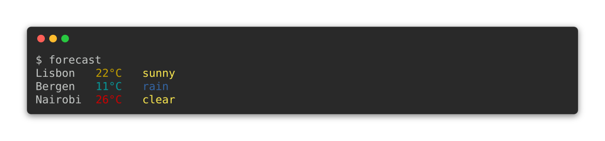

# {octicon}`book` Sphinx

[Sphinx](https://www.sphinx-doc.org) is the best way to document your Python CLI. Click Extra provides several utilities to improve the quality of life of maintainers.

````{important}
For these helpers to work, you need to install `click_extra`'s additional dependencies from the `sphinx` extra group:

```{code-block} shell-session
$ pip install click_extra[sphinx]
```
````

```{seealso}
To capture a CLI's output as a static image for a README, slide, or any surface that cannot run Sphinx, see [CLI screenshots](screenshots.md).
```

```{seealso}
The same extension runs arbitrary Python at build time, and renders a release compatibility table. Both are documented in [Python directives](python-directives.md).
```

## Setup

Once [Click Extra is installed](install.md), you can enable its [extensions](https://www.sphinx-doc.org/en/master/usage/configuration.html#confval-extensions) in your Sphinx's `conf.py`:

```{code-block} python
:caption: `conf.py`
:emphasize-lines: 3
extensions = [
    ...
    "click_extra.sphinx",
]
```

This unlocks the always-on features: the ANSI-capable Pygments HTML formatter, the GitHub-flavored alert (`> [!NOTE]`, `> [!WARNING]`, ...) → MyST/reST admonition converter, [todo-list deduplication](#todo-list-deduplication), and the [man-page hook](man-page.md#from-a-sphinx-build). The `click:*` and `python:*` directive families are disabled by default and require an explicit opt-in described below.

```{danger}
**Build-time code execution.** Every `click:*` and `python:*` directive runs its body with the same privileges as the Sphinx process: full filesystem access, full network access, and full access to the build environment's secrets (`GITHUB_TOKEN`, `READTHEDOCS_TOKEN`, etc.). The runner namespace is unrestricted: there is no sandbox.

This is intentional: build-time execution is the whole point of those directives. But it means the same trust boundary I'd apply to a `Makefile` or `conftest.py` applies here:

- Only run `sphinx-build` against source I trust.
- Do not auto-build documentation from unverified pull requests in CI without an isolated, secret-free environment.
- Treat any `print` call inside `python:render*` whose output incorporates untrusted data as a content-injection sink. reST in particular allows `.. raw:: html` and `.. include:: /path/to/file`, both of which can read local files or inject HTML into the rendered page.

The risk profile is identical to other build-time-execution extensions like `jupyter-sphinx`, `myst-nb`, and `sphinx-exec-code`.
```

````{important}
**Opt-in required.** Both directive families are **disabled by default**. A project that adds `click_extra.sphinx` to its `extensions` list gets the always-on features automatically, but does *not* gain build-time code execution unless the maintainer explicitly turns it on. Add this to `conf.py`:

```python
click_extra_enable_exec_directives = True
```

Without it, `click:source`, `click:run`, `python:source`, `python:run`, `python:render`, `python:render-myst`, and `python:render-rst` are not registered with Sphinx. Documents that reference them get an "Unknown directive" warning and the directive body is never executed. This way a transitive import of `click_extra.sphinx`, or a maintainer who installs the extension purely for ANSI-aware code blocks, cannot be tricked into running attacker-supplied Python by a doc-only pull request.
````

```{tip}
I recommend using one of these themes, which works well with Click Extra:

-  [Furo](https://github.com/pradyunsg/furo) - Which has been [fixed to support Click Extra](https://github.com/pradyunsg/furo/pull/657) as of `2023.05.20`.
-  [Shibuya](https://github.com/lepture/shibuya) - Which is [explicitly supporting Click Extra](https://shibuya.lepture.com/extensions/click-extra/) as of `2025.9.22`.
```

```{seealso}
Using MkDocs instead of Sphinx? See the [MkDocs integration](mkdocs.md).
```

## `click:*` directives

Click Extra adds two new directives:

| Directive      | Purpose                                                                                            |
| -------------- | -------------------------------------------------------------------------------------------------- |
| `click:source` | Define and show the source code of a Click CLI in Sphinx.                                          |
| `click:run`    | Invoke the CLI defined above, and display the results as if it was executed in a terminal session. |

Thanks to these, you can directly demonstrate the usage of your CLI in your documentation. You no longer have to maintain screenshots of you CLIs. Or copy and paste their outputs to keep them in sync with the latest revision. Click Extra will do that job for you.

These directives supports both [MyST Markdown](https://myst-parser.readthedocs.io) and [reStructuredText](https://www.sphinx-doc.org/en/master/usage/restructuredtext/basics.html) syntax.

### Usage

Here is how to define a simple Click-based CLI with the `click:source` directive:

``````{tab-set}
`````{tab-item} MyST Markdown
:sync: myst
````{code-block} markdown
:emphasize-lines: 1
```{click:source}
from click_extra import echo, command, option, style

@command
@option("--name", prompt="Your name", help="The person to greet.")
def hello_world(name):
    """Simple program that greets NAME."""
    echo(f"Hello, {style(name, fg='red')}!")
```
````
`````

`````{tab-item} reStructuredText
:sync: rst
```{code-block} rst
:emphasize-lines: 1
.. click:source::

    from click_extra import echo, command, option, style

    @command
    @option("--name", prompt="Your name", help="The person to greet.")
    def hello_world(name):
        """Simple program that greets NAME."""
        echo(f"Hello, {style(name, fg='red')}!")
```
`````
``````

After defining the CLI source code in the `click:source` directive above, you can invoke it with the `click:run` directive.

The `click:run` directive expects a Python code block that uses the `invoke` function. This function is specifically designed to run Click-based CLIs and handle their execution and output.

Here is how to invoke the example with a `--help` option:

``````{tab-set}
`````{tab-item} MyST Markdown
:sync: myst
````{code-block} markdown
:emphasize-lines: 1
```{click:run}
invoke(hello_world, args=["--help"])
```
````
`````

`````{tab-item} reStructuredText
:sync: rst
```{code-block} rst
:emphasize-lines: 1
.. click:run::

    invoke(hello_world, args=["--help"])
```
`````
``````

Placed in your Sphinx documentation, the two blocks above renders to:

```{click:source}
from click_extra import echo, command, option, style

@command
@option("--name", prompt="Your name", help="The person to greet.")
def hello_world(name):
    """Simple program that greets NAME."""
    echo(f"Hello, {style(name, fg='red')}!")
```

```{click:run}
from textwrap import dedent
result = invoke(hello_world, args=["--help"])
print(repr(result.stdout))
assert result.stdout.startswith(dedent(
    """\
    \x1b[94m\x1b[4mUsage:\x1b[0m \x1b[97m\x1b[1mhello-world\x1b[0m \x1b[36m\x1b[2m\x1b[3m[OPTIONS]\x1b[0m

      Simple program that greets NAME.

    \x1b[94m\x1b[4mOptions:\x1b[0m
      \x1b[36m\x1b[1m--name\x1b[0m \x1b[36m\x1b[2m\x1b[3mTEXT\x1b[0m                  The person to greet.
      \x1b[36m\x1b[1m--time\x1b[0m / \x1b[36m\x1b[1m--no-time\x1b[0m           Measure and print elapsed execution time."""
))
```

This is perfect for documentation, as it shows both the source code of the CLI and its results.

Notice how the CLI code is properly rendered as a Python code block with syntax highlighting. And how the invocation of that CLI renders into a terminal session with ANSI coloring of output.

You can then invoke that CLI again with its `--name` option:

``````{tab-set}
`````{tab-item} MyST Markdown
:sync: myst
````{code-block} markdown
:emphasize-lines: 2
```{click:run}
invoke(hello_world, args=["--name", "Joe"])
```
````
`````

`````{tab-item} reStructuredText
:sync: rst
```{code-block} rst
:emphasize-lines: 3
.. click:run::

    invoke(hello_world, args=["--name", "Joe"])
```
`````
``````

Which renders in Sphinx as if it was executed in a terminal code block:

```{click:run}
result = invoke(hello_world, args=["--name", "Joe"])
assert "Hello, " in result.output
assert "Joe" in result.output
```

```{hint}
The `click:source` and `click:run` directives work well with standard vanilla `click`-based CLIs.

The example above imports its CLI primitives from the `click-extra` module instead, to demonstrate the coloring of terminal session outputs: `click-extra` provides [fancy coloring of help screens](colorize.md) by default.
```

```{tip}
Need to run arbitrary Python that isn't a Click CLI? See [`python:run`](python-directives.md#python-directives) and the rest of the `python:*` family for general-purpose build-time execution and live-content generation.
```

```{seealso}
Click Extra's own documentation extensively use `click:source` and `click:run` directives. [Look around in its Markdown source files](https://github.com/kdeldycke/click-extra/tree/main/docs) for advanced examples and inspiration.
```

### Options

You can pass options to both the `click:source` and `click:run` directives to customize their behavior:

| Option                                                                                                                                         | Description                                                                                                                                                                                                             | Example                              |
| ---------------------------------------------------------------------------------------------------------------------------------------------- | ----------------------------------------------------------------------------------------------------------------------------------------------------------------------------------------------------------------------- | ------------------------------------ |
| [`:linenos:`](https://www.sphinx-doc.org/en/master/usage/restructuredtext/directives.html#directive-option-code-block-linenos)                 | Display line numbers.                                                                                                                                                                                                   | `:linenos:`                          |
| [`:lineno-start:`](https://www.sphinx-doc.org/en/master/usage/restructuredtext/directives.html#directive-option-code-block-lineno-start)       | Specify the starting line number.                                                                                                                                                                                       | `:lineno-start: 10`                  |
| [`:emphasize-lines:`](https://www.sphinx-doc.org/en/master/usage/restructuredtext/directives.html#directive-option-code-block-emphasize-lines) | Highlight specific lines in the source block.                                                                                                                                                                           | `:emphasize-lines: 2,4-6`            |
| `:emphasize-result-lines:`                                                                                                                     | Highlight specific lines in the captured output block. Same syntax as `:emphasize-lines:`. Only applies to `click:run`; ignored by `click:source`.                                                                      | `:emphasize-result-lines: 1,3`       |
| [`:force:`](https://www.sphinx-doc.org/en/master/usage/restructuredtext/directives.html#directive-option-code-block-force)                     | Ignore minor errors on highlighting.                                                                                                                                                                                    | `:force:`                            |
| [`:caption:`](https://www.sphinx-doc.org/en/master/usage/restructuredtext/directives.html#directive-option-code-block-caption)                 | Set a caption for the code block.                                                                                                                                                                                       | `:caption: My Code Example`          |
| [`:name:`](https://www.sphinx-doc.org/en/master/usage/restructuredtext/directives.html#directive-option-code-block-name)                       | Set a name for the code block (useful for cross-referencing).                                                                                                                                                           | `:name: example-1`                   |
| [`:class:`](https://www.sphinx-doc.org/en/master/usage/restructuredtext/directives.html#directive-option-code-block-class)                     | Set a CSS class for the code block.                                                                                                                                                                                     | `:class: highlight`                  |
| [`:dedent:`](https://www.sphinx-doc.org/en/master/usage/restructuredtext/directives.html#directive-option-code-block-dedent)                   | Specify the number of spaces to remove from the beginning of each line.                                                                                                                                                 | `:dedent: 4`                         |
| [`:language:`](https://www.sphinx-doc.org/en/master/usage/restructuredtext/directives.html#directive-option-literalinclude-language)           | Specify the programming language for syntax highlighting. This can be used as an alternative to [passing the language as an argument](#syntax-highlight-language).                                                      | `:language: sql`                     |
| `:show-source:`/`:hide-source:`                                                                                                                | Flags to force the source code within the directive to be rendered or not.                                                                                                                                              | `:show-source:` or `:hide-source:`   |
| `:show-results:`/`:hide-results:`                                                                                                              | Flags to force the results of the CLI invocation to be rendered or not. Only applies to `click:run`. Is silently ignored in `click:source`.                                                                             | `:show-results:` or `:hide-results:` |
| `:show-prompt:`/`:hide-prompt:`                                                                                                                | Flags to force the shell prompt drawn above the results to be rendered or not. Only applies to `click:run`. Hiding it also drops the prompt from the SVG written by `:screenshot:`, which is drawn from the same lines. | `:show-prompt:` or `:hide-prompt:`   |

#### `code-block` options

Because the `click:source` and `click:run` directives produces code blocks, they inherits the [same options as the Sphinx `code-block` directive](https://www.sphinx-doc.org/en/master/usage/restructuredtext/directives.html#directive-code-block).

For example, you can highlight some lines of with the `:emphasize-lines:` option, display line numbers with the `:linenos:` option, and set a caption with the `:caption:` option:

``````{tab-set}
`````{tab-item} MyST Markdown
:sync: myst
````{code-block} markdown
:emphasize-lines: 2-4
```{click:source}
:caption: A magnificent ✨ Hello World CLI!
:linenos:
:emphasize-lines: 4,7
from click_extra import echo, command, option, style

@command
@option("--name", prompt="Your name", help="The person to greet.")
def hello_world(name):
    """Simple program that greets NAME."""
    echo(f"Hello, {style(name, fg='red')}!")
```
````
`````

`````{tab-item} reStructuredText
:sync: rst
```{code-block} rst
:emphasize-lines: 2-4
.. click:source::
   :caption: A magnificent ✨ Hello World CLI!
   :linenos:
   :emphasize-lines: 4,7

   from click_extra import echo, command, option, style

   @command
   @option("--name", prompt="Your name", help="The person to greet.")
   def hello_world(name):
       """Simple program that greets NAME."""
       echo(f"Hello, {style(name, fg='red')}!")
```
`````
``````

Which renders to:

```{click:source}
:caption: A magnificent ✨ Hello World CLI!
:linenos:
:emphasize-lines: 4,7
from click_extra import echo, command, option, style

@command
@option("--name", prompt="Your name", help="The person to greet.")
def hello_world(name):
    """Simple program that greets NAME."""
    echo(f"Hello, {style(name, fg='red')}!")
```

#### Display options

You can also control the display of the source code and the results of the CLI invocation with the `:show-source:`/`:hide-source:` and `:show-results:`/`:hide-results:` options.

By default:

- `click:source` displays the source code of the CLI. Because its content is not executed, no results are displayed. This is equivalent to having both `:show-source:` and `:hide-results:` options.
- `click:run` displays the results of the CLI invocation, but does not display the source code. This is equivalent to having both `:hide-source:` and `:show-results:` options.

Explicit options override this behavior. To [display only the result](https://github.com/kdeldycke/click-extra/issues/719) of the CLI invocation, without the source code defining that CLI, add `:hide-source:` to the `click:source` directive:

``````{tab-set}
`````{tab-item} MyST Markdown
:sync: myst
````{code-block} markdown
:emphasize-lines: 2
```{click:source}
:hide-source:
from click_extra import echo, command, style

@command
def simple_print():
    echo(f"Just a {style('string', fg='blue')} to print.")
```

```{click:run}
invoke(simple_print)
```
````
`````

`````{tab-item} reStructuredText
:sync: rst
```{code-block} rst
:emphasize-lines: 2
.. click:source::
   :hide-source:

   from click_extra import echo, command, style

   @command
   def simple_print():
       echo(f"Just a {style('string', fg='blue')} to print.")

.. click:run::

   invoke(simple_print)
```
`````
``````

Which only renders the `click:run` directive, as the `click:source` doesn't display anything:

```{click:source}
:hide-source:
from click_extra import echo, command, style

@command
def simple_print():
    echo(f"Just a {style('string', fg='blue')} to print.")
```

```{click:run}
invoke(simple_print)
```

If you want to display the source code used to invoke the CLI in addition to its results, you can add the `:show-source:` option to the `click:run` directive:

``````{tab-set}
`````{tab-item} MyST Markdown
:sync: myst
````{code-block} markdown
:emphasize-lines: 2
```{click:run}
:show-source:
result = invoke(simple_print)

# Some inline tests.
assert result.exit_code == 0, "CLI execution failed"
assert not result.stderr, "Found error messages in <stderr>"
```
````
`````

`````{tab-item} reStructuredText
:sync: rst
```{code-block} rst
:emphasize-lines: 2
.. click:run::
   :show-source:

   result = invoke(simple_print)

   # Some inline tests.
   assert result.exit_code == 0, "CLI execution failed"
   assert not result.stderr, "Found error messages in <stderr>"
```
`````
``````

In this particular mode the `click:run` produced two code blocks, one for the source code, and one for the results of the invocation:

```{click:run}
:show-source:
result = invoke(simple_print)

# Some inline tests.
assert result.exit_code == 0, "CLI execution failed"
assert not result.stderr, "Found error messages in <stderr>"
```

```{caution}
`:show-results:`/`:hide-results:` options have no effect on the `click:source` directive and will be ignored. That's because this directive does not execute the CLI: it only displays its source code.
```

### Hiding the prompt

A `click:run` block opens its results with the invocation that produced them, drawn as a shell prompt:

```{click:run}
result = invoke(simple_print)
assert result.exit_code == 0
assert result.output.endswith(" to print.\n")
```

`:hide-prompt:` drops that line and leaves the output on its own. Reach for it when the surrounding prose already names the command, or when the block exists to show what a CLI prints rather than how to call it:

```{click:run}
:hide-prompt:
result = invoke(simple_print)
assert result.exit_code == 0
assert result.output.endswith(" to print.\n")
```

Environment variables handed to `invoke()` are rendered as assignments on the invocation itself, which is how the runner applies them: they are scoped to that one call and are not inherited by the blocks below.

```{click:source}
:hide-source:
from click_extra import command, echo, option

@command
@option("--unit", envvar="WEATHER_UNITS", default="celsius")
def forecast(unit):
    echo(f"Paris: 18 {unit}.")
```

```{click:run}
result = invoke(forecast, env={"WEATHER_UNITS": "fahrenheit"})
assert result.exit_code == 0
assert result.output == "Paris: 18 fahrenheit.\n"
```

The prompt is one line prepended to the captured output, so it is part of the results rather than a block of its own. It is rendered by {func}`~click_extra.execution.format_cli_prompt`, the same helper that draws it onto an SVG [capture](#committed-captures): a block combining `:hide-prompt:` with `:screenshot:` therefore writes an image without one either.

### Committed captures

Inside these pages a `click:run` block renders live, so none of them needs a screenshot. A README on GitHub or PyPI, a slide, or a social post cannot run code, and those surfaces need a captured image. Two options let a block maintain one without giving up its live rendering:

- `:screenshot: <name>` writes the block's output to `<name>.svg`, in the directory the `click_extra_screenshot_dir` `conf.py` value names (`assets` by default, relative to the documentation source root). Nothing about the page changes: the results code block stays, being selectable, searchable and theme-aware where an image is none of those. The file is rewritten on every build, so it cannot drift from the CLI.

- `:mirror:` puts the image on the page as well, by keeping a Markdown link to it in the source `.md`, between `<!-- screenshot -->` and `<!-- screenshot-end -->` markers directly below the fence. That region is refreshed by `click-extra refresh-directives`. Holding a link rather than generated data, it goes stale only when the capture is renamed.

- `:screenshot-columns:` lays the capture out at a width of its own, or at `auto` for the one its longest line asks for. Click wraps the CLI's own text at its fixed width either way: what this decides is the picture, so a line the CLI never wrapped (a prompt, a wide table, a machine-readable dump) stops folding mid-word. See [width](screenshots.md#width) for the CLI-side flag.

- `:screenshot-border:`, `:screenshot-border-width:`, `:screenshot-radius:`, `:screenshot-shadow:`, `:screenshot-backdrop:`, `:screenshot-margin:`, `:screenshot-opacity:`, `:screenshot-padding:` and `:screenshot-title:` restate the window the capture is drawn in, each mirroring the command-line option of the same name. Left out, each takes what the chrome asks for. See [the window](screenshots.md#the-window). `:screenshot-line-numbers:` is a flag, numbering the block's captured lines in a gutter, and `:screenshot-emphasize-lines:` bands the lines it names with the same `1,3-5` specification `:emphasize-lines:` takes, open-ended ranges included. Both count the prompt as line 1, and both reach an animated capture as readily as a still. Quote a hex color (`:screenshot-backdrop: "#1f6feb"`): a directive's options are read as YAML, where an unquoted `#` opens a comment and leaves the option empty.

- `:screenshot-preset:` draws the capture as a named terminal, from its window decorations down to the sigil its shell prompts with. A block naming none falls back to the `click_extra_screenshot_preset` `conf.py` value, so a project drawing every capture as the same desktop states it once. See [terminal presets](screenshots.md#terminal-presets).

- `:screenshot-watermark:` credits the image in its bottom-right corner, with `:screenshot-watermark-color:` for the ink. Unlike the `screenshot` command, which credits click-extra on every image it writes, a block draws none unless asked: its image is rewritten and committed on every build, so a mark naming a release would rewrite every asset the day that release changes. `click_extra_screenshot_watermark` in `conf.py` turns it on for the whole project. See [the credit line](screenshots.md#the-credit-line).

- `:screenshot-background: light` draws the capture on white chrome, with the ANSI palette to match, for a block rendering a light-background theme. Defaults to `dark`, what a terminal and this package's default theme both look like. Only the image answers to it: the page's own results block is styled by the site's stylesheet and follows the reader's theme either way. See [light and dark chrome](screenshots.md#light-and-dark-chrome) for the CLI-side flag.

- `:screenshot-animate:` draws an [animated capture](screenshots.md#animated-captures) instead of a still. It is a Python expression, read in the same namespace the block's own source runs in, so a `click:source :hide-source:` block above can build the subject. Naming a `Spinner` takes its frames and its interval as they stand; any other sequence of strings is one captured text per frame, and states how long each is shown with `:screenshot-interval:`. An animated block pictures its frames rather than its results, which still render on the page as any other block's do.

  The frames come from a declared subject and not from a timing, so the same expression composes the same lines on every build and the committed asset is rewritten byte for byte. See [picturing a spinner](spinner.md#picturing-a-spinner) for a worked example.

- `:screenshot-record:` is the same option for frames that were *recorded* rather than declared, and it is written once. A recording cannot be reproduced: which spinner glyph pairs with which screen is settled by the scheduler, so the same command records a different set of frames every other run, and regenerating would dirty the working tree for nothing anyone did. The expression is therefore not even evaluated once the asset exists, which also keeps the command it records off every later build's clock. To take a fresh recording, delete the file and build again. `:screenshot-quantum:` rounds the recorded durations onto a grid, in seconds. `:screenshot-hold:` states how long the last frame stays up, `:screenshot-blank:` how long the cycle then closes on an empty screen, and `:screenshot-speed:` how much faster to replay than was recorded. A recording defaults to a two-second hold and a six-tenths blank; a declared animation cycles in place with no end to mark, so it defaults to neither. See [printing while spinning](spinner.md#printing-while-spinning) for a worked example, and [keeping a recording committable](screenshots.md#keeping-a-recording-committable) for why the two options differ.

````{code-block} markdown
:emphasize-lines: 2-3
```{click:run}
:screenshot: greet-screen
:mirror:
result = invoke(greet)
```
````

Which, once refreshed, keeps this below the fence, so the capture shows wherever the raw Markdown is read:

```{code-block} markdown
<!-- screenshot -->


<!-- screenshot-end -->
```

The name doubles as the image's alt text, so pick one that reads as a description.

#### Both renderings, side by side

The two come from one execution, so a tab set can hold them together. Take a CLI leaning on color:

```{click:source}
from click_extra import command, echo, style

@command
def forecast():
    """Report tomorrow's weather."""
    echo(f"Lisbon   {style('22°C', fg='yellow')}   {style('sunny', fg='bright_yellow')}")
    echo(f"Bergen   {style('11°C', fg='cyan')}   {style('rain', fg='blue')}")
    echo(f"Nairobi  {style('26°C', fg='red')}   {style('clear', fg='bright_yellow')}")
```

``````{tab-set}
`````{tab-item} Live text
:sync: live-text
```{click:run}
:screenshot: forecast-screen
result = invoke(forecast)
assert result.exit_code == 0
assert "Bergen" in result.output
```
`````

`````{tab-item} Captured image
:sync: captured-image

`````
``````

The first tab is what the page renders on its own: real text, selectable and searchable, its colors resolved by the site's stylesheet, so it follows a reader switching to the light theme. The second is the file that same run wrote, framed in terminal chrome and identical wherever it is embedded, theme included. That immutability is the point on a surface that cannot run code, and the drawback on one that can.

```{note}
`:mirror:` puts its region directly below the fence, which inside a tab set means inside that tab. A layout like this one references the image by hand instead: the link only ever changes when the capture is renamed, and Sphinx warns if the two fall out of step.
```

```{tip}
The two are independent on purpose. `:screenshot:` alone maintains an image some *other* surface embeds, which is how the before/after screens opening this project's [readme](https://github.com/kdeldycke/click-extra#example) are produced: they come from the [tutorial](tutorial.md)'s own blocks, and no one has to remember to reshoot them.
```

```{caution}
Captures are written into the documentation *source* tree, not the build output, since that is where a README finds them. A build therefore leaves them refreshed in your working copy: commit what changed. See [screenshots](screenshots.md) for the surfaces this serves, and for capturing a CLI outside a documentation build.
```

```{warning}
Pick what you capture with the committed file in mind, because whatever the command prints is what gets checked into the repository. Verbose output is the trap: a single `--verbosity DEBUG` run echoes the configuration search, which means absolute paths, the host's `pyproject.toml`, git hashes and kernel details, all frozen into an image and pushed. A live block gets away with it, being regenerated per build and never committed.

Two rules of thumb: prefer a command whose output depends only on the CLI, and read the image once before committing it. This project [pins the application directory](https://github.com/kdeldycke/click-extra/blob/main/docs/conf.py) in `conf.py` for the same reason: `click.get_app_dir()` otherwise answers per platform, so a `--config` default would render one way on macOS and another on Linux, and every capture of a help screen would flip with its author's laptop.
```

### Standalone `click:run` blocks

You can also use the `click:run` directive without a preceding `click:source` block. This is useful when you want to demonstrate the usage of a CLI defined elsewhere, for example in your package's source code.

In the example below, we import the `click_extra.cli.demo` function, which is defined in the [`click_extra/cli.py`](https://github.com/kdeldycke/click-extra/blob/main/click_extra/cli.py) source file. There is no need to redefine the CLI in a `click:source` block beforehand:

``````{tab-set}
`````{tab-item} MyST Markdown
:sync: myst
````{code-block} markdown
```{click:run}
from click_extra.cli import demo
invoke(demo, args=["--help"])
```
````
`````

`````{tab-item} reStructuredText
:sync: rst
```{code-block} rst
.. click:run::

   from click_extra.cli import demo
   invoke(demo, args=["--help"])
```
`````
``````

The execution of that CLI renders as well:

```{click:run}
from click_extra.cli import demo
result = invoke(demo, args=["--help"])
assert result.exit_code == 0
assert "Usage:" in result.stdout
```

```{caution}
Avoid `--version` in a live `click:run` block. `VersionOption` resolves the owning package by walking the call stack, then memoizes the result for the rest of the build. On this project's own docs, `click_extra_manpages` (set in `conf.py`) generates `demo`'s man pages before any page is read, and that walk resolves `--version` for the first time from a call path with no `CliRunner.invoke` frame in it, landing on a Sphinx frame instead of the CLI's own module. The wrong value then sticks for every later `--version` example in the same build: verified, this block used to render `Click Extra, version 9.1.0` — this build's Sphinx version, not click-extra's (see the [caution on the version page](version.md#variables) for the same quirk affecting `{package_name}`). `--help` and ordinary subcommands are unaffected, since they do no package detection.
```

### Capture mode

`click:run` and `click:tree` execute the documented CLI through Click's test runner. On Click `8.4` and later, the output is captured at the file-descriptor level (Click's `capture="fd"` mode), so a CLI that writes through its `stdout` descriptor, such as one re-opening `sys.stdout.fileno()` to force UTF-8 output, renders normally instead of aborting the build with `io.UnsupportedOperation`.

Select the capture mode with the `click_extra_run_capture` value in `conf.py`:

```{code-block} python
:caption: `conf.py`
click_extra_run_capture = "fd"  # "fd" (default) or "sys"
```

Set it to `"sys"` to use Click's legacy in-memory capture, which exposes no file descriptor. On Click releases older than `8.4` the value is ignored, as the `capture` parameter does not exist.

### Inline tests

The `click:run` directive also embeds tests in your documentation.

Tests written there run at build time. They catch regressions early and keep the documentation up to date with the CLI, in the spirit of [`doctest`](https://docs.python.org/3/library/doctest.html) and [Docs as Tests](https://www.docsastests.com/docs-as-tests/concept/2024/01/09/intro-docs-as-tests.html).

For example, here is a simple CLI:

``````{tab-set}
`````{tab-item} MyST Markdown
:sync: myst
````{code-block} markdown
```{click:source}
from click import echo, command

@command
def yo_cli():
    echo("Yo!")
```
````
`````

`````{tab-item} reStructuredText
:sync: rst
```{code-block} rst
.. click:source::

   from click import echo, command

   @command
   def yo_cli():
       echo("Yo!")
```
`````
``````

Put the code above in a `click:source` directive, and the following Python code in a `click:run` block:

``````{tab-set}
`````{tab-item} MyST Markdown
:sync: myst
````{code-block} markdown
:emphasize-lines: 6
```{click:run}
result = invoke(yo_cli, args=["--help"])

assert result.exit_code == 0, "CLI execution failed"
assert not result.stderr, "Found error messages in <stderr>"
assert "Usage: yo-cli [OPTIONS]" in result.stdout, "Usage line not found in help screen"
```
````
`````

`````{tab-item} reStructuredText
:sync: rst
```{code-block} rst
:emphasize-lines: 7
.. click:run::

   result = invoke(yo_cli, args=["--help"])

   assert result.exit_code == 0, "CLI execution failed"
   assert not result.stderr, "Found error messages in <stderr>"
   assert "Usage: yo-cli [OPTIONS]" in result.stdout, "Usage line not found in help screen"
```
`````
``````

The block collects the `result` of the `invoke` call, then inspects its `exit_code`, `stderr` and `stdout` with `assert` statements.

If the CLI changes and its help screen is no longer what the test expects, the build breaks with a message similar to:

```{code-block} text
:emphasize-lines: 22
Versions
========

* Platform:         darwin; (macOS-15.5-arm64-64bit)
* Python version:   3.11.11 (CPython)
* Sphinx version:   8.2.3
* Docutils version: 0.21.2
* Jinja2 version:   3.1.6
* Pygments version: 2.19.2

Loaded Extensions
=================

(...)
* myst_parser (4.0.1)
* click_extra.sphinx (5.1.0)

Traceback
=========

      File "(...)/click-extra/docs/sphinx.md:197", line 5, in <module>
    AssertionError: Usage line not found in help screen

The full traceback has been saved in:
/var/folders/gr/1frk79j52flczzs2rrpfnkl80000gn/T/sphinx-err-5l6axu9g.log
```

Having your build fails when something unexpected happens is a great signal to catch regressions early.

On the other hand, if the build succeed, the `click:run` block will render as usual with the result of the invocation:

```{click:source}
:hide-source:
from click import echo, command

@command
def yo_cli():
    echo("Yo!")
```

```{click:run}
:emphasize-result-lines: 2
result = invoke(yo_cli, args=["--help"])

assert result.exit_code == 0, "CLI execution failed"
assert not result.stderr, "Found error messages in <stderr>"
assert "Usage: yo-cli [OPTIONS]" in result.stdout, "Usage line not found in help screen"
```

### Syntax highlight language

By default, code blocks produced by the directives are automatically highlighted with these languages:

- `click:source`: [`python`](https://pygments.org/docs/lexers/#pygments.lexers.python.PythonLexer)
- `click:run`: [`ansi-shell-session`](pygments.md#lexer-variants)

To override these defaults, pass the language as an optional parameter to the directive.

Take a CLI that only prints SQL queries:

```{click:source}
:emphasize-lines: 6
from click_extra import echo, command, option

@command
@option("--name")
def sql_output(name):
    sql_query = f"SELECT * FROM users WHERE name = '{name}';"
    echo(sql_query)
```

Then you can force the SQL Pygments highlighter on its output by passing the [short name of that lexer (`sql`)](https://pygments.org/docs/lexers/#pygments.lexers.sql.SqlLexer) as the first argument to the directive:

````{code-block} markdown
:emphasize-lines: 1
```{click:run} sql
invoke(sql_output, args=["--name", "Joe"])
```
````

And renders to:

```{click:run} sql
:emphasize-result-lines: 2
invoke(sql_output, args=["--name", "Joe"])
```

See how the output (the second line above) is now rendered with the `sql` Pygments lexer, which is more appropriate for SQL queries. But of course it also parse and renders the whole block as if it is SQL code, which mess up the rendering of the first line, as it is a shell command.

In fact, if you look at Sphinx logs, you will see that a warning has been raised because of that:

```{code-block} text
.../docs/sphinx.md:257: WARNING: Lexing literal_block "$ sql-output --name Joe\nSELECT * FROM users WHERE name = 'Joe';" as "sql" resulted in an error at token: '$'. Retrying in relaxed mode. [misc.highlighting_failure]
```

```{hint}
Alternatively, you can force syntax highlight with the `:language:` option, which takes precedence over the default language of the directive.
```

### CLI reference tree

The `click:tree` directive walks a Click command group at build time and expands into a full CLI reference page: a summary table on top, then one `--help` capture per command, nested by depth. It is meant to replace per-project hand-rolled scripts that generate the same scaffolding (a summary table, anchors, one `click:run` per command) by hand.

The required argument is a Python expression evaluated in the per-document runner namespace; it must resolve to a {py:class}`click.Command`. The optional body is Python preamble that runs in the same namespace before the expression is evaluated, so you can either rely on a prior `click:source` import or inline the import in the directive's body.

Here is a small recipe CLI to demonstrate:

```{click:source}
from click_extra import echo, command, group, option

@group()
def kitchen():
    """Manage kitchen tools and recipes."""

@kitchen.command()
@option("--minutes", type=int, default=5)
def boil(minutes):
    """Boil water for tea."""
    echo(f"Boiling for {minutes} minutes.")

@kitchen.group()
def pantry():
    """Inspect pantry contents."""

@pantry.command()
def jars():
    """List jars on the shelf."""
    echo("Olives, honey, pickles.")

@pantry.command()
@option("--fruit", default="apple")
def count(fruit):
    """Count fruits in the basket."""
    echo(f"Three {fruit}s.")
```

A single `click:tree` invocation expands into a summary table plus one `--help` capture for `kitchen`, `kitchen boil`, `kitchen pantry`, `kitchen pantry count`, and `kitchen pantry jars`:

````{code-block} markdown
```{click:tree} kitchen
:root-label: kitchen --help
```
````

Which renders as:

```{click:tree} kitchen
:root-label: kitchen --help
```

#### Tree options

| Option             | Description                                                                                                        | Default                                                                        |
| ------------------ | ------------------------------------------------------------------------------------------------------------------ | ------------------------------------------------------------------------------ |
| `:max-depth:`      | Maximum recursion depth into nested groups.                                                                        | `10`                                                                           |
| `:heading-offset:` | Shift all generated headings down by N levels. Override when the auto-detected depth is wrong for the page layout. | Surrounding section depth (root nested one level below the enclosing section). |
| `:anchor-prefix:`  | Slug prefix for every generated anchor.                                                                            | Slug of the CLI name.                                                          |
| `:label-prefix:`   | Display prefix for the command labels in the table and headings.                                                   | The CLI name.                                                                  |
| `:root-label:`     | Heading text for the root `--help` block.                                                                          | `"Help screen"`                                                                |
| `:no-table:`       | Skip the summary table.                                                                                            | Table is rendered.                                                             |
| `:no-root:`        | Skip the root `--help` block.                                                                                      | Root block is rendered.                                                        |

#### Inline import in the directive body

If the CLI lives in your package, you can skip the seed `click:source` block and import directly in the body:

````{code-block} markdown
```{click:tree} demo
from click_extra.cli import demo
```
````

The rendered output is identical to the kitchen example above: a summary table and one `--help` block per (sub)command. The only difference is where the CLI comes from: a package import instead of a preceding `click:source` block.

```{note}
`click:tree` is currently MyST-only because the expanded scaffolding uses MyST's `(label)=` anchor syntax and pipe tables. An rST equivalent would emit `.. _label:` targets and `list-table::` directives instead; it has not been implemented yet.
```

### Configuration reference

The `click:config` directive documents a CLI's [`config_schema`](config.md) at build time: a summary table linking each option to its section, then one heading per option with its docstring, type, default, and a TOML example pinned to the default value. Like `click:tree`, it replaces per-project hand-rolled generators that produce the same reference from the schema dataclass by hand.

The required argument is a Python expression evaluated in the per-document runner namespace. It accepts either a {py:class}`click.Command` whose `config_schema` is wired (the schema is pulled off its `ConfigOption`), or a schema dataclass directly. The optional body is Python preamble, same as `click:tree`.

Click Extra's own CLI declares a `config_schema`, so a single invocation documents its `[tool.click-extra]` section:

````{code-block} markdown
```{click:config} demo
from click_extra.cli import demo
```
````

Which renders as:

```{click:config} demo
from click_extra.cli import demo
```

#### Config options

| Option             | Description                                                                                                        | Default                                                                           |
| ------------------ | ------------------------------------------------------------------------------------------------------------------ | --------------------------------------------------------------------------------- |
| `:heading-offset:` | Shift all generated headings down by N levels. Override when the auto-detected depth is wrong for the page layout. | Surrounding section depth (options nested one level below the enclosing section). |
| `:section:`        | TOML table header shown in the per-option examples. An explicitly empty value suppresses the header.               | `tool.{cli-name}` when the argument is a CLI; no header for a bare schema.        |
| `:no-table:`       | Skip the summary table.                                                                                            | Table is rendered.                                                                |
| `:no-examples:`    | Skip the TOML example blocks.                                                                                      | Examples are rendered.                                                            |

Option metadata comes from the `schema_field_infos()` introspection helper, which is also part of the public API for CLIs that render their own configuration reference (a `show-config` table, say): dotted kebab-case keys, type annotations, defaults from a pristine schema instance, and attribute docstrings. Docstrings are parsed as the host document's markup, and their first paragraph doubles as the option's summary in the table.

```{caution}
Attribute docstrings are recovered from the schema's source file. A schema defined inline in a `click:source` block was born in an `exec` call, has no source file, and therefore documents its options without descriptions. Import the schema from a real module instead, as in the example above.
```

```{note}
`click:config` is currently MyST-only: place it in a `.md` document with `myst_parser` enabled. Like `click:tree`, an rST equivalent has not been implemented yet.
```

## GitHub alerts

A [GitHub-flavored Markdown alert](https://docs.github.com/en/get-started/writing-on-github/getting-started-with-writing-and-formatting-on-github/basic-writing-and-formatting-syntax#alerts) is a blockquote GitHub renders as a colored callout. Click Extra's Sphinx extension converts each one into a [MyST admonition](https://myst-parser.readthedocs.io/en/latest/syntax/admonitions.html), so the same source renders on GitHub and in the built documentation.

```{deprecated} 7.16.0
`myst-parser` `5.1.0` ships a native [`alert` syntax extension](https://myst-parser.readthedocs.io/en/latest/syntax/optional.html) covering the same five alert types. On that release and above, Click Extra's converter steps aside: add `"alert"` to `myst_enable_extensions` and the rest of this section no longer applies, `colon_fence` included.
```

### Setup

On `myst-parser` below `5.1.0`, you need to enable the [`colon_fence` extension](https://myst-parser.readthedocs.io/en/latest/syntax/optional.html#code-fences-using-colons) in your Sphinx configuration, as the converter renders each alert as a colon fence:

```{code-block} python
:caption: `conf.py`
:emphasize-lines: 6
extensions = [
    ...
    "click_extra.sphinx",
]

myst_enable_extensions = ["colon_fence"]
```

### Supported alert types

GitHub supports five alert types, all of which are replaced behind the scenes with their corresponding MyST admonitions:

````{list-table}
:header-rows: 1
:widths: 10 30 30 30
* - Type
  - GitHub syntax
  - MyST syntax
  - Rendered
* - Note
  - ```markdown
    > [!NOTE]
    > Useful information.
    ```
  - ```markdown
    :::{note}
    Useful information.
    :::
    ```
  - ```{note}
    Useful information.
    ```
* - Tip
  - ```markdown
    > [!TIP]
    > Helpful advice.
    ```
  - ```markdown
    :::{tip}
    Helpful advice.
    :::
    ```
  - ```{tip}
    Helpful advice.
    ```
* - Important
  - ```markdown
    > [!IMPORTANT]
    > Key information.
    ```
  - ```markdown
    :::{important}
    Key information.
    :::
    ```
  - ```{important}
    Key information.
    ```
* - Warning
  - ```markdown
    > [!WARNING]
    > Potential issues.
    ```
  - ```markdown
    :::{warning}
    Potential issues.
    :::
    ```
  - ```{warning}
    Potential issues.
    ```
* - Caution
  - ```markdown
    > [!CAUTION]
    > Negative consequences.
    ```
  - ```markdown
    :::{caution}
    Negative consequences.
    :::
    ```
  - ```{caution}
    Negative consequences.
    ```
````

### Usage

Write alerts using GitHub's blockquote syntax:

```{code-block} markdown
> [!NOTE]
> This is a note that will render as an admonition in Sphinx.

> [!WARNING]
> Reader discretion is strongly advised.
```

These will render in Sphinx as:

> [!NOTE]
> This is a note that will render as an admonition in Sphinx.

> [!WARNING]
> Reader discretion is strongly advised.

### Rules

Playing with alerts on various GitHub websites, I reverse-engineered the following specifications:

- Alert type must be in uppercase: `[!TIP]`, not `[!tip]`.
- No spaces in the directive: `[! NOTE]`, `[!NOTE ]` or `[ !NOTE]` are invalid.
- Must be the first thing in the blockquote: `> Hello [!NOTE] This is a note.` is interpreted as a normal blockquote, not an alert.
- Only the first line of the blockquote is parsed for the alert type: subsequent lines are considered part of the alert content.
- The alert content can span multiple lines, as long as they are part of the same blockquote.
- Empty blockquotes are ignored: `> [!TIP]` without any content is not rendered.
- Nested blockquotes are supported: the alert content can contain other blockquotes, lists, code blocks, etc.

### Nested alerts

GitHub alerts support nested content, including other blockquotes, lists, code blocks, and even nested alerts. This allows for complex documentation structures that render correctly both on GitHub and in Sphinx.

You can include various Markdown elements inside an alert:

````{code-block} markdown
> [!NOTE]
> This alert contains:
> - A bullet list
> - With multiple items
>
> And a code block:
> ```python
> print("Hello, world!")
> ```
````

Which renders as:

> [!NOTE]
> This alert contains:
>
> - A bullet list
> - With multiple items
>
> And a code block:
>
> ```python
> print("Hello, world!")
> ```

You can nest alerts within alerts for hierarchical information:

```{code-block} markdown
> [!WARNING]
> Be careful with this operation.
>
> > [!TIP]
> > If you encounter issues, try restarting the service.
```

Which renders as:

> [!WARNING]
> Be careful with this operation.
>
> > [!TIP]
> > If you encounter issues, try restarting the service.

## Todo-list deduplication

[`sphinx.ext.todo`](https://www.sphinx-doc.org/en/master/usage/extensions/todo.html) collects doctree nodes, not documented objects. A `{todo}` written once in a docstring therefore lands on the `todolist` page once per *rendering* of that docstring, and two conventions common to autodoc projects render one docstring several times:

- **A full-API page plus per-feature pages.** A project that documents every module on one page, then documents the same modules again next to the prose explaining them, renders each docstring twice. Marking the second block `:no-index:` does not help: that option suppresses the cross-reference target and the search-index entry, and leaves the docstring rendered in full.
- **A package that re-exports its members.** `automodule` documents the imported names a package lists in `__all__`, so a symbol shows up once under the package and once under the module defining it. Both renderings can land on the same page.

The two multiply. Before this hook, [Click Extra's own todo-list](todolist.md) showed 35 entries for 17 distinct `{todo}` directives, one of them repeated four times.

Nothing upstream deduplicates, so `click_extra.sphinx` trims the surplus nodes just before the list is rendered. No configuration is needed, and a project that enables neither the extension nor a `todolist` never notices the hook.

Among the renderings of one directive, the surviving entry is the first in *(reached through a defining module, document name, position in the document)* order. So a symbol reached through both its package and its module keeps the module's attribution, and a reader following the *original entry* backlink lands on the same page from one build to the next.

Set the flag to get Sphinx's raw output back, one entry per rendering:

```{code-block} python
:caption: `conf.py`
click_extra_dedupe_todos = False
```

## ANSI shell sessions

The extension registers Click Extra's [ANSI-capable lexers](pygments.md#ansi-language-lexers) with Sphinx's highlighter. Name one as the language of a code block, and the escape sequences render as colors instead of raw bytes:

``````{tab-set}
`````{tab-item} MyST Markdown
:sync: myst
````{code-block} markdown
:emphasize-lines: 1
```{code-block} ansi-shell-session
$ my-cli --help
[1mUsage:[0m [97mmy-cli[0m [36m[2m[OPTIONS][0m [36m[2mCOMMAND[0m [36m[2m[ARGS][0m...

  Manage recipes and shopping lists.

[1mOptions:[0m
  [36m--name[0m [36m[2mTEXT[0m    Your name.
  [36m--help[0m          Show this message and exit.
```
````
`````

`````{tab-item} reStructuredText
:sync: rst
```{code-block} rst
:emphasize-lines: 1
.. code-block:: ansi-shell-session

    $ my-cli --help
    [1mUsage:[0m [97mmy-cli[0m [36m[2m[OPTIONS][0m [36m[2mCOMMAND[0m [36m[2m[ARGS][0m...

      Manage recipes and shopping lists.

    [1mOptions:[0m
      [36m--name[0m [36m[2mTEXT[0m    Your name.
      [36m--help[0m          Show this message and exit.
```
`````
``````

Either form renders in full color:

```{code-block} ansi-shell-session
$ my-cli --help
[1mUsage:[0m [97mmy-cli[0m [36m[2m[OPTIONS][0m [36m[2mCOMMAND[0m [36m[2m[ARGS][0m...

  Manage recipes and shopping lists.

[1mOptions:[0m
  [36m--name[0m [36m[2mTEXT[0m    Your name.
  [36m--help[0m          Show this message and exit.
```

The [lexer variants](pygments.md#lexer-variants) table lists every language these lexers cover, and [lexers usage](pygments.md#lexers-usage) shows what the same block looks like without them.

## Legacy MyST + reStructuredText syntax

Before MyST was fully integrated into Sphinx, many projects used a mixed syntax setup with MyST and reStructuredText. If you are maintaining such a project or need to ensure compatibility with older documentation, you can use these legacy Sphinx snippets.

This rely on MyST's ability to embed reStructuredText within MyST documents, via the [`{eval-rst}` directive](https://myst-parser.readthedocs.io/en/latest/syntax/roles-and-directives.html#how-directives-parse-content).

So instead of using the `{click:source}` and `{click:run}` MyST directive, you can wrap your reStructuredText code blocks with `{eval-rst}`:

````{code-block} markdown
:emphasize-lines: 1
```{eval-rst}
.. click:source::

   from click import echo, command

   @command
   def yo_cli():
       echo("Yo!")

.. click:run::

    invoke(yo_cli)
```
````

Which renders to:

```{eval-rst}
.. click:source::

   from click import echo, command

   @command
   def yo_cli():
       echo("Yo!")

.. click:run::

    invoke(yo_cli)
```

````{warning}
CLI states and references are lost as soon as an `{eval-rst}` block ends. So a `.. click:source::` directive needs to have all its associated `.. click:run::` calls within the same rST block.

If not, you are likely to encounter execution tracebacks such as:
```pytb
  File ".../click-extra/docs/sphinx.md:372", line 1, in <module>
NameError: name 'yo_cli' is not defined
```
````

## `click_extra.sphinx` API

```{eval-rst}
.. autoclasstree:: click_extra.sphinx
   :strict:

.. automodule:: click_extra.sphinx
   :no-index:
   :members:
   :undoc-members:
   :show-inheritance:
```
