# {octicon}`sync` Spinner

An indeterminate progress spinner for blocking work whose duration is unknown: a subprocess, a network call, a long query. Where [`click.progressbar`](https://click.palletsprojects.com/en/stable/api/#click.progressbar) needs a known length or an iterable to advance through, `Spinner` simply signals that something is happening.

It animates on a background thread, so the calling thread stays free to block on the work itself:

```python
from time import sleep

from click_extra import Spinner

with Spinner("Brewing tea"):
    sleep(5)
```

The spinner draws to `stderr` and is a no-op whenever that stream is not a terminal (a pipe, a file, a CI log), so redirected output and machine-readable formats stay clean. Reassign its `label` while it runs to reflect the current step, and set a `delay` so it only appears once an operation is genuinely slow.

## Use as a decorator

A `Spinner` doubles as a decorator, with or without parentheses. `@Spinner` wraps a function directly; `@Spinner("…")` configures the spinner first. Either way the function spins for the duration of every call and returns its result untouched.

```python
@Spinner  # Bare form: a default spinner.
def roast(batch):
    sleep(5)
    return batch


@Spinner("Roasting coffee", timer=True)  # Configured form.
def roast_slowly(batch):
    sleep(5)
    return batch
```

The one instance is shared across calls, which is right for sequential use; give concurrent callers their own spinner.

## Spin direction

Pass `reverse=True` to rotate the other way. It works with the default frames or any custom sequence:

```python
with Spinner("Chilling lemonade", reverse=True):
    sleep(5)
```

A clock is the clearest thing to run backwards, since a reader already knows which way its hands are supposed to go:

```{click:source}
:hide-source:
from click_extra import SPINNERS, Spinner

winding = Spinner("Winding forward", spinner=SPINNERS["clock"])
unwinding = Spinner("Winding back", spinner=SPINNERS["clock"], reverse=True)
```

```{click:run}
:screenshot: clock-forward-screen
:screenshot-animate: winding
:screenshot-columns: auto
:screenshot-margin: 12
:hide-results:
assert winding.frames == unwinding.frames  # The one catalog entry...
assert unwinding.reverse and not winding.reverse  # ...played both ways.
```



```{click:run}
:screenshot: clock-reverse-screen
:screenshot-animate: unwinding
:screenshot-columns: auto
:screenshot-margin: 12
:hide-results:
assert unwinding.reverse
```



This is why the catalog carries no `timeTravel`. [cli-spinners](https://github.com/sindresorhus/cli-spinners) ships one, because its renderers only play frames forwards and a backwards clock has to be a second preset to exist at all. Here it is `SPINNERS["clock"]` with `reverse=True`, and a duplicate entry would only be a second name for the same animation.

The animation source is just a sequence of strings. `click_extra.spinner` ships the default Braille `SPINNER_FRAMES` and a plain `ASCII_SPINNER_FRAMES` for terminals without Unicode glyphs; pass your own to `frames` for anything else.

### Picturing a spinner

`frame_lines()` hands back one turn of the animation held still, one line per frame. The glyph, the label, the style and the timer land where the running spinner puts them, `reverse` included, so the picture cannot drift from what the terminal shows. No thread starts and no terminal is needed:

```python
from click_extra import SPINNERS, Spinner, Style

spinner = Spinner("Brewing tea", spinner=SPINNERS["moon"], style=Style(fg="green"))
lines = spinner.frame_lines()
```

Colors are applied by default, whatever stream the spinner itself would have drawn on: a picture carries its own answer to whether ANSI survives. Pass `color=False` for the bare text. These lines are what an [animated capture](screenshots.md#animated-captures) stacks into an SVG.

A documentation page asks for that picture with [`:screenshot-animate:`](sphinx.md#committed-captures), naming the spinner to draw. The option takes the frames and the interval straight off it, so the image below is built from the same object the paragraph above describes:

```{click:source}
:hide-source:
from click_extra import SPINNERS, Spinner, Style

brewing = Spinner("Brewing tea", spinner=SPINNERS["moon"], style=Style(fg="#f1fa8c"))
```

```{click:run}
:screenshot: moon-spinner
:screenshot-animate: brewing
:screenshot-columns: 24
:screenshot-margin: 16
:hide-results:
assert len(brewing.frame_lines()) == len(SPINNERS["moon"].frames)
assert "Brewing tea" in brewing.frame_lines()[0]
```



Because the frames come from a declared spinner rather than from a timed recording, the same expression composes the same lines on every build: the committed asset is rewritten byte for byte and the working tree stays clean.

## Spinner catalog

`SPINNERS` is a catalog of around 90 ready-made animations, each a `SpinnerPreset` bundling the frames and the interval they were tuned for. They are ported from [cli-spinners](https://github.com/sindresorhus/cli-spinners), the de-facto reference collection. Pick one with `spinner=`:

```python
from click_extra import Spinner, SPINNERS

with Spinner("Brewing tea", spinner=SPINNERS["moon"]):
    sleep(5)
```

The preset sets both the frames and the interval; an explicit `frames=` or `interval=` still overrides it. Because the spinner redraws the whole line instead of backspacing, the multi-character animations (`bouncing-bar`, `pong`, `shark`, …) render correctly here, unlike in the upstream renderers that had to drop them.

### Full inventory

Every style is browsable from the CLI. On an interactive terminal `click-extra spinner` animates a live tour of the selection (`--all` for the whole catalog, `--random N` for a sample, or `--select name1,name2` for specific ones); `--table` prints the reference table below instead of animating. The Frames column previews each animation, and the Tour column is the dwell time the live tour spends on each: three full cycles, clamped to two-to-three seconds:

```{click:run}
from click_extra.cli import demo

result = invoke(demo, args=["--color", "spinner", "--all", "--table"])
assert result.exit_code == 0
assert "moon" in result.output
assert "bouncing-bar" in result.output
assert "dots-8bit" in result.output
assert "Interval" in result.output
assert "Tour" in result.output
```

Every one of them, animating:

```{python:render}
from pathlib import Path

from click_extra.screenshot import CaptureFormat, cell_width, render
from click_extra.screenshot_presets import PRESETS
from click_extra.spinner import Spinner
from click_extra.spinner_presets import SPINNERS

assets = Path(__srcdir__) / "assets"
cells = []
for name, preset in SPINNERS.items():
    lines = Spinner(spinner=preset).frame_lines(color=False)
    # Drawn as a bare block rather than a window: ninety title bars would be
    # ninety times more chrome than animation. The width is stated rather than
    # left to `auto`, which carries a twenty-column floor and would give a
    # one-glyph spinner a bar of empty terminal to sit in.
    (assets / f"spinner-{name}.svg").write_text(
        render(
            format=CaptureFormat.SVG,
            columns=max(cell_width(line) for line in lines),
            unique_id=f"spinner-{name}",
            frames=lines,
            interval=preset.interval,
            preset=PRESETS["plain"],
            watermark="",
            margin=0,
            padding=2,
        ),
        encoding="utf-8",
    )
    cells.append(f"`{name}` | ")

# Three pairs to a row, so ninety entries read as a gallery and not a scroll.
WIDE = 3
print("| " + " | ".join(["Name | Animation"] * WIDE) + " |")
print("|" + " :--- | :--- |" * WIDE)
for index in range(0, len(cells), WIDE):
    row = cells[index : index + WIDE]
    row += ["&nbsp; | &nbsp;"] * (WIDE - len(row))
    print("| " + " | ".join(row) + " |")
```

## Bell on completion

Set `beep=True` to ring the terminal bell once when the spinner stops, handy for a long task you walk away from. It rings only when the spinner was actually shown, so redirected or non-interactive runs stay quiet:

```python
with Spinner("Baking bread", beep=True):
    sleep(5)
```

```{click:source}
:hide-source:
from click_extra.recording import ScreenRecorder


def record(demo, **kwargs):
    """Run one of this page's demos against a recorder, and keep its screens.

    A ScreenRecorder answers `isatty()` in the affirmative without being a
    terminal, so the spinner animates into it with no pseudo-terminal involved.
    """
    recorder = ScreenRecorder()
    demo(stream=recorder, **kwargs)
    return recorder.frames()
```

## Printing while spinning

Because the spinner draws to `stderr`, results written to `stdout` never collide with the animation. To emit a line on the *same* stream as the spinner, use `echo()`: it erases the current frame, prints the message above the spinner, and lets the animation carry on underneath. A bare `print` would instead leave a frame glyph stranded mid-line.

```{click:source}
from time import sleep

from click_extra import Spinner


def pick(stream=None):
    """Fill three baskets, tracing each one as it lands."""
    with Spinner("Picking apples", stream=stream) as spinner:
        for basket in range(3):
            sleep(1.5)
            spinner.echo(f"Filled basket {basket}")
```

The `stream` argument is threaded through only so this page can record the animation below. A real call leaves it out, and the spinner finds `stderr` on its own.

```{click:run}
:screenshot: picking-apples-screen
:screenshot-record: record(pick)
:screenshot-columns: auto
:screenshot-margin: 16
:hide-results:
assert callable(pick)
```



Each echoed line is kept where it landed and the animation carries on below it, which is the whole difference from a bare `print`.

## Parallel work

A `Spinner` drives a single line, so a pool of concurrent tasks does not need one apiece: one spinner can report on them all. The simplest way is to let the main thread update it as the tasks finish, through [`concurrent.futures.as_completed`](https://docs.python.org/3/library/concurrent.futures.html#concurrent.futures.as_completed).

Update the `label` for a running count:

```{click:source}
from concurrent.futures import ThreadPoolExecutor, as_completed

cities = ["Cairo", "Lima", "Oslo", "Paris", "Tokyo"]

# How long each forecast takes to come back, standing in for a real fetch.
latency = {"Cairo": 1.7, "Lima": 0.5, "Oslo": 2.1, "Paris": 0.9, "Tokyo": 1.3}


def fetch(city):
    sleep(latency[city])  # The blocking call: a download, a query, a subprocess.
    return city


def count_forecasts(stream=None):
    """Fetch every forecast at once, counting them off as they land."""
    with Spinner(f"Fetching forecasts (0/{len(cities)})", stream=stream) as spinner:
        with ThreadPoolExecutor() as pool:
            futures = [pool.submit(fetch, city) for city in cities]
            for done, _ in enumerate(as_completed(futures), 1):
                spinner.label = f"Fetching forecasts ({done}/{len(cities)})"
        # A spinner erases itself on the way out, so the final tally only
        # reaches the screen if the animation gets one more beat to draw it.
        sleep(0.3)
```

```{click:run}
:screenshot: forecast-count-screen
:screenshot-record: record(count_forecasts)
:screenshot-columns: auto
:screenshot-margin: 16
:hide-results:
assert callable(count_forecasts)
```



Or `echo()` a line as each task lands, leaving a trail of finished work that scrolls up while the spinner keeps turning below it:

```{click:source}
def trail_forecasts(stream=None):
    """Fetch every forecast at once, leaving a line behind for each."""
    with Spinner("Fetching forecasts", stream=stream) as spinner:
        with ThreadPoolExecutor() as pool:
            futures = {pool.submit(fetch, city): city for city in cities}
            for future in as_completed(futures):
                spinner.echo(f"✓ {futures[future]}")
```

```{click:run}
:screenshot: forecast-trail-screen
:screenshot-record: record(trail_forecasts)
:screenshot-columns: auto
:screenshot-margin: 16
:hide-results:
assert callable(trail_forecasts)
```



The cities land in whatever order the pool finishes them, which is why the trail above is not alphabetical.

Both `label` and `echo()` are safe to touch while the animation runs, so a worker thread can stream its own progress mid-task rather than only reporting on completion. A genuine spinner *per* task, several rotating at once on their own lines, is a separate capability: it needs a coordinated multi-line region, which `Spinner` does not attempt.

### The operation trail

The two idioms above (a running `done/total` label, plus one echoed line per finished task) are packaged together as {py:class}`~click_extra.spinner.OperationTrail`, the batch-reporting companion of the [concurrency primitives](execution.md) `run_jobs` and `run_lanes`. Each completed operation leaves a persistent `✓`/`✘` {py:func}`~click_extra.spinner.trail_line` on screen, and {py:meth}`~click_extra.spinner.OperationTrail.finish` closes the batch with a kept summary line:

```python
from click_extra.execution import run_jobs
from click_extra.spinner import OperationTrail

jobs = 4

with OperationTrail(
    label="Fetching", unit="feeds", total=len(feeds), jobs=jobs
) as trail:

    def fetch(feed):
        trail.mark(*pull(feed))  # pull() returns (ok, message).

    list(run_jobs(fetch, feeds, jobs=jobs))
    trail.finish(
        trail.ok_count == len(feeds),
        f"Fetched {trail.ok_count}/{len(feeds)} feeds",
    )
```

Run concurrently, that is one aggregate spinner carrying the tally while the finished operations stack up above it:

```{click:source}
:hide-source:
from click_extra.spinner import OperationTrail


def fetch_feeds(stream=None):
    """Pull five feeds four at a time, tracing each outcome as it lands."""
    feeds = ["apples", "bread", "cheese", "damsons", "eggs"]
    with OperationTrail(
        label="Fetching", unit="feeds", total=len(feeds), jobs=4,
        enabled=True, stream=stream,
    ) as trail:
        def pull(feed):
            # Staggered, so four jobs running at once still land one by one.
            sleep(0.8 + 0.7 * feeds.index(feed))
            trail.mark(feed != "cheese", f"{feed} fetched" if feed != "cheese"
                       else "cheese went off")
        with ThreadPoolExecutor(max_workers=4) as pool:
            list(pool.map(pull, feeds))
        trail.finish(
            trail.ok_count == len(feeds),
            f"Fetched {trail.ok_count}/{len(feeds)} feeds",
        )
```

```{click:run}
:screenshot: feed-trail-screen
:screenshot-record: record(fetch_feeds)
:screenshot-columns: auto
:screenshot-margin: 16
:hide-results:
assert callable(fetch_feeds)
```



The rendering adapts to the batch's concurrency, and you pick neither mode by hand. Run concurrently (`jobs > 1`), one aggregate spinner carries the `Fetching 3/5 feeds` tally while the trail lines stream above it, its animation picked from the [catalog](#spinner-catalog) with `spinner=SPINNERS["moon"]`. Run sequentially (`jobs <= 1`), each outcome echoes as a plain line and every operation stays free to keep its own per-call `Spinner`. Either way the finisher carries the elapsed time. {class}`~click_extra.spinner.OperationTrail` details what each mode drives.

Like the spinner, the trail renders only on an interactive stream unless `enabled` forces the matter, so pipes and CI logs stay clean, and `mark()` is safe to call from worker threads. A sequential batch whose real product is another output (a result table on `stdout`) can silence its trail with `echo_sequential=False` while keeping the {py:attr}`~click_extra.spinner.OperationTrail.ok_count` tally.

Off a terminal the trail is silent, so it cannot render in a captured build unless `enabled` forces it. Passing `enabled=True` echoes the trail regardless of the stream, which is how this page shows a live sequential run (a real CLI leaves `enabled=None` and lets the terminal decide, as the `--progress` section below covers):

```{click:source}
from click_extra import command
from click_extra.spinner import OperationTrail


@command
def roast():
    """Roast a tray of vegetables, tracing each outcome as it lands."""
    vegetables = ["carrots", "fennel", "leeks", "peppers"]
    # enabled=True forces the trail on so this page can render it; a real CLI
    # leaves enabled=None to auto-detect the terminal (see --progress below).
    with OperationTrail(jobs=1, enabled=True) as trail:
        for vegetable in vegetables:
            roasted = vegetable != "leeks"  # The leeks caught the heat.
            trail.mark(
                roasted,
                f"{vegetable} roasted" if roasted else f"{vegetable} scorched",
            )
        trail.finish(
            trail.ok_count == len(vegetables),
            f"Roasted {trail.ok_count}/{len(vegetables)} vegetables",
        )
```

```{click:run}
result = invoke(roast, args=[])
assert result.exit_code == 0
# Each finished operation echoes a persistent ✓/✘ trail line.
assert "✓" in result.output
assert "carrots roasted" in result.output
assert "✘" in result.output
assert "leeks scorched" in result.output
# The finisher is the ✘ summary, one vegetable having scorched.
assert "Roasted 3/4 vegetables" in result.output
```

The lines echo in order as each outcome lands, and the run closes on the `✘` finisher because one vegetable scorched: the same trail a sequential batch leaves in a real terminal, without the live redraw.

The trail's `timer` follows the `--time` / `--no-time` flag by default (`timer=None`), so this untimed run shows no clocks. Under `--time` the `✘` finisher gains the batch's total, and each operation can report its own elapsed time: wrap the work in an {py:meth}`~click_extra.spinner.OperationTrail.operation` handle, whose `mark()` times itself, so the lines read `✓ carrots roasted (2.4s)`. Force it either way with `timer=True` or `timer=False`, or hand `timer` a `lambda seconds: …` callable to format the clock.

```python
def roast(vegetable):
    op = trail.operation()  # Start this operation's clock.
    roasted = vegetable != "leeks"
    op.mark(
        roasted,
        f"{vegetable} roasted" if roasted else f"{vegetable} scorched",
    )
```

While the batch runs, the aggregate indicator counts the elapsed time *up* from zero by default; pass `clock="eta"` to count *down* an estimate of the time remaining instead. A determinate bar reads that estimate from Click natively, and the concurrent spinner borrows the same `click.progressbar` estimator since the trail knows its `total`. The per-operation and finisher times stay elapsed either way.

The bundled CLI wraps all three renderings in one command, to watch in a terminal what this page can only echo: `click-extra trail` roasts a batch behind a concurrent aggregate spinner, `--jobs 1` drops to the sequential plain-line trail above, and `--progress-bar` swaps the spinner for a determinate bar.

```{click:run}
from click_extra.cli import demo

result = invoke(demo, args=["trail", "--help"])
assert result.exit_code == 0
assert "Trace a simulated batch of operations" in result.stdout
assert "--progress-bar" in result.stdout
```

### A progress bar instead of a spinner

Because the trail knows its `total`, it can carry a *determinate* [progress bar](#progress-bars) rather than an indeterminate spinner. Give the `roast` command above a bar by adding `progress_bar=True` (mutually exclusive with `spinner=`, and requiring a positive `total`), plus the `label` and `unit` its tally reads:

```python
with OperationTrail(
    label="Roasting",
    unit="vegetables",
    total=len(vegetables),
    progress_bar=True,
) as trail:
    ...  # mark() each outcome, then finish(), exactly as above.
```

The aggregate indicator becomes a bar holding the `done/total` count, the same `✓`/`✘` outcomes streaming above it, and a kept summary replaces the bar on `finish()`. It serves sequential and concurrent batches alike.

Unlike the sequential trail above, the bar is driven by cursor-control codes, so it draws only on an interactive terminal, unless `enabled` forces it. Recorded off one, the landed outcomes sit above a bar tracking the tally:

```{click:source}
:hide-source:
def roast_with_bar(stream=None):
    """Roast a tray of vegetables behind a determinate bar."""
    vegetables = ["carrots", "fennel", "leeks", "peppers"]
    with OperationTrail(
        label="Roasting", unit="vegetables", total=len(vegetables),
        progress_bar=True, enabled=True, stream=stream,
    ) as trail:
        for vegetable in vegetables:
            sleep(1.4)
            roasted = vegetable != "leeks"
            trail.mark(
                roasted,
                f"{vegetable} roasted" if roasted else f"{vegetable} scorched",
            )
        trail.finish(
            trail.ok_count == len(vegetables),
            f"Roasted {trail.ok_count}/{len(vegetables)} vegetables",
        )
```

```{click:run}
:screenshot: roast-bar-screen
:screenshot-record: record(roast_with_bar)
:screenshot-columns: auto
:screenshot-margin: 16
:hide-results:
assert callable(roast_with_bar)
```



When the last vegetable lands, `finish()` replaces the bar with the kept `✘ Roasted 3/4 vegetables (0.0s)` summary, the same trail a sequential run leaves behind. A log record emitted mid-batch still lands on its own line above the bar, through the same cooperation the spinner uses. To watch a bar drive a live batch, run `click-extra trail --progress-bar` in a terminal.

## Styling and color

The spinner's glyph, label and timer are painted with a [`Style`](styling.md) instance: the very type Click Extra's [theme system](theme.md) is built on. The simplest customization is a foreground color:

```python
from click_extra import Spinner, Style

with Spinner("Counting sheep", style=Style(fg="cyan")):
    sleep(5)
```

A `Style` carries far more than a foreground color. Add a background with `bg`, and text attributes like `bold`, `dim`, `italic`, `underline`, `blink` or `reverse`, and combine them freely:

```python
with Spinner("Counting sheep", style=Style(fg="bright_white", bg="blue", bold=True)):
    sleep(5)
```

Colors accept any form [`click.style`](https://click.palletsprojects.com/en/stable/api/#click.style) understands: ANSI names (`"red"`, `"bright_magenta"`), 256-color indexes, `#rrggbb` hex strings, or `(r, g, b)` tuples. A `Style` carrying an unrenderable color or attribute is rejected with a `ValueError` at construction, so a typo fails fast instead of silently dying on the animation thread.

### Color follows the terminal, not the spinner

Color is decoupled from the animation: under `--no-color` or `NO_COLOR` the spinner keeps spinning, just in plain text (the `--progress` section below explains the rationale). Inside a Click Extra CLI the color follows the reconciled `--color`/`--no-color` flag; standalone it honors `FORCE_COLOR`, then `NO_COLOR`, then falls back to whether the terminal is interactive.

The same `Style` type colors the `ok()` / `fail()` finishers: they default to the theme's `success`/`error` style and take a `style=` override, covered in the *Success and failure* section below.

## Success and failure

Stopping the spinner (or leaving its context) erases it. To leave a result on screen instead, finish with `ok()` or `fail()`: each replaces the final frame with a kept line. The marker defaults to the theme's success/error glyph (`✓` / `✘`), painted with the active theme's `success`/`error` [`Style`](theme.md), so a finished spinner matches the rest of a themed CLI.

```{click:source}
:hide-source:
def bake(stream=None):
    """Bake a loaf, leaving the outcome on screen."""
    with Spinner("Baking bread", stream=stream) as spinner:
        sleep(2.5)
        spinner.ok()
```

```python
with Spinner("Baking bread") as spinner:
    sleep(5)
    spinner.ok()  # ✓ Baking bread
```

```{click:run}
:screenshot: baking-bread-screen
:screenshot-record: record(bake)
:screenshot-columns: auto
:screenshot-margin: 16
:hide-results:
assert callable(bake)
```



Pass your own marker (`spinner.ok("done")`) or override the paint with a `Style` (`spinner.fail(style=Style(fg="bright_red"))`). Color is stripped under `--no-color`/`NO_COLOR`; off a terminal the line is still written, so the outcome is recorded in logs and pipes.

Because the finisher is written even when the spinner never appeared (a call shorter than the `delay`, a pipe, a non-terminal), gate it on the `shown` property when you only want it after a spinner the reader actually saw:

```python
with Spinner("Baking bread") as spinner:
    bake()
    if spinner.shown:
        spinner.ok()
```

## Elapsed time

Set `timer=True` to append the running wall-clock time to the spinner, and to any `ok()`/`fail()` line:

```{click:source}
:hide-source:
def simmer(stream=None):
    """Simmer stock, with the clock running beside the label."""
    with Spinner("Simmering stock", timer=True, stream=stream) as spinner:
        sleep(4)
        spinner.ok()
```

```python
with Spinner("Simmering stock", timer=True) as spinner:
    sleep(5)
    spinner.ok()  # ✓ Simmering stock (5.0s)
```

```{click:run}
:screenshot: simmering-stock-screen
:screenshot-record: record(simmer)
:screenshot-columns: auto
:screenshot-margin: 16
:hide-results:
assert callable(simmer)
```



The default format is compact: `2.3s`, then `1:05`, then `1:02:03`. For anything else, pass a callable instead of `True`: it receives the elapsed seconds and returns the string to show:

```python
with Spinner("Simmering stock", timer=lambda s: f"{s / 60:.0f} min") as spinner:
    sleep(5)
    spinner.ok()  # ✓ Simmering stock (0 min)
```

Read the elapsed time any moment from the `elapsed_time` property, which freezes once the spinner stops.

## The `--progress` option

`click_extra.command` and `click_extra.group` add a `--progress`/`--no-progress` flag to every CLI by default. It resolves to a single boolean at `ctx.meta["click_extra.progress"]`, which a command reads to decide whether to start a `Spinner`:

```python
from click_extra import Spinner, command, pass_context
from click_extra.context import PROGRESS


@command
@pass_context
def harvest(ctx):
    """Pick apples, showing a spinner when progress is enabled."""
    with Spinner("Picking apples", enabled=None if ctx.meta[PROGRESS] else False):
        sleep(5)
```

Spinner display is **decoupled from color**. A spinner is an interactivity concern, not a color one: it is driven by cursor-control codes, which the [NO_COLOR standard](https://no-color.org) explicitly does not govern. So `--no-color` and `NO_COLOR` strip the spinner's color but keep it spinning, the same way [cargo](https://doc.rust-lang.org/cargo/reference/config.html), npm, pip, [Rich](https://rich.readthedocs.io/en/latest/console.html), [indicatif](https://github.com/console-rs/indicatif) and [ora](https://github.com/sindresorhus/ora) gate progress on the terminal rather than on color.

The resolved value is `False` only for **non-interactive output** (a pipe, a `TERM=dumb` terminal, or CI: handled by the widget's own check when you pass `enabled=None`) and for **explicit intent** (`--no-progress` or `--accessible`, the latter so a screen reader is never handed a spinning glyph).

## Progress bars

The same `--progress`/`--no-progress` flag also gates Click's *determinate* progress bar. `click_extra.progressbar` is a drop-in for [`click.progressbar`](https://click.palletsprojects.com/en/stable/api/#click.progressbar): it reads the resolved flag and hides the bar when progress is off, so a single `--no-progress` (or `--accessible`) silences both the indeterminate spinner and the determinate bar.

```{click:source}
from click_extra import command, progressbar


@command
def harvest():
    """Pick apples behind a determinate progress bar."""
    with progressbar((1, 2, 3), label="Picking apples") as bar:
        for _ in bar:
            pass
```

```{click:run}
# Shown by default: off a TTY the bar emits its label once.
result = invoke(harvest, args=[])
assert result.exit_code == 0
assert "Picking apples" in result.output
```

```{click:run}
# --no-progress hides the bar entirely, exactly as it stops the spinner.
result = invoke(harvest, args=["--no-progress"])
assert result.exit_code == 0
assert "Picking apples" not in result.output
```

The `hidden` argument stays authoritative: pass an explicit `hidden=True` or `hidden=False` to force the bar regardless of the flag, mirroring how an explicit `color=` overrides `ctx.color` on `click.echo`. Color is handled upstream too, since Click renders the bar through `click.echo`: `--no-color` and `NO_COLOR` strip its ANSI without any extra wiring.

The bar's estimated-time display is gated the same way, but on `--time` rather than `--progress`: `show_eta` defaults to `None`, shown under `--time` and hidden otherwise, so a bare bar and an [operation trail](#the-operation-trail) agree on when to surface timing. An explicit `show_eta=True` or `show_eta=False` overrides it (Click's own default is `True`).

## `click_extra.spinner` API

```{eval-rst}
.. autoclasstree:: click_extra.spinner
   :strict:

.. automodule:: click_extra.spinner
   :no-index:
   :members:
   :undoc-members:
   :show-inheritance:

.. autoclasstree:: click_extra.spinner_presets
   :strict:

.. automodule:: click_extra.spinner_presets
   :no-index:
   :members:
   :undoc-members:
   :show-inheritance:
```
