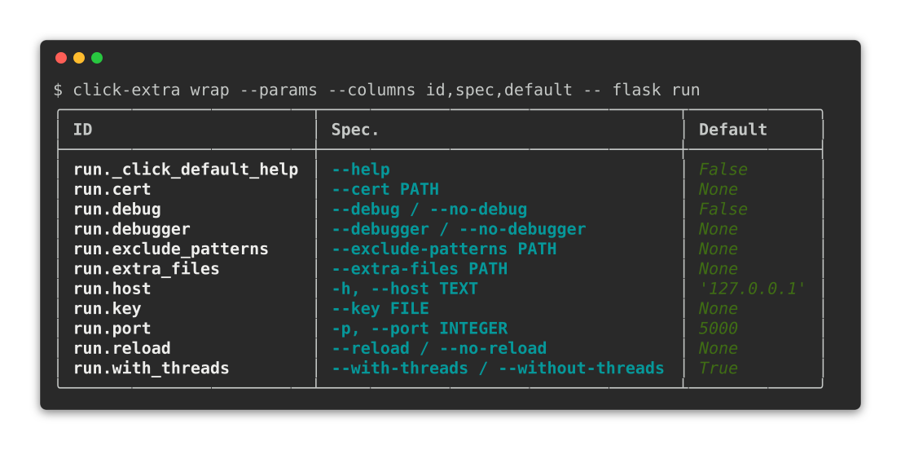

# {octicon}`terminal` CLI wrapper

Click Extra's `wrap` subcommand runs any installed Click CLI through Click Extra, without modifying the target's source code. Its main use is introspection: `--params` loads the target and [describes it](#introspecting-external-clis) without running it, so you can inspect any Click CLI, yours or a third party's. It also applies help colorization, useful for previewing how a third-party CLI would look with Click Extra's keyword highlighting and themed styling, and `--help-format` renders the target as an artifact for a program or a build step.

## Introspect any Click CLI

The `--params` flag turns `wrap` into a read-only inspector. It loads any Click CLI without running it, and prints a table of every parameter. Here is Flask's `run` subcommand, its parameters listed with the spec a user types and the default each one falls back to:

```{click:source}
:hide-source:
from click_extra.cli import demo
```

```{click:run}
:screenshot: wrap-flask-params-screen
:hide-results:
result = invoke(demo, args=["wrap", "--params", "--columns", "id,spec,default", "--", "flask", "run"])
assert result.exit_code == 0
assert "run.port" in result.output
```



You can produce this table in your own terminal, without installing Click Extra:

```shell-session
$ uvx --with flask click-extra wrap --params --columns id,spec,default -- flask run
```

Each part of the command above:

- `--params` introspects the target instead of running it.
- `--columns id,spec,default` restricts the table to each parameter's ID, its command-line spec, and its default.
- `--` separates Click Extra's options from the target CLI and its subcommand path.
- `--with flask` pulls the target into `uvx`'s ephemeral environment, since the wrapper imports it in-process (see [Dependencies of the wrapped CLI](#dependencies-of-the-wrapped-cli)).

This is the main use case: answering questions about a CLI you did not write. The table shows the default of each parameter, the environment variables that reach it, and the options the help screen hides. All of it comes without reading the target's source or running it. The same inspection serves your own CLI in a bug report or a support thread: paste the one-liner, and the reader sees your parameter surface exactly as Click parsed it.

Every introspection mode follows the same contract. [Introspecting external CLIs](#introspecting-external-clis) below documents the full table, the `value` and `source` columns, and the `--man`, `--tree` and `--help-format` modes.

## Usage

The `wrap` subcommand is the default when no known subcommand is given, so both forms work:

```shell-session
$ click-extra wrap -- flask --help
$ click-extra -- flask --help
```

```{click:source}
:hide-source:
from click_extra.cli import demo
```

```{click:run}
result = invoke(demo, args=["wrap", "--help"])
assert result.exit_code == 0
assert "Run, or introspect, any Click CLI" in result.stdout
```

````{tip}
`run` is an alias for `wrap`, so you can also use:

```shell-session
$ click-extra run -- flask --help
```
````

## Wrapping a Click CLI

Pass the target CLI name (or path) as the first argument. Everything after it is forwarded to the target:

```shell-session
$ click-extra -- flask --help
$ click-extra -- black --help
$ click-extra -- ./my_script.py --help
$ click-extra -- ../my-project --help
$ click-extra -- my_package.cli:main --help
```

````{tip}
Every example on this page uses the `--` separator to visually split Click Extra's own options from the target CLI and its arguments. It is optional (Click Extra stops parsing its own options at the first token it does not recognize), but using it consistently keeps the two sides of the invocation unambiguous:

```shell-session
$ click-extra --no-color -- flask --help
```
````

Flask prints its own help uncolored. Through the wrapper the same screen comes back themed, with the `--debug` reference in the description picked up by [cross-reference highlighting](colorize.md#cross-reference-highlighting):

```{click:run}
:screenshot: wrap-flask-help-screen
result = invoke(demo, args=["wrap", "--", "flask", "run", "--help"])
assert result.exit_code == 0
assert not result.stderr
assert "Run a local development server." in result.stdout
```

## Execution timing

The group-level `--time` flag measures the total execution time of the wrapped CLI, including import and patching overhead:

```shell-session
$ click-extra --time -- flask routes
Execution time: 0.342 seconds.
```

## Color control

`--color` / `--no-color` controls whether ANSI codes are emitted, overriding whatever the target would have decided on its own. The default `auto` keeps colors for a terminal and drops them for a pipe or a file, so reach for `--color=always` when the destination is not a terminal but you want the styling anyway. The flag also respects environment variables like `NO_COLOR`, `CLICOLOR`, and `FORCE_COLOR`:

```shell-session
$ click-extra --color=always -- flask --help
$ click-extra --no-color -- flask --help
$ NO_COLOR=1 click-extra -- flask --help
```

The group-level `--theme` option selects a color preset for help screens. The flag is part of click-extra's default options, so it works on every click-extra command:

```shell-session
$ click-extra --theme light -- flask --help
```

Custom themes can be registered with `register_theme()` before the CLI is parsed *or* declared inside the `--config` file (see [Custom themes via config](#custom-themes-via-config) below). Either way the new name becomes a valid value for `--theme` for the duration of the invocation.

```{tip}
To keep what `wrap` renders, hand it to [`screenshot`](screenshots.md#any-command-any-cli), which writes the colored help to an SVG or an HTML file. Its `--wrap` flag runs the pair for you: `click-extra screenshot --output flask-help.svg --wrap -- flask --help`.
```

## Configuration

Click Extra's [configuration file](config.md) support works alongside the wrapper. Group-level options like `verbosity` can be set in `pyproject.toml`:

```toml
[tool.click-extra]
verbosity = "DEBUG"
```

```shell-session
$ click-extra -- flask --help
debug: Set <Logger click_extra (DEBUG)> to DEBUG.
...
```

### Defaults for the wrapped CLI

The `[tool.click-extra.wrap.<script>]`{l=toml} section sets persistent defaults for a specific target CLI. All keys are converted to CLI arguments and prepended to the target's invocation:

```toml
[tool.click-extra.wrap.flask]
app = "myapp:create_app"
debug = true
```

```shell-session
$ click-extra -- flask routes
# Equivalent to: flask --app myapp:create_app --debug routes
```

The section name must match the script name you pass on the command line. Multiple targets can each have their own section:

```toml
[tool.click-extra.wrap.flask]
app = "myapp:create_app"

[tool.click-extra.wrap.quart]
app = "otherapp:create_app"
```

Explicit CLI arguments always override config values:

```shell-session
$ click-extra -- flask --app otherapp routes
# CLI --app wins over config
```

Invalid option names are caught by the target CLI itself with standard Click error messages, so typos are surfaced immediately.

### Custom themes via config

The `--config` flag also accepts theme overrides and brand-new theme definitions. Drop a `[tool.click-extra.themes.<name>]` table into the same `pyproject.toml` and the new palette is loaded before `--theme` is validated, so it can be selected on the command line or pinned via `theme = "..."`:

```toml
[tool.click-extra]
theme = "midnight"

# Override one slot of the built-in `dark` theme:
[tool.click-extra.themes.dark]
option = { fg = "bright_cyan" }

# Define a fresh palette named "midnight":
[tool.click-extra.themes.midnight]
option = { fg = "blue", bold = true }
heading = { fg = "magenta" }
choice = { fg = "yellow" }
```

```shell-session
$ click-extra --help
# --theme [dark|dracula|light|manpage|midnight|monokai|nord|solarized-dark]
$ click-extra -- flask --help     # rendered with the "midnight" palette
```

Themes loaded this way live on `ctx.meta` for the current invocation only. The module-level `theme_registry` is never mutated, so back-to-back wraps in the same process don't cross-contaminate. See [Themes from your `--config` file](theme.md#themes-from-your-config-file) for the full schema and the validation behavior.

## Script resolution

`SCRIPT` is accepted in five forms, tried in this order:

1. A `console_scripts` entry point exposed by an installed package, the most common case:

   ```{code-block} shell-session
   $ click-extra wrap -- flask --help
   ```

2. A local project directory. Its console-script entry point is read from `pyproject.toml` (`[project.scripts]`) or `setup.cfg` (`console_scripts`), and the directory holding its top-level package is added to `sys.path` so it imports without an install step. This is handy for a checked-out project sitting next to your own:

   ```{code-block} shell-session
   $ click-extra wrap -- ../my-project --help
   ```

   Both the flat layout (the package at the project root) and the src layout (under `src/`) are detected. When several scripts point at *different* targets, pass the right one with `module:function` notation; the error lists the candidates. Adding the directory to `sys.path` makes its package importable, but it does *not* install the project's dependencies, so see [Dependencies of the wrapped CLI](#dependencies-of-the-wrapped-cli) below.

3. A `.py` file path. The file is imported in place, with no install step required:

   ```{code-block} shell-session
   $ click-extra wrap -- path/to/my_cli.py --help
   ```

4. `module:function` notation pointing straight at a Click command object. Useful when the entry point is a wrapper rather than the command itself, or when the command isn't exposed as a console script at all:

   ```{code-block} shell-session
   $ click-extra wrap -- flask.cli:cli --help
   ```

5. A bare Python module name invocable via `python -m`. The resolver imports the module and picks up the Click command from its top-level attributes:

   ```{code-block} shell-session
   $ click-extra wrap -- my_package.cli --help
   ```

The same resolver backs every `wrap` mode, including [`--params`](#introspecting-external-clis) and [`--man`](man-page.md#target-resolution).

## Dependencies of the wrapped CLI

`wrap` runs the target inside Click Extra's own interpreter: it imports the resolved module and calls it in-process (see [Script resolution](#script-resolution)). The target is never installed into a separate environment, so **every third-party package the target imports must already be importable where `wrap` runs**, exactly as if you had launched the target directly.

This bites hardest when [wrapping a project directory](#script-resolution). Pointing `wrap` at a checked-out project makes its package importable by putting it on `sys.path`, but it does *not* install that project's declared dependencies. If the target's CLI imports a package that is absent, the failure surfaces from the target's own code:

```{code-block} shell-session
$ click-extra wrap -- ../weather-cli --help
...
ModuleNotFoundError: No module named 'httpx'
```

A traceback like this means resolution already succeeded and the target started running: the missing module is a dependency of the target, not of Click Extra. It is the same error a direct `python -m weather_cli` would raise.

The lightest fix is to layer the missing packages onto an ephemeral run with [`uv`](https://docs.astral.sh/uv/), one `--with` per dependency:

```{code-block} shell-session
$ uv run --with httpx click-extra wrap -- ../weather-cli --help
```

Alternatively, run `wrap` from an environment that already has the target and its dependencies installed (the target's own virtualenv, for example).

## Ephemeral wrapping with `uvx`

The wrapper pairs well with [`uvx`](https://docs.astral.sh/uv/guides/tools/#running-tools) for one-shot colorization of any Click CLI without permanently installing Click Extra. The ephemeral environment holds only Click Extra, so the target and anything it imports have to be pulled in with `--with` (see [Dependencies of the wrapped CLI](#dependencies-of-the-wrapped-cli) above):

```shell-session
$ uvx --with flask click-extra -- flask --help
$ uvx --with black click-extra -- black --help
```

A CLI already built with Click Extra or Cloup passes through unchanged: it brings its own help formatting, and the wrapper leaves that alone while still running it. What the wrapper patches into Click on the way, and why it does so in two places, is documented on {func}`click_extra.cli_wrapper.patch_click`.

## Introspecting external CLIs

The `--params` flag turns `wrap` into a read-only inspector: it loads any Click CLI without running it and prints a table of every parameter, with its ID, spec, class, type, hidden status, environment variables, and default value. This is the same table the [`--params` option](parameters.md#params-option) produces for a Click Extra CLI, pointed at a foreign target instead.

The other introspection modes follow the same contract, each documented on its facet's page: [`--man`](man-page.md) reads the target's manual, [`--tree`](tree.md#foreign-clis) prints its hierarchy of nested subcommands, and [`--help-format`](machine-readable.md) renders it as JSON, Markdown, roff or a [Carapace spec](carapace.md#the-wrap-help-format-carapace-mode). All four are mutually exclusive.

```{click:source}
:hide-source:
from click_extra.cli import demo
```

```{click:run}
result = invoke(demo, args=["wrap", "--help"])
assert result.exit_code == 0
assert "Show the parameters of the target CLI" in result.stdout
```

Here is Flask's `run` subcommand rendered with the vertical table format:

```{click:run}
result = invoke(demo, args=["wrap", "--params", "--table-format", "vertical", "--", "flask", "run"])
assert result.exit_code == 0
assert "run.host" in result.output
assert "run.port" in result.output
assert "-p, --port INTEGER" in result.output
```

Because `wrap` resolves the target's own context, the auto-generated environment variables resolve too (Flask sets the `FLASK_` prefix, so `--port` reads `FLASK_RUN_PORT`):

```{click:run}
result = invoke(demo, args=["wrap", "--params", "--table-format", "vertical", "--columns", "id,envvars", "--", "flask", "run"])
assert result.exit_code == 0
assert "FLASK_RUN_PORT" in result.output
```

### Restricting columns

Pass `--columns` a comma-separated list of column IDs to restrict and reorder the table, SQL `SELECT`-style. The [opening example](#introspect-any-click-cli) selects `id,spec,default`; reordered, the same table runs `spec` first:

```{click:run}
result = invoke(demo, args=["wrap", "--params", "--columns", "spec,id,default", "--", "flask", "run"])
assert result.exit_code == 0
assert "run.port" in result.output
```

### Reading values and their source

Any options after `SCRIPT` (and its subcommand path) are replayed against the resolved command, so the `value` and `source` columns report what each parameter would resolve to under those arguments:

```{click:run}
result = invoke(demo, args=["wrap", "--params", "--columns", "id,value,source", "--", "flask", "run", "--port", "8080"])
assert result.exit_code == 0
assert "8080" in result.output
assert "COMMANDLINE" in result.output
```

### Machine-readable output

Everything the wrapper can extract from a target, as data a program reads rather than a screen a person does, is collected in [machine-readable help](machine-readable.md#any-click-cli): the parameter inventory in any [structured format](table.md#table-formats), and the command itself as JSON, Markdown, a man page or a Carapace spec.

### Subcommand drilling

Extra arguments after `SCRIPT` navigate into nested command groups; the table then scopes to the resolved node:

```shell-session
$ click-extra wrap --params -- flask run
$ click-extra wrap --params -- flask routes
```

### Target resolution

Target resolution follows [the same order as the default mode](#script-resolution): a `console_scripts` entry point, a local project directory, a `.py` file path, `module:function` notation, or a bare Python module name.

When the resolved entry point is a wrapper function (not a Click command), the module is scanned for Click command instances. If a single command group is found, it is used automatically. If multiple candidates exist, the error message lists them so you can use explicit `module:name` notation:

```shell-session
$ click-extra wrap --params -- flask.cli:cli
```

Some CLIs import their Click command *lazily*: a `__main__:main` wrapper that runs `from my_package.cli import cli` only when called, for instance. The module scan then finds nothing at the top level and `wrap` reports `No Click command found in my_package.__main__`. Introspection cannot recover the command from such an entry point, nor from the project directory that resolves to it, because running the wrapper is the only thing that would import the command. Point it instead at the module that *defines* the command with `module:function` notation, making the package importable if it is not installed:

```shell-session
$ PYTHONPATH=../my-project click-extra wrap --man -- my_package.cli:cli
```

## `click_extra.cli_wrapper` API

```{eval-rst}
.. autoclasstree:: click_extra.cli_wrapper
   :strict:

.. automodule:: click_extra.cli_wrapper
   :no-index:
   :members:
   :undoc-members:
   :show-inheritance:
```
